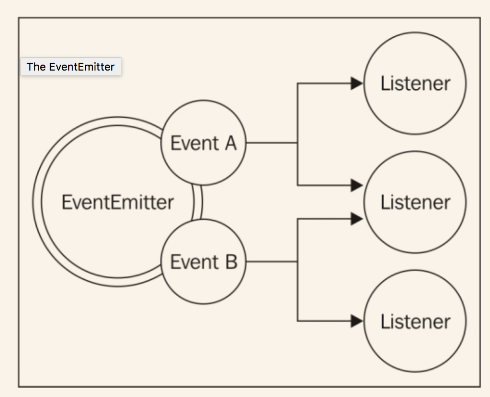

# 观察者模式
Node.js中另一个重要且基础的模式是*观察者模式*。它和反应器模式、回调、模块一样，都是Node.js平台的支柱，也是使用node核心模块和用户模块的前提。
反应器模式是构建Node.js响应式特性的理想解决方案，是对回调的一个完美补充。下面我们给出一个标准的定义：

>观察者模式：定义一个对象（叫做主题），当状态改变时，可以通知一系列的观察者（或者是收听者）。

和回调模式主要的不同是主题可以通知多个观察者，但是一个传统的连续传递风格的回调通常只能将其结果传递给一个收听者，即回调函数本身。

## EventEmitter(事件发送器)
在传统的面向对象编程中，观察者模式包含接口、具体的类、依赖关系；在Node.js中，一切变得简单得多。观察者模式已经集成进内核并且可以通过**EventEmitter**类使用。*EventEmitter*类可以让我们注册一个或多个函数作为收听者，当一个特定的事件被触发时，这些收听者会被触发。下面的图片直观地解释了这个概念：

*EventEmitter*是一个原型，是从核心模块*event*导出的。下面的代码展示了如何获取其引用：

```
var EventEmitter = require('events').EventEmitter;
var eeInstance = new EventEmitter();
```
*EventEmitter*可用的方法如下：

* `on(event,listener)`:把一个新的收听者（函数）注册到给定类型的事件上。
* `once(event,listener)`:注册一个新的收听者，但是事件发送一次后即移除该收听者。
* `emit(event,[arg1],[...])`:创建一个新的事件，附加提供给收听者的参数。
* `removeListener(event,listener)`:移除某个特定事件的某个收听者。

前面所有的方法都返回一个允许链式访问的*EventEmitter*实例。*listener*函数有其函数签名，`function([arg1],[...])`,它只是简单地接收事件发出时提供的参数。在收听者内部，`this`表示创造事件的*EventEmitter*本身。
由此可见，收听者和回调函数之间有很大的区别；尤其是收听者的第一个参数不是错误，而是事件发生时传给`emit()`的任何数据。

## 创建和使用事件发送器
接下来我们看如何实际使用*EventEmitter*。最简单的方式是创建一个新实例直接使用。下面的代码展示了当在文件中发现某个特定的模式时，一个函数通过EventEmitter实时通知订阅者的示例：

```
var EventEmitter = require('events').EventEmitter;
var fs = require('fs');

function findPattern(files, regex) {
  var emitter = new EventEmitter();
  files.forEach(function(file) {
    fs.readFile(file, 'utf8', function(err,content) 	 {
      if(err)
        return emitter.emit('error', err);
      emitter.emit('fileread', file);
      var match = null;
      if(match = content.match(regex))
        match.forEach(function(elem) {
          emitter.emit('found', file, elem);
        });
    });
  });
  return emitter;
}  
```
前面这个函数创建的*EventEmitter*将会产生下面三个事件：

* `fileread`:文件读取时发生。
* `found`:找到匹配项时发生。
* `error`:读文件出错时发生。

下面看如何使用`filePattern()`函数：

```
findPattern(
    ['fileA.txt', 'fileB.json'],
    /hello \w+/g
  )
  .on('fileread', function(file) {
    console.log(file + ' was read');
  })
  .on('found', function(file, match) {
    console.log('Matched "' + match + '" in file '+ file);
  })
  .on('error', function(err) {
    console.log('Error emitted: ' + err.message);
  });
```
在前面的例子中，为每个*EventEmitter*创建的事件类型都注册了一个接收者,*EventEmitter*由`findPattern()`创建。

## 传递错误
*EventEmitter*不能像回调那样在发生错误时抛出异常，如果事件异步发生，错误会消失在事件循环中。相应地，协议规定发送一个特别的事件，叫做`error`，把一个`Error`对象作为参数传递进去。我们刚定义的`findPattern()`就是这么定义的。

> 一般说来为`error`事件注册一个收听者是一个好的实践，Node会区别对待它，如果没找到对应的收听者，会自动抛出一个异常并退出程序。
## 使任何对象都可以被监听
有时直接从*EventEmitter*类创建一个可监听的对象并不够，因为只用来生产新事件有点不够实用。使一个普通的可被监听更常见，这个功能可以通过拓展`EventEmitter`类来实现。
为了描述这个模式，像下面这样实现`findPattern()`的功能：

```
var EventEmitter = require('events').EventEmitter;
var util = require('util');
var fs = require('fs');

function FindPattern(regex) {
  EventEmitter.call(this);
  this.regex = regex;
  this.files = [];
}
util.inherits(FindPattern, EventEmitter);

FindPattern.prototype.addFile = function(file) {
  this.files.push(file);
  return this;
};
FindPattern.prototype.find = function() {
  var self = this;
  self.files.forEach(function(file) {
    fs.readFile(file, 'utf8', function(err, content) {
      if(err)
        return self.emit('error', err);
      
      self.emit('fileread', file);
      var match = null;
      if(match = content.match(self.regex))
        match.forEach(function(elem) {
          self.emit('found', file, elem);
        });
    });
  });
  return this;
}; 
```
我们定义的`FindPattern`原型使用核心模块`util`的`inherits()`方法继承了*EventEmitter*。通过这种方式，它变成了一个特性完整的可监听类。下面是使用示例：

```
var findPatternObject = new FindPattern(/hello \w+/);
findPatternObject
  .addFile('fileA.txt')
  .addFile('fileB.json')
  .find()
  .on('found', function(file, match) {
    console.log('Matched "' + match + '" in file ' + file);
  })
  .on('error', function(err) {
    console.log('Error emitted ' + err.message);
  }); 
```
可以看到`FindPattern`对象拥有一整套的方法，还有通过继承`EventEmitter`而获得监听功能。
这在Node.js的生态系统中是非常常见的功能。比如,核心`http`模块`server`对象定义的方法诸如`listen()`、`close()`、`setTimeout()`，其内部还继承了`EventEmitter`函数，正因如此，它才能创建事件，比如`request`，收到新的请求；`connection`,建立了新的连接；`closed`，服务器关闭了。
另一个继承了*EventEmitter*的例子是Node.js流。我们将在第3章，关于流编程中详细讨论。
## 同步和异步事件
和回调一样，事件可以同步发送或异步发送，不能把两种方式混在一起使用，这个原则是非常重要的。更重要的是，当发送相同类型的事件时，应该避免产生*释放恶魔*一节中描述的问题。
同步和异步事件的差别在于收听者注册的方式。当采用异步的方式发送事件时，所有的事件都可以被用来注册你的收听者，即便是*EventEmitter*已经被初始化，因为事件在下次事件循环之前肯定不会被触发。正如`findPattern()`发生的事情一样。我们刚才定义的函数代表着大部分Node.js模块的常规做法。
与此相反，用同步的方式发送事件，就要求在发出任何事件之前，已经将所有的收听者注册完毕。来看下面的例子：

```
function SyncEmit() {
  this.emit('ready');
}
util.inherits(SyncEmit, EventEmitter);

var syncEmit = new SyncEmit();
syncEmit.on('ready', function() {
  console.log('Object is ready to be used');
});
```
如果`ready`事件异步发出，前面的代码应该会正常执行；然而，事件是同步地发生的，当事件已经发出之后才注册收听者，所以收听者永远不会触发，控制台上什么都打印不出来。
相对于回调来说，有些情况下出于某种目的采用同步的`EventEmitter`风格是有意义的。正因如此，在文档中清楚地标注`EventEmitter`的行为方式是非常重要的，这样做是为了防止缠身疑惑，降低用错的可能性。
## 事件发送器和回调
当定义一个异步接口时，是采用`EventEmitter`还是简单地接收一个回调是很难抉择的。有一个通用的选择方法：当必须以异步方式返回的时候采用回调，当需要立即通信时采用事件。
虽然有这个简单的原则，但是二者大部分情况下是等同的，可以返回相同的结果，这一点让人很疑惑。示例如下：

```
function helloEvents() {
  var eventEmitter = new EventEmitter();
  setTimeout(function() {
    eventEmitter.emit('hello', 'world');
  }, 100);
  return eventEmitter;
}
function helloCallback(callback) {
  setTimeout(function() {
    callback('hello', 'world');
  }, 100);
}

```

从功能角度来讲，`helloEvents()`和`helloCallback()`这两个方法是等同的。第一个采用事件通知超时，第二个采用回调通知调用者，把事件类型作为一个参数。他们之间真正的差别是可读性，语义表示、实现功能所需的代码量。虽然无法给出一系列决定性的规则以供大家选取，但可以提供一些提示来帮助决策。
首先看到的是，当支持不同类型的事件时，回调就有一定的局限性。我们也可以通过传入类型作为回调的参数来区分不同的事件；或者接收多个回调，每个回调都支持某个事件。但这样不能算是一个优雅的接口。这种情况下，*EventEmitter*可以提供更好的接口、更少的代码。
另一个更倾向于使用*EventEmitter*的情况是同一个事件发生多次或者从不发生。回调只会被触发一次，返回操作成功还是失败。我们可能会遇到不断重复的情况，我们会重新考虑事件发生的本质，应该是通信而不是返回一个结果；这种情况下，更倾向于选取`EventEmitter`。
最后，使用回调模式的接口只能通知某一个接口，但使用`EventEmitter`函数可以让多个收听者接收到相同的通知。

## 组合回调和EventEmitter
在某些情况下，回调可以和*EventEmitter*联用。当我们要实现*最小界面*原则时，这个模式是非常有用的，导出一个异步的函数作为主要功能，通过返回一个*EventEmitter*来提供更多的特性，更好地控制。`node-glob`是一个提供glob风格文件搜索的[模块](https://www.npmjs.com/package/glob)，它提供了这种模式的一个范例。模块的主入口是它返回的函数，函数签名如下：

```
glob(pattern, [options], callback)
```

这个函数接收`pattern`作为第一个参数，一系列的选项，和附带一个符合搜索模式的的文件列表的回调。与此同时，函数还返回了一个`EventEmitter`来提供精细的处理状态报告。比如，当发现一个匹配项时，可以实时地接收到通知，当获取到所有匹配的文件时，使用`end`事件来通知，通过`abort`来判断线程是否被人为终止。代码如下：

```
var glob = require('glob');
glob('data/*.txt', function(error, files) {
  console.log('All files found: ' + JSON.stringify(files));
}).on('match', function(match) {
  console.log('Match found: ' + match);
}); 
```
在Node.js中，暴露一个简单、整洁、最小入口并且使用另一种方式提供更多高级或者不重要的特性是非常常见的，合并*EventEmitter*和传统的回调是达到这个目的的方式之一。

> 模式：创建一个接收回调返回`EventEmitter`的函数，使用主函数为主要功能提供一个简单清晰的入口，使用`EventEmitter`提供更多精细的事件。


