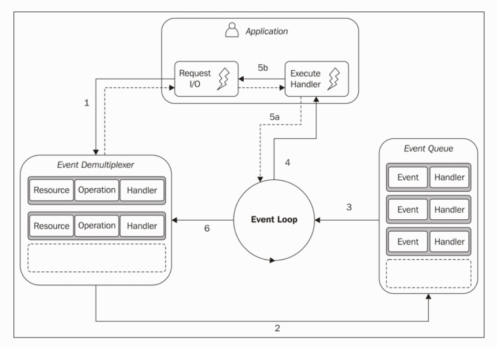
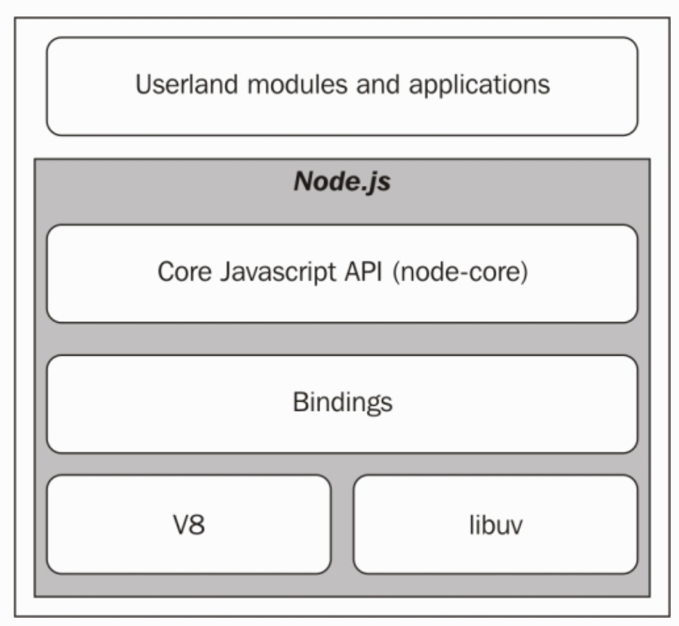

# 反应器模式
这一节，我们分析反应器模式。它是Node.js异步机制的核心。我们将探讨这个模式背后的主要概念，诸如单线程架构、无阻塞I/O,也会谈及这些机制是怎样构建Node.js平台的基础的。
## I/O很慢
I/O无疑是最慢的计算机基础操作。内存的访问时间为**微毫秒**级，但是访问磁盘或网络数据的时间在毫秒级别。对于宽带访问也是一样的；内存的传输速率可以保持在GB/s的级别，磁盘和网络的速率从MB/s到GB/s不等（GB/s只是有时候能达到）。I/O不耗CPU，但是它增加了从发送请求到操作结束的延迟。除了上述内容，我们还得考虑人为因素；应用程序的数据输入通常是由人来完成的，比如点击按钮或在实时聊天应用里发送一条消息，所以I/O的速度和频率不止和技术有关，它实际会比磁盘或网络慢很多。
## 阻塞I/O
在传统的阻塞I/O编程中，调用包含I/O请求的函数会阻塞线程的执行直到操作结束。这个过程可以消耗几毫秒（访问磁盘）到几分钟甚至更多（用户操作产生的数据，如按一个键）。下面的伪代码展示了一个典型的采用阻塞模式读取socket的例子：

```
//在有数据返回前阻塞线程
data = socket.read();
//有数据返回之后
print(data);
```
显而易见，采用阻塞I/O方式实现的Web服务器没法在一个线程上同时处理多个连接。每个网络I/O操作都将阻塞其它连接的处理。因此，Web服务器处理并发访问的传统方式为开启一个新的线程或处理（或者从线程池拿来一个进行复用），这样才能保证每个请求都被处理，一个I/O请求阻塞了线程不会导致其它请求不可用，因为他们在不同的线程中处理。
下面的图片描述了这个场景：
**//todo:处理这张图片**
上面这张图强调了等待从相关连接里接收新的数据时每个线程的空闲了多少时间。那么，如果我们将所有可能阻塞请求的I/O都考虑在内，如数据库和文件系统的访问，我们就知道每个线程大概要阻塞多少次来等待I/O操作的结果。不幸的是，考虑到系统资源，线程的开销并不小。它消耗内存、引起上下文切换，所以每个连接运行一个长时间运行的线程，但是大部分时间并不使用它，考虑到效率问题，它并不是一个很好的方案。
## 非阻塞I/O
除了阻塞I/O,大部分现代操作系统支持另外一种访问资源的机制，叫做非阻塞I/O。在这种操作模式下，系统调用被立刻返回，无需等待数据读/写完成。如果在调用时没有结果，这个功能会简单地返回一个预定义的常量，表示现在没有数据可以返回。
举个例子，在Unix操作系统中，`fctl()`函数用于操作一个已有文件的描述符来改变它的访问模式为非阻塞的（用`O_NONBLOCK` 标签）。一旦这个资源处于非阻塞模式，在有可读数据（可以返回的数据）之前，任何读取操作都会失败同时返回一个状态码`EAGAIN`。
访问这种非阻塞I/O的基本模式为在一个循环中不断地请求资源，直到真正的数据返回了，这叫 **忙碌等待（busy-waiting）**。下面的伪代码展示了怎样用非阻塞和轮询从多个资源读取数据。

```
resources = [socketA, socketB, pipeA];
while(!resources.isEmpty()) {
  for(i = 0; i < resources.length; i++) {
    resource = resources[i];
    //试着读取
    var data = resource.read();
    if(data === NO_DATA_AVAILABLE)
      //现在没可读数据;
      continue;
    if(data === RESOURCE_CLOSED)
      //如果资源被关闭，移除资源。
      resources.remove(i);
    else
      //接收到了数据，处理它。
      consumeData(data);
  }
}
```
这样一来，用这个简单的技术，就可以在同一个线程中处理不同的资源了，但这效率还是不高。在刚才的例子中，大部分CPU时间用在循环资源上了。轮询算法经常导致大量的CPU时间浪费。
## 事件分发
显然忙碌等待不是处理非阻塞资源的理想技术，但幸运的是，大部分操作系统提供了高效的原生的并发处理机制；这个机制叫做同步事件分发或事件通知接口。这个组件收集并排列来自一系列被监控资源的事件，在新的事件需要处理之前阻塞它。下面的伪代码描述了常见的同时从两个资源读取数据的同步事件分发器：

```
socketA, pipeB;
watchedList.add(socketA, FOR_READ);  //[1]
watchedList.add(pipeB, FOR_READ);
while(events = demultiplexer.watch(watchedList)) {  //[2]
  //event loop
  foreach(event in events) {         //[3]
    //这个读取一直会返回数据
    data = event.resource.read();
    if(data === RESOURCE_CLOSED)
      //资源关闭，从监控列表中移除。
      demultiplexer.unwatch(event.resource);
    else
      //真的数据返回了，处理它
      consumeData(data);
  }
}
```
下面是前面伪代码关键部分的解释：

*   1.这些资源被加进数据结构中，这些资源都有一个操作，在例子中叫`read`。
*   2.创建事件通知器，包含一组被监控的资源。这个请求是同步、阻塞的，直到任意一个被监控的资源可读。这时，事件分发器从调用中返回，一系列的事件可以被处理。
*   3.被分发器返回的每个事件都被处理。这样，与每个事件关联的资源确保已经可读并且操作时无需阻塞。当所有的事件被处理完，这个流程将会继续在事件分发器上阻塞，直到又有新的事件可以被处理。这叫做`事件循环`。


用这种模式，我们可以在一个线程中处理多个I/O操作，不用`忙碌等待`技术。下图向我们展示了Web服务器是怎样用同步时间分发器和单个线程处理多个连接的。
//todo:做图片
上图可以帮我们更好地理解在一个线程中，采用同步时间分发器，并发是怎样工作的。我们可以看到，只采用一个线程并没有消弱我们同时运行多个I/O任务的能力。这些任务顺着时间展开，而不是在多个线程展开。这有助于减少总的空闲时间，如上图所示。但这并不是采用这种模型的唯一原因。采用一个单独的线程，还有助于程序员处理并发。贯穿本书，我们可以发现，在不采用进程竞争和同步多线程的情况下，我们有更简单的并发策略。
在下一节，我们进一步讨论Node.js的并发模型。

## 反应器模式
我们现在可以介绍**反应器模式**了，这是前面章节提到的算法的特定实现。这背后的主要思路是每个I/O操作都要关联一个处理器（在Node.js中以回调函数为代表），当事件被创建和处理之后触发。反应器模式的结构如下图所示：



以下为使用反应器模式的应用程序的内部运作模式：

* 1. 应用程序通过向** 事件分发器 **提交一个请求来创建一个新的I/O操作。同时指定一个处理器，在操作完成的时候会被执行。向事件分发器发送一个请求的过程是非阻塞的，它立即将控制权交还给程序。
* 2. 当一组I/O操作完成时，事件分发器把新事件推送到** 事件对列 ** 。
* 3. 此时，事件循环遍历事件队列的所有条目。
* 4. 对于每个事件，关联的处理器被触发。
* 5. 处理器是应用程序代码的一部分，当执行完成时，将控制权交还给事件循环（5a）。在处理器执行的过程中，新的异步操作可能被请求（5b），引起新的操作被插入到事件分发器（1），这发生在将控制权交还回去之前。
* 6. 当事件队列中所有的条目都被处理了，循环会回到阻塞状态，等待事件分发器触发下一次循环。

现在对异步操作的细节了解清楚了：应用程序即时表现出访问资源的兴趣，并提供一个处理器。处理器会在操作完成之后被触发。

> 注：
> 当在事件分发器中没有挂起的操作时，Node.js应用程序会自动退出。

那我们可以在Node.js的核心定义模式了。

> 模式（反应器）：以阻塞的方式处理，直到新的事件从被监控的资源发出。通过将每个事件分发到相关的处理器来反应。

## Node.js的非阻塞引擎-libuv
每个操作系统都有自己的时间分发器：Linux上的`epoll`、Mac系统上的`kqueue`、windows系统上的I/O完成端接口（IOCP）。此外，在同一个操作系统上，对于不同类型的资源处理方式也不同。比如，在Unix操作系统上，常规文件系统的文件不支持非阻塞操作，所以为了模拟非阻塞行为，就需要使用事件循环之外的一个单独的线程。所有这些不同操作系统内外的不一致性需要一个更高级别的抽象，为不同的事件分发分别构建。这就是Node.js核心团队创建了一个C类库叫做`libuv`的原因，为了使Node.js兼容所有主流的平台，规范不同类型资源的非阻塞行为。`libuv`现在是Node.js的底层I/O引擎。
除了对底层系统调用进行了抽象之外，`libuv`同时也实现了反应器模式，提供了一个API来创建事件循环，管理事件队列，运行异步I/O操作，排列其它类型的任务。
> 注：
> Nikhil Marathe的免费在线书籍是学习`libuv`的一个非常好的资源，可以在[http://nikhilm.github.io/uvbook/](http://nikhilm.github.io/uvbook/)访问到。

## Node.js清单
反应器模式和libuv是Node.js基础模块，但也需要另外三个来组成完整的平台：

* 封装libuv和其它底层功能并暴露给JavaScript一系列组件。
* V8,最初是由谷歌开发用于Chrome浏览器。这也是Node.js这么快的原因之一。V8以它的改良设计、速度、高效的内存管理著称。
* 一个核心的Javascript库（称为Node核心库）来实现上层Node.js的API。

这就是Node.js的完整清单，下图展示了最终架构：



