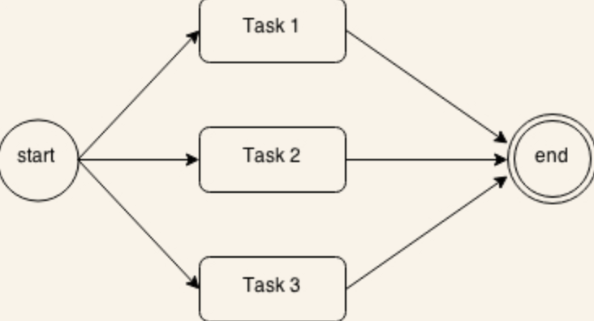
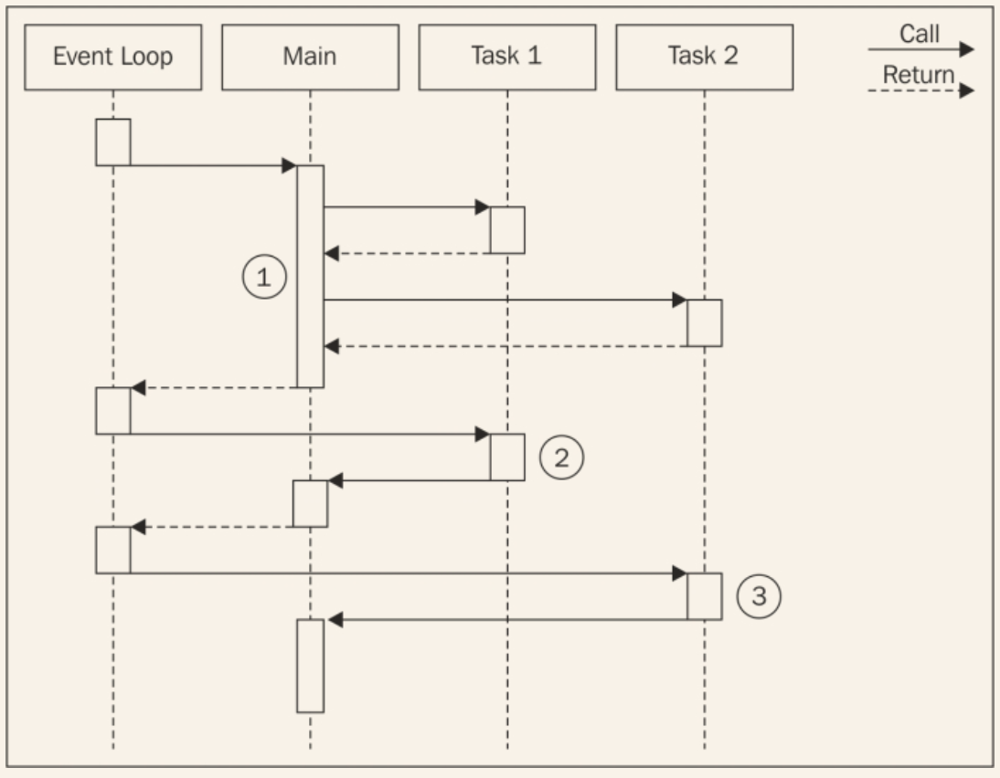
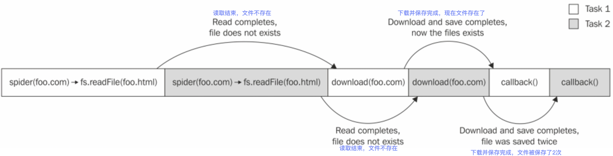
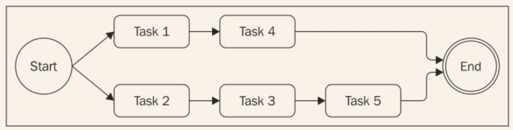

# 使用纯JavaScript
我们已经看到了第一个回调地狱的例子，这种情况是必须避免的；然而，这不是使用异步代码唯一需要关注的问题。实际上，在一些情况下，控制一组异步任务的顺序需要使用特定的模式和技术，尤其是如果我们只用纯JavaScript，而不是借助任何外部库。举个例子，遍历集合，按顺序应用异步操作并不是和在数组上触发*forEach()*一样简单，但这确实需要类似于回调的技术。
在这一节，我们不光会学到怎样避免回调地狱，而且会学到怎样使用纯JavaScript实现一些最常见的流程控制模式。
## 回调的原则
在写异步代码时，首先需要牢记的原则是定义回调时不滥用闭包。大家很容易这样做，因为不需要任何多余的思考，比如模块化和可重用性；然而，我们看到了这样做弊大于利。大多数情况下，修复回调地狱不需要任何库、复杂的技术、或者是修改方案，只需要一些常识。
下面是一些基本原则，帮助我们保证较低的嵌套级别，提高代码可组织性：

* 你必须尽快退出。使用*return*、*continue*或者*break*，基于上下文，来退出当前的声明而不是写完整的*if/else*声明。这样有助于代码层级较浅。
* 给回调命名，确保它们在闭包之外，把中间结果作为参数传递。给函数命名可以使其在栈追踪结果中看起来更清晰。
* 你需要使代码模块化。尽可能把代码分成更小的，重用度更高的函数。
## 应用回调原则
为了展示前面提到的原则能力，让我们用它们来解决网络爬虫应用中的地狱回调问题。
第一步，我们可以重构错误检查模式，移除*else*声明。这使当接收到错误后，立刻从函数返回成为了可能。所以，相对于使用如下代码：

```
if(err) {
  callback(err);
} else {
  //当没有错误时需要执行的代码
}
```
通过写成下面这样来提高代码的组织：

```
if(err) {
  return callback(err);
}
//当没有错误时需要执行的代码
```
用这个简单的技巧，可以立即减少函数的嵌套级别；非常简单且不需要任何复杂的重构。

>执行刚描述的优化时常见的错误是触发回调之后忘记结束函数执行。对于错误处理的场景，下面是典型的缺陷代码：

```
if(err) {
  callback(err);
}
//code to execute when there are no errors 
```
> 我们应该知道，触发回调之后，函数会继续执行。那么插入一个*return*指令来阻塞函数剩余代码的执行。同样需要记住，函数返回什么一点也不重要；真实的结果（错误）是被异步地创建并传递到回调。异步函数的返回值通常被忽略。这个属性使我们可以简写为：`return callback(...)`。啰嗦一点的写法是：

```
callback(...)
return;
```
作为优化*spider()*函数的第二种方法，我们可以尝试确定出可重用的代码。比如，把给定字符串写入文件的功能可以容易地拿到一个独立的函数中，如下：

```
function saveFile(filename, contents, callback) {
  mkdirp(path.dirname(filename), function(err) {
    if(err) {
      return callback(err);
    }
    fs.writeFile(filename, contents, callback);
  });
} 
```
按照相同的原则，我们可以创建一个通用函数，叫做*download()*,把文件名作为输入，然后把URL下载到一个给定的文件。在内部，我们可以使用刚定义的*saveFile()*函数。

```
function download(url,filename,callback) {
  console.log('Downloading'+url+'\n');
  request(url,function(err,response,body){
    if(err){
      return callback(err);
    }
    saveFile(filename,body,function(err){
      console.log('Downloading and saved :'+url+'\n');
      if(err){
        return callback(err);
      }
      callback(null,filename);
    })
  })
}
```
最后一步，修改*spider()*函数，修改之后，代码是这样的：

```
function spider(url,callback) {
  var filename=utilities.urlToFilename(url);
  fs.exists(filename,function (exists) {
    if(exists){
      return callback(null,filename,false);
    }
    download(url,filename,function (err) {
      if(err){
        return callback(err);
      }
      callback(null,filename,true);
    })
  })
}
```
*spider()*函数的功能和接口是一样的；变化的只有代码的组织。通过应用基本的原则，我们能够大大减少代码嵌套的层级，同时增加其可重用性和可测试性。事实上，我们可以试着导出*saveFile()*和*download()*,这样才能在其它模块中重用它们。这也使我们可以更容易地测试其功能。
这一节的重构清晰地展示了大部分情况下，我们只需要一些原则来确保不滥用闭包和异步函数。显然这是有效的，需要很少的工作量，只使用纯JavaScript。
## 顺序执行
现在开始探索异步流程控制模式。我们会以分析**顺序执行**流程开始。
按顺序执行一组任务意味着每次执行一个，一个接一个地执行。执行的顺序非常重要，需要保存起来，因为列表中任务的结果会影响下一个的执行。下图描述了这个概念：

这个流程有一些变种：

* 按顺序执行一组任务，无需关联或传递结果
* 前一个任务的输出作为后一个任务的输入（也被称为*链式*、*管线*、*瀑布*）。
* 遍历一个集合的同时一个接一个地对元素运行异步任务。

顺序执行，除了采用简单地使用阻塞API实现，当使用异步的CPS实现是带来回调地狱的主要原因。

### 顺序执行已知数量的任务
在前面一节的*spider()*函数中，我们已经遇到过顺序执行。通过应用我们学到过的规则，我们能够组织一组已知的任务来按顺序执行。以那个代码作为纲领，我们可以用下面的模式生成一个解决方案：

```
function task1(callback) {
  asyncOperation(function() {
    task2(callback);
  });
}
function task2(callback) {
  asyncOperation(function(result) {
    task3(callback);
  });
}

function task3(callback) {
  asyncOperation(function() {
    callback();
  });
}

task1(function() {
  //task1, task2, task3 completed
});
```
前面的模式展示了每个任务是怎样触发下一个任务的，基于常用异步操作完成。这个模式强调了任务的模块化，展示了在处理异步代码时，并不总需要闭包。
### 依次遍历
前面我们描述的模式在我们预先知道有哪些、有多少任务将要执行的情况下会很好地工作。这使我们硬编码按顺序执行的下一个任务的触发；但如果我们想对集合中的每个元素执行异步操作怎么办呢？这种情况下，我们即不能硬编码任务顺序了，相反，必须动态地构建。
#### 网络爬虫版本2
为展示依次遍历的例子，我们给网络爬虫引入一个新特性。我们现在想递归地下载网页中包含的链接。为了实现这个功能，我们将提取出网页中所有的链接，然后在每个上面按顺序触发我们的网络爬虫。
第一步是修改*spider()*函数，使其可以使用一个叫做*spiderLinks()*的函数触发一个递归的下载，等会我们会创建这个函数。
同样的，一改之前的检查文件是否存在，现在我们尝试读取它，然后开始搜寻其链接；用这种方式，我们能够继续被打断的下载。在最终的修改中，传入了一个新参数*nesting*，帮助我们限制回调的深度。最终代码如下：

```
function spider(url, **nesting**, callback) {
  var filename=utilities.urlToFilename(url);
  **fs.readFile(filename,'utf8',function (err,body) {
    if(err){
      if(err.code!=='ENOENT'){
        return callback(err);
      }**
      return download(url,filename,function (err,body) {
        if(err){
          return callback(err);
        }
        **spiderLinks(url,body,nesting,callback);**
      })
    }
    **spiderLinks(url,body,nesting,callback);**
  })
}
```
#### 按顺序爬取链接
现在我们可以创建新版的网络爬虫的核心代码了，*spiderLinks()*函数，使用顺序异步遍历算法下载网页中所有的链接。关注下文中我们将要定义的方式：

```
function spiderLinks(currentUrl, body, nesting, callback) {
    if (nesting === 0) {
        return process.nextTick(callback);
    }
    var links = utilities.getPageLinks(currentUrl, body);//[1]
    function iterate(index) {//[2]
        if (index === links.length) {
            return callback();
        }
        spider(links[index], nesting - 1, function (err) {//[3]
            if (err) {
                return callback(err);
            }
            iterate(index + 1);
        })
    }

    iterate(0);//[4]
}
```
从新函数中需要理解的内容如下：

1. 使用*utilities.getPageLinks()*函数获取网页中包含的所有链接列表。这个函数只返回指向内部目标的链接（同一个主机）。
2. 使用一个本地函数*iterate()*遍历所有的链接，包含下一个要分析的链接的*index*。在这个函数中，我们要做的第一件事情是检查index是否等于*links*数组的长度，在这种情况下，我们立即触发*callback()*函数，因为此时所有的条目都被处理完了。
3. 此时，处理链接的条件都具备了。我们触发*spider()*函数，同时减少*nesting*级别，然后当操作完成后，触发遍历的下一步。
4. 作为*spiderLinks()*函数的最后一步，通过触发*iterate(0)*来启动遍历。

我们刚展示的算法是我们遍历一个数组，按顺序对没个项执行异步操作，在我们的例子中是*spider()*函数。
我们现在可以尝试新版的爬虫应用，查看它递归地下载网页的内容，一个接着一个。如果中断处理（通常用Ctrl+C），链接多的话可能会花一会时间。如果等下我们想恢复这个操作，只需执行爬虫程序，提供第一次运行时相同的URL。

> 既然我们的网络爬虫可能触发整站的下载，请慎重地使用它。比如，不要设置太高的深入级别，不要让爬虫运行超过几秒钟。用几千个请求使服务器过载是不礼貌的。在有些情形下，这也被认为是不合法的。请负责地使用它。

#### 模式
前面章节的*spiderLinks()*函数的代码是一个清晰的案例，展示了怎样遍历一个集合，同时执行一个异步操作。我们也可以发现，这个模式也可以应用到任何其它需要异步地按顺序遍历集合或任务列表的情况。这个模式可以表示如下：

```
function iterate(index) {
  if(index === tasks.length)  {
    return finish();
  }
  var task = tasks[index];
  task(function() {
    iterate(index + 1);
  });
}

function finish() {
  //iteration completed
}

iterate(0); 
```
> 如果*task()*是一个异步操作，这种类型的算法变得递归了，知道这一点非常重要。在这种情况下，每次循环中栈不会被释放，将有危险达到栈调用的最大值。

刚表述的这种模式非常有用，可以适用于多种情形；比如，我们可以映射数组的元素或者可以在递归中传递一个操作的结果给另一个，实现*reduce*算法，如果满足特定条件，可以提前退出循环，或者可以遍历无数个元素。
我们也可以选择把这个解决方案进一步归纳，把它包进一个函数，签名如下：

```
iterateSeries(collection, iteratorCallback, finalCallback)
```
这个留给你做练习。

> 模式（顺序遍历）：按顺序执行一系列的任务的方式为：创建一个叫做*iterator*，会触发集合中下一个可用的任务同时确保在当前任务完成后，触发遍历的下一步。

## 并行执行
在某些情况下，一组异步任务的执行顺序不那么重要，我们只想在所有的任务执行完后收到通知。这种情况使用**并行执行**工作流处理比较好，如下图所示：


考虑到Node.js是单线程的，这可能听起来有点奇怪。但是如果我记得我们在第一章讨论过的*Node.js设计基础*，我们发现，即使只有一个线程，依旧可以达到并发，多亏了Node.js的非阻塞特性。事实上，这里的并行一词用的并不恰当，它的意思并不是指同时运行，而是它们的执行被底层的非阻塞API负责，由事件循环插入。
如我们所知，当请求一个新的异步操作时，任务会把控制权返回给事件循环，使事件循环可以执行其它任务。准确描述这种流程的词是并发，但这里为了简便起见，还是用并行。
下图展示了怎样在一个Node.js程序中并行地运行两个异步任务：

在上图中，我们有一个执行两个移除任务的**Main**函数：

1. **Main**函数触发了**Task1**和**Task2**的执行。因为触发的是异步操作，它们立即把控制权返回给**Main**函数，然后**Main**函数把控制权交还给事件循环。
2. 当**Task1**的异步操作完成后，事件循环把控制权交给它。当**Taks1**完成了它的内部异步处理，它会通知**Main**函数。
3. 当被**Task2**触发的异步操作完成后，事件循环触发了它的回调，把控制权交还给**Task2**。在**Task2**结束后，**Main**函数再次被通知。此时，**Main**函数知道**Task1**和**Taks2**都完成了，所以它可以继续执行或把操作的结果返回给另外一个回调。

简而言之，这意味着在Node.js中，我们可以并行地执行纯异步的操作，因为并发在内部被非阻塞API处理。在Node.js中，同步（阻塞）操作不能够并发地运行除非它们的执行被放到异步操作中，或使用*setTimeout()*或*setImmediate()*进行了推迟。我们会在第6章 模式菜谱 中看到更多的细节。
### 网络爬虫版本3
我们的网络爬虫应用看起来非常适合应用并行执行的概念。到现在为止，我们的应用以串行的方式递归地下载链接。我们可以通过并行地下载所有连接来提升性能。
只需要修改*spiderLinks()*函数来确保一次启动所有的*spider()*任务，当所有的任务执行完后再触发最终回调。那么，按照如下方式修改*spiderLinks()*：

```
function spiderLinks(currentUrl, body, nesting, callback) {
    if (nesting === 0) {
        return process.nextTick(callback);
    }
    var links = utilities.getPageLinks(currentUrl, body);
    if (links.length === 0) {
        return process.nextTick(callback);
    }
    var completed = 0, errored = false;

    function done(err) {
        if (err) {
            errored = true;
            return callback(err);
        }
        if (++completed === links.length && !errored) {
            return callback();
        }
    }

    links.forEach(function (link) {
        spider(link, nesting - 1, done);
    });
}
```
现在解释其变化。正如前面所述，*spider()*任务一次全部启动了。通过简单地遍历*links*数组，无需等待前面一个任务完成的情况下启动任务：

```
links.forEach(function (link) {
   spider(link, nesting - 1, done);
});
```
然后，确保应用等待所有任务都完成的技巧是，给*spider()*函数提供一个特别的回调，叫做*done()*。当一个爬虫任务完成时，*done()*函数会增加计数器的数值。当完成下载数达到*links*数组的长度时，最终的回调被触发：

```
function done(err) {
        if (err) {
            errored = true;
            return callback(err);
        }
        if (++completed === links.length && !errored) {
            return callback();
        }
    }
```
通过这些修改，我们会发现现在使用爬虫来爬取一个网页，在整个过程的速度方面有很大提升。因为每个下载都是并行地运行的，无需等待前面的处理完。
#### 模式
同样，对于并行执行，我们可以把模式抽离出来，可以复用到不同的情况。这个模式可以用如下代码来表示：

```
var tasks = [...];
var completed = 0;
tasks.forEach(function(task) {
  task(function() {
    if(++completed === tasks.length) {
      finish();
    }
  });
});

function finish() {
  //all the tasks completed
}
```
经过稍微修改，可以把这个模式应用到累积每个任务的结果到一个集合中，通过过滤或映射数组的元素，或者在完成的任务数达到某个数值后立即触发*finish()*回调。（最后一种情况叫做**竟态**）

>模式（无限并行执行）：通过一次全部启动的方式使一组异步任务并行执行，通过累积回调被触发的次数来确定它们是否都已经执行完毕。

#### 修复并行任务时的竞争条件
使用阻塞I/O和多线程的组合来并行地运行一组任务非常麻烦。但是，我们刚才看到，在Node.js中，这是另外一番光景；并行地运行多个任务是非常直接的，并且资源开销比较小。这是Node.js的主要优势之一，因为它使并行变成了一常规操作而不是一个必要时才会使用的复杂技术。
Node.js并发模型的另一个重要的特性是处理任务同步和竟态条件的能力。在多线程编程中，通常使用一些结构，诸如锁、互斥器、信号、监控，这也是并行最复杂的方面之一，也会对性能造成比较大的影响。在Node.js中，我们通常无需任何炫酷的同步机制，因为所有的东西都是同步运行的！但是，这并不意味着没有竟态条件，相反，它非常常见。问题的根源在于异步操作的触发和结果通知之间的延迟。举个具体的例子，可以再把网络爬虫拿出来，尤其是最新版，确实包含一个竟态条件（你发现了吗？）。
我们刚说的问题存在于*spider()*函数，当开始下载某个链接前检查一个文件是否存在时：

```
function spider(url, nesting, callback) {
    var filename = utilities.urlToFilename(url);
    fs.readFile(filename, 'utf8', function (err, body) {
        if (err) {
            if (err.code !== 'ENOENT') {
                return callback(err);
            }
            return download(url, filename, function (err, body) {
                if (err) {
                    return callback(err);
                }
                spiderLinks(url, body, nesting, callback);
            })
        }
        spiderLinks(url, body, nesting, callback);
    })
}
```
问题在于，两个基于同一个URL运行的*spider*任务可能触发同一个文件的*fs.readFile()*,这种情况发生在当一个任务完成下载并创建文件之前，导致两个任务都启动了下载。如下图所示：



上图展示了*Task1*和*Task2*是怎样在一个Node.js单线程上交替的，异步操作是怎样引入竟态条件的。在我们的例子中，两个爬虫任务以下载同一个文件结束。
怎样修复这个问题呢？答案比想象的更简单一些。事实上，我们只需要一个变量来可控地排除多个*spider()*任务基于同一个URL运行。通过如下代码可以实现：

```
var spidering = {};
function spider(url, nesting, callback) {
  if(spidering[url]) {
    return process.nextTick(callback);
  }
  spidering[url] = true;
  [...]
```
这个修改无需任何注释。如果给定的URL在*spidering*映射中已经存在，那么就简单地退出；否则，设置标签并继续下载。对于这种情况，我们无需释放锁，因为我们也不想两次下载同一个URL，即使*spider*任务在两个完全不同的时间执行。
竟态条件可能会导致许多问题，即使处于一个单线程的环境。在某些情况下，会导致数据污染，通常很难调试，因为整个过程非常短暂。所以，运行并行任务时双重检查是非常实用的。
## 有限并行执行
通常无节制地启动并行任务会导致过载。假设有成千上万的文件读取、URL访问、数据库查询并行执行。这种情况下常见的问题是资源用尽，比如，当尝试一次打开太多文件时会导致用尽所有的文件描述符。在web应用中，也会使其非常容易遭受**拒绝服务（DoS）**攻击。在这种情况下，限制同时运行的任务数是一个好主意。这样一来，我们可以为服务器的负载增加可以测性，同时确保我们的应用不会用尽资源。下图展示了有5个任务，两两并行的情况：



从上图中，可以清楚地知道我们的算法是怎样工作的：

1. 刚开始，在没超过限制时，创建尽可能多的任务。
2. 在达到限制后，每次任务执行完才启动一个或多个任务。

### 限制并发量
### 全局地限制并发量
### 使用队列
#### 队列重用
#### 网络爬虫版本4


