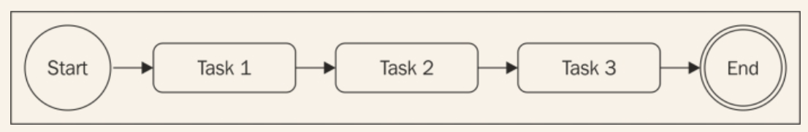

# 使用纯JavaScript
我们已经看到了第一个回调地狱的例子，这种情况是必须避免的；然而，这不是使用异步代码唯一需要关注的问题。实际上，在一些情况下，控制一组异步任务的顺序需要使用特定的模式和技术，尤其是如果我们只用纯JavaScript，而不是借助任何外部库。举个例子，遍历集合，按顺序应用异步操作并不是和在数组上触发*forEach()*一样简单，但这确实需要类似于回调的技术。
在这一节，我们不光会学到怎样避免回调地狱，而且会学到怎样使用纯JavaScript实现一些最常见的流程控制模式。
## 回调的原则
在写异步代码时，首先需要牢记的原则是定义回调时不滥用闭包。大家很容易这样做，因为不需要任何多余的思考，比如模块化和可重用性；然而，我们看到了这样做弊大于利。大多数情况下，修复回调地狱不需要任何库、复杂的技术、或者是修改方案，只需要一些常识。
下面是一些基本原则，帮助我们保证较低的嵌套级别，提高代码可组织性：

* 你必须尽快退出。使用*return*、*continue*或者*break*，基于上下文，来退出当前的声明而不是写完整的*if/else*声明。这样有助于代码层级较浅。
* 给回调命名，确保它们在闭包之外，把中间结果作为参数传递。给函数命名可以使其在栈追踪结果中看起来更清晰。
* 你需要使代码模块化。尽可能把代码分成更小的，重用度更高的函数。
## 应用回调原则
为了展示前面提到的原则能力，让我们用它们来解决网络爬虫应用中的地狱回调问题。
第一步，我们可以重构错误检查模式，移除*else*声明。这使当接收到错误后，立刻从函数返回成为了可能。所以，相对于使用如下代码：

```
if(err) {
  callback(err);
} else {
  //当没有错误时需要执行的代码
}
```
通过写成下面这样来提高代码的组织：

```
if(err) {
  return callback(err);
}
//当没有错误时需要执行的代码
```
用这个简单的技巧，可以立即减少函数的嵌套级别；非常简单且不需要任何复杂的重构。

>执行刚描述的优化时常见的错误是触发回调之后忘记结束函数执行。对于错误处理的场景，下面是典型的缺陷代码：

```
if(err) {
  callback(err);
}
//code to execute when there are no errors 
```
> 我们应该知道，触发回调之后，函数会继续执行。那么插入一个*return*指令来阻塞函数剩余代码的执行。同样需要记住，函数返回什么一点也不重要；真实的结果（错误）是被异步地创建并传递到回调。异步函数的返回值通常被忽略。这个属性使我们可以简写为：`return callback(...)`。啰嗦一点的写法是：

```
callback(...)
return;
```
作为优化*spider()*函数的第二种方法，我们可以尝试确定出可重用的代码。比如，把给定字符串写入文件的功能可以容易地拿到一个独立的函数中，如下：

```
function saveFile(filename, contents, callback) {
  mkdirp(path.dirname(filename), function(err) {
    if(err) {
      return callback(err);
    }
    fs.writeFile(filename, contents, callback);
  });
} 
```
按照相同的原则，我们可以创建一个通用函数，叫做*download()*,把文件名作为输入，然后把URL下载到一个给定的文件。在内部，我们可以使用刚定义的*saveFile()*函数。

```
function download(url,filename,callback) {
  console.log('Downloading'+url+'\n');
  request(url,function(err,response,body){
    if(err){
      return callback(err);
    }
    saveFile(filename,body,function(err){
      console.log('Downloading and saved :'+url+'\n');
      if(err){
        return callback(err);
      }
      callback(null,filename);
    })
  })
}
```
最后一步，修改*spider()*函数，修改之后，代码是这样的：

```
function spider(url,callback) {
  var filename=utilities.urlToFilename(url);
  fs.exists(filename,function (exists) {
    if(exists){
      return callback(null,filename,false);
    }
    download(url,filename,function (err) {
      if(err){
        return callback(err);
      }
      callback(null,filename,true);
    })
  })
}
```
*spider()*函数的功能和接口是一样的；变化的只有代码的组织。通过应用基本的原则，我们能够大大减少代码嵌套的层级，同时增加其可重用性和可测试性。事实上，我们可以试着导出*saveFile()*和*download()*,这样才能在其它模块中重用它们。这也使我们可以更容易地测试其功能。
这一节的重构清晰地展示了大部分情况下，我们只需要一些原则来确保不滥用闭包和异步函数。显然这是有效的，需要很少的工作量，只使用纯JavaScript。
## 顺序执行
现在开始探索异步流程控制模式。我们会以分析**顺序执行**流程开始。
按顺序执行一组任务意味着每次执行一个，一个接一个地执行。执行的顺序非常重要，需要保存起来，因为列表中任务的结果会影响下一个的执行。下图描述了这个概念：

这个流程有一些变种：

* 按顺序执行一组任务，无需关联或传递结果
* 前一个任务的输出作为后一个任务的输入（也被称为*链式*、*管线*、*瀑布*）。
* 遍历一个集合的同时一个接一个地对元素运行异步任务。

顺序执行，除了采用简单地使用阻塞API实现，当使用异步的CPS实现是带来回调地狱的主要原因。

### 顺序执行已知数量的任务
在前面一节的*spider()*函数中，我们已经遇到过顺序执行。通过应用我们学到过的规则，我们能够组织一组已知的任务来按顺序执行。以那个代码作为纲领，我们可以用下面的模式生成一个解决方案：

```
function task1(callback) {
  asyncOperation(function() {
    task2(callback);
  });
}
function task2(callback) {
  asyncOperation(function(result) {
    task3(callback);
  });
}

function task3(callback) {
  asyncOperation(function() {
    callback();
  });
}

task1(function() {
  //task1, task2, task3 completed
});
```
前面的模式展示了每个任务是怎样触发下一个任务的，基于常用异步操作完成。这个模式强调了任务的模块化，展示了在处理异步代码时，并不总需要闭包。
### 依次遍历

#### 网络爬虫版本2

#### 按顺序爬取链接

#### 模式

## 并行执行

### 网络爬虫版本3

#### 模式

#### 修复并行任务时的竞争条件

## 有限并行执行

### 限制并发量

### 全局地限制并发量

### 使用队列

### 网络爬虫版本4


