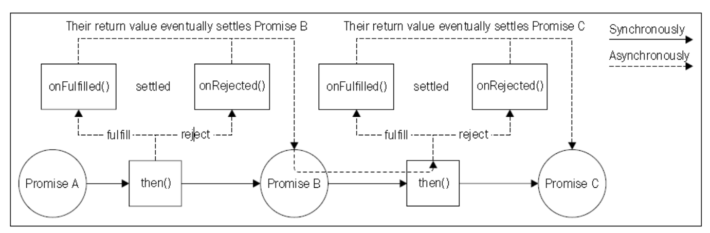

# Promises
在本章之初就已经提过，CPS不是写异步代码的唯一方式。事实上，JavaScript系统为传统的回调模式提供了备选方案。一个势头正劲的备选方案，将会成为ECMAScript6说明的一部分（被称为ES6 或 Harmony），ES6是JavaScript语言的未来版本。这里说的是**promise**，尤其是遵循*Promises/A+*说明来实现的特定版本（https://promisesaplus.com ）。
>注：有其它promises实现，它们和*Promises/A+*不一样，在这些说明中，最流行的是JQuery提供的模式。在本节讨论的大部分话题不适用于这些不兼容的实现。 

## 什么是Promise
简单地说，promises是一种抽象，允许异步函数返回一个叫做**promise**的对象，代表操作的最终结果。在promises术语中，当异步操作没有完成时，叫做**pending**，当操作成功完成后，是**fullfilled**状态，当操作因为错误终止时，叫做**rejected**状态。当一个promise要么fullfilled，要么rejected，都被认为是**settled**。
可以使用promise的`then()`方法来接收执行成功的结果或者是执行失败的错误原因。以下是它的签名：

```
promise.then([onFulfilled], [onRejected])
```
这里`onFullfilled()`是一个函数，会接收promise执行成功时的结果，`onRejected()`是另一个函数，会接收终止的原因（如果有的话）。两个函数都是可选的。
看下面的代码来了解Promise是怎样改变我们的代码的：

```
asyncOperation(arg, function(err, result) {
    if(err) {
        //handle error
    }
    //do stuff with result
});
```
`then()`方法的一个关键特性是它可以同步地返回另一个Promise。如果`onFulfilled()`或`onRejected()`返回一个值x，由`then()`返回的promise 可以是：

* 如果x是值类型，则执行顺利完成，结果为x
* 如果x是一个promise或者是一个*thenable*的对象，则顺利完成时的结果是x顺利完成时返回的值。
* 如果x是一个promise或者是一个*thenable*的对象，则失败时的结果是x失败时返回的值。

> thenable 是指一个类似于promise的对象，包含一个`then()`方法。这个术语用于表示使用不同的手段实现的某种promise。

这个特性使我们可以构建promise链，使我们可以方便地聚合、编排多种不同的异步操作。此外，如果不想制定`onFulfilled()`、`onRejected()`处理函数，成功时的返回值或者失败时的错误原因都会自动地传递到链中的下一个promise。这使我们可以自动地在整个链上自动地传递错误，直到它被`onRejected()`函数处理。使用promise链，顺序执行的任务突然变成了简单的操作：

```
asyncOperation(arg)
    .then(function(result1) {
        //returns another promise
        return asyncOperation(arg2);
    })
    .then(function(result2) {
        //returns a value
        return 'done';
    })
    .then(undefined, function(err) {
        //any error in the chain is caught here
    });
```
下图从另外一个角度展示了promise链的工作模式：


promise的另外一个重要特性是`onFulfilled()`和`onRejected`函数一定会被异步地触发，即使同步地用一个值来返回结果，和前面的结果一样，在链的前一个`then()`中返回了字符串`done`。这个设定使我们避免发生放出恶魔的情况，使代码的一致性和健壮性不会受到影响。
接下来是最好的部分。如果在`onFulfilled`或`onRejected`处理函数中抛出一个异常（使用`throw`命令），被`then()`返回的promise会自动地使用异常作为原因来使promise进入被拒绝状态。相对于`CPS`来说，这有着极大的优势，这意味着使用promise，异常会自动地在链上传递，这样一来，`throw`命令便不再是敌人了。

> 了解更多关于Promise/A+规范的描述，可以参照官方网站：[https://promisesaplus.com/](https://promisesaplus.com/)。

## Promises/A+ 的实现
在Node.js或者总的来说在Javascript中，有一些类库实现了Promise/A+ 规范。下面的这几个比较流行：

* Bluebird( https://npmjs.org/package/bluebird )
* Q ( https://npmjs.org/package/g )
* RSVP( https://npmjs.org/package/rsvp )
* Vow( https://npmjs.org/package/vow )
* When.js ( https://npmjs.org/package/when )
* ES6 Promises

他们之间的却别在于基于*Promise/A+* 标准所增加的特性。标准实际上只定义了*then()* 函数的行为和Promise处理的步骤，但并没有制定其它的功能，比如，promise是怎样从一个基于回调的异步函数创建的。
在本书的例子中，我会尝试使用一组由ES6 promise 实现的API，它被Javascript原生地支持，无需使用其它外部库。所幸，列表中的前几个库逐渐改为支持ES6 API ，因此使用它们中的任何一个都不会使我们局限于任何一种强制的实现，其实我们只用了ES6标准的一组特性。

> 请牢记，在本书写作时，ECMAScript6标准仍旧是一个草案。所以可能会和最终标准有所出入。同时，考虑到写作的同时，Node.js附带的V8版本还无法原生地支持Promise。所以本书的例子将会采用某个前面所列的实现，即BlueBird。当然了，只会使用兼容ES6 Promise的那部分API。

作为参考，以下为现在ES6 Promise 提供的API：

* **构造器** （`new Promise(function(resolve, reject) {}`）：创建了一个新的promise，基于传入的参数来执行完成和失败的动作。对于构造器的解释如下：
    * `resolve()`:这个函数会以一个正常的值来完成一个promise。如果`obj`是一个值，则正常的值为`obj`，如果`obj`是promise或者是thenable，则正常值为`obj`的正常值。
    * `reject(err)`：以一个原因`err`来拒绝promise。`err`是`Error`的一个实例。
* `Promise`对象的静态方法：
    * `Promise.resolve(obj)`：由一个thenable或值创建一个新的promise。
    * `Promise.reject(err)`：创建一个promise，以`err`作为原因拒绝。
    * `Promise.all(array)`：此方法创建一个Promise，当数组中的每一项都正常完成了，返回一个完成值的数组，当有任何项被拒绝时，以第一个被拒绝的原因作为此promise的拒绝原因。数组的每一项都可以是promise、一般的thenable或者是一个值。
* `Promise`实例的方法：
    * `promise.then(onFulfilled,onRejected)`：这是promise的必要方法。。这个行为和前面提到的*Promise/A+*标准兼容的。
    * `promise.catch(onRejected)`：它只是一个`promise.then(undefined,onRejected)`的语法糖。

> 值得一提的是，有些promise的实现提供了另外一种创建新的promise的机制；叫做*deferreds* 。本书不会表述这部分内容，因其不是ES6标准的一部分，如果你想知道更多，你可以阅读Q（https://github.com/kriskowal/q#using-deferreds）或When.js（https://github.com/cujojs/when/wiki/Deferred）的文档。

## 把一个Node.js风格的函数Promise化
在Node.js中，更宽泛一些，在Javascript中，只有很少的几个库支持“开箱即用”的Promise。大部分情况下，需要将一个典型的基于回调的函数转换为返回Promise的函数；这就是众所周知的**Promise化**。
所幸，Node.js中的回调约定使我们可以创建一个可重用的函数来使Node.js风格的API promise 化。使用`Promise`对象的构造器可以很容易地达到这一目的。然后创建一个新的函数叫做`promisify()`，然后将其放入`utilities.js`模块（稍后把它应用到网络爬虫应用中）：

```
var Promise = require('bluebird');

module.exports.promisify = function (callbackBasedApi) {
  return function promisified() {
    var args = [].slice.call(arguments);
    return new Promise(function (resolve, reject) {    //[1]
      args.push(function (err, result) {      //[2]
        if (err) {
          return reject(err);          //[3]
        }
        if (arguments.length <= 2) {        //[4]
          resolve(result);
        } else {
          resolve([].slice.call(arguments, 1));
        }
      });
      callbackBasedApi.apply(null, args);      //[5]
    });
  }
};
```
前述代码返回了另外一个叫做`promisified()`的函数，它代表传入的`callbackBasedApi`的promise化的版本。以下是其工作原理：

1. `promisified()`函数使用` Promise`的构造器创建了一个新的promise，然后将其立即返回给调用者。
2. 在传给` Promise`构造器中，传给` callbackBasedApi`一个特殊的回调函数。回调函数一般都是最后一个传入，只需要简单地把它附加到提供给` promisified()`的参数列表最后。
3. 在这个特定的回调函数中，如果接收到一个错误，立即拒绝这个promise。
4. 如果没有错误，就以一个值或者数组作为完成值来完成这个promise，取决于有多少结果被传递到回调。
5. 最后，用构造好的参数列表来触发` callbackBasedApi`。

> 大部分promise的实现已经提供了可以立刻使用的帮助类，可以把一个Node.js风格的API转换为返回一个promise的函数。比如，Q有`Q.denodeify()`和`Q.nbind()`，Bluebird有`Promise.promisify()`，When.js有`node.lift()`。

## 顺序执行
前面说了一点必要的理论，现在可以把网络爬虫转换为使用promise的模式了。基于顺序下载链接的版本2。
在`spider.js`模块中，第一步是加载promise实现，然后把计划使用的基于回调的函数promise化：

```
var Promise = require('bluebird');
var utilities = require('./utilities');

var request = utilities.promisify(require('request'));
var mkdirp = utilities.promisify(require('mkdirp'));
var fs = require('fs');
var readFile = utilities.promisify(fs.readFile);
var writeFile = utilities.promisify(fs.writeFile);
```
接下来转换`download()`函数：

```
function download(url, filename) {
    console.log('Downloading ' + url);
    var body;
    return request(url)
        .then(function (results) {
            body = results[1];
            return mkdirp(path.dirname(filename));
        })
        .then(function () {
            return writeFile(filename, body);
        })
        .then(function () {
            console.log('Downloaded and saved: ' + url);
            return body;
        });
}
```
可以直观地看到，使用promise实现的顺序执行代码是多么优雅；只有一条清晰的`then()`函数链。`download()`函数的最终返回值是最后一个`then()`执行完后返回的promise。这就确保了调用者只有在所有操作（` request`、` mkdirp`、` writeFile`）都完成的前提下，才会接收到一个以`body`作为完成值的promise。
接下来，该是`spider()`函数了：

```
function spider(url, nesting) {
    var filename = utilities.urlToFilename(url);
    return readFile(filename, 'utf8')
        .then(
        function (body) {
            return spiderLinks(url, body, nesting);
        },
        function (err) {
            if (err.code !== 'ENOENT') {
                throw err;
            }

            return download(url, filename)
                .then(function (body) {
                    return spiderLinks(url, body, nesting);
                });
        }
        );
}
```
需要注意的是，上面的代码为`readFile()`返回的promise也注册了`onRejected()`方法，来处理网页还未下载的情况（文件不存在）。同样有趣的是，我们可以用`throw`从函数内部传递错误。
既然修改了`spider()`函数，那么久可以修改其主入口，如下：

```
spider(process.argv[2], 1)
    .then(function () {
        console.log('Download complete');
    })
    .catch(function (err) {
        console.log(err);
    });
```
看上面的代码中，第一次使用了语法糖` catch`来处理所有的` spider()`的错误。你仔细看一下我们到现在为止写的代码，会惊喜地发现，没有像使用回调时必须要写的错误传递的逻辑。这明显是一个非常大的优势，可以极大地减少代码中的冗余代码，降低异步错误捕获不到的可能性。
### 顺序遍历
到现在为止，网络爬虫的代码主要是对什么是promise和怎样使用它做了一个概览，展示了怎样使用promise来实现一个简单优雅的顺序执行。但是，到现在为止，上面的代码只展示了如何执行有限个异步操作。剩下的部分将会完成关于顺序执行流程的探索，来看怎样用promise来实现遍历。同样，网络爬虫版本2的`spiderLinks()`函数可以很好地诠释这个用法：

```
function spiderLinks(currentUrl, body, nesting) {
    var promise = Promise.resolve();        //[1]
    if (nesting === 0) {
        return promise;
    }
    var links = utilities.getPageLinks(currentUrl, body);
    links.forEach(function (link) {        //[2]
        promise = promise.then(function () {
            return spider(link, nesting - 1);
        });
    });

    return promise;
}
```
为遍历某个网页中的所有链接，上面的代码动态地构造了一个promise链：

1. 首先，定义一个“空”的promise，完成时的结果为undefined。这个promise只是作为promise链的起点。
2. 然后是一个循环，以通过触发上一个promise的`then`方法返回的新的promise来更新`promise`变量。这就是使用promise的异步遍历模式。

这样一来，在循环的结束，`promise`变量会包含循环中最后一次触发`then()`返回的结果，所以只有当链上所有的promise都完成了，整体才会返回完成状态。这样一来，可以完全地将网络爬虫转换为promise版本。现在可以尝试使用它。

### 顺序遍历的模式
总结一下这一节关于顺序执行的内容，抽象出一个模式来按顺序遍历一组promise：

```
var tasks = [...]
var promise = Promise.resolve();
tasks.forEach(function(task) {
  promise = promise.then(function() {
    return task();
  });
});
promise.then(function() {
  //All tasks completed
});
```
`forEach`的替代方案是`reduce()` ，可以使代码更紧致：

```
var tasks = [...]
var promise = tasks.reduce(function(prev, task) {
  return prev.then(function() {
    return task();
  });
}, Promise.resolve());

promise.then(function() {
  //All tasks completed
});
```
通常，为了适配这种模式，我们可以把所有的任务放在一个数组中；可以实现一个映射算法，或者构建一个过滤器，等等。

> 使用promise进行顺序遍历的模式：使用循环动态地构建一个promise链。

## 并行执行
并行执行流程使用promise之后也变得简单地多了。事实上，只需要使用内建的`Promise.all()`函数来创建一个新的promise，当输入的所有promise都完成时这个promise才完成。这实际是一个并行的执行，因为没有制定promise之间的执行流程。
用网络爬虫的版本3，即并行下载链接的版本，来演示这个方法。修改`spiderLinks()`函数，使用promise来实现一个并行流程：

```
// 并行版
function spiderLinks(currentUrl, body, nesting) {
    if (nesting === 0) {
        return Promise.resolve();
    }

    var links = utilities.getPageLinks(currentUrl, body);
    var promises = links.map(function (link) {
        return spider(link, nesting - 1);
    });

    return Promise.all(promises);
}
```
很明显，这个模式包含一次将所有的`spider()`任务都启动起来，放入到`elements.map()`循环中。这一次，在启动一个新的任务之前，无需等待前一个任务完成，所有的任务都同时开始，一个接着一个。然后，启动`Promise.all()`方法，返回一个新的promise，当数组中所有的promise都完成时，这个新的promise才会完成。换句话说，当所有的下载任务都完成了，这个promise才完成；这就是我们想要的。
## 有限的并行执行
不幸的是，ES6 promise 并没有提供实现有限的并行控制流程的方法，但是可以基于实用纯Javascript限制并发的方法来实现。事实上，在`TaskQueue`类中的实现可以很容易地适配到支持返回promise的任务。通过修改`next()`方法可以很容易地达到这一目的：

```
TaskQueue.prototype.next = function () {
    var self = this;
    while (self.running < self.concurrency && self.queue.length) {
        var task = self.queue.shift();
        task().then(function () {
            self.running--;
            self.next();
        });
        self.running++;
    }
}
```
现在，无需使用回调来处理任务，只需简单地在返回的promise上触发`then()`函数。剩下的代码和旧版的`TaskQueue`基本相同。现在回到`spider.js`模块，修改它，使其支持新版的`TaskQueue`类。首先，定义一个新的`TaskQueue`实例：

```
function spiderLinks(currentUrl, body, nesting) {
    if (nesting === 0) {
        return Promise.resolve();
    }

    var links = utilities.getPageLinks(currentUrl, body);
    //we need the following because the Promise we create next
    //will never settle if there are no tasks to process
    if (links.length === 0) {
        return Promise.resolve();
    }

    return new Promise(function (resolve, reject) {    //[1]
        var completed = 0;
        links.forEach(function (link) {
            var task = function () {          //[2]
                return spider(link, nesting - 1)
                    .then(function () {
                        if (++completed === links.length) {
                            resolve();
                        }
                    })
                    .catch(reject);
            };
            downloadQueue.pushTask(task);
        });
    });
}
```
前面代码中的两件事情值得关注：

1. 首先，需要使用Promise构造函数创建并返回一个新的promise。可以看到，这是我们可以手动地触发promise完成，只有当队列中所有的任务都完成后才能触发。
2. 其次要看如何定义一个任务。只需把一个`onFulfilled()`回调附加到spider()返回的promise 上，这样一来就可以计算完成的下载任务。当完成的下载任务数达到了当前页面的连接数之后，我们就知道处理已经完成了，这样就可以触发外部promise的`resolve()`函数了。

> *Promise/A+*规范声明，`then()`方法的`onFulfilled()`和`onRejected()`回调只会排他性地执行一次（要么这个执行，要么那个执行）。一个兼容这个规范的实现应该确保即使调用了`resolve`或者`reject`多次，promise只会完成一次或者拒绝一次。

第四版使用promise的网络爬虫应用可以试用一下了。你可以再次了解下载任务是怎样以并发数2并行运行的。