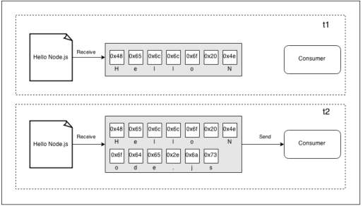
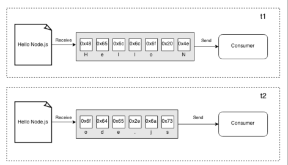
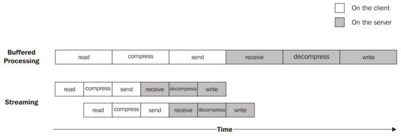

# 认识流的重要性
在诸如Node.js这种基于事件的平台上，处理I/O最有效的方式是：输入一到达就处理，一产出便输出。
在这一节，我们将给出一个对于Node.js stream的基础和其作用做一个初始介绍。请记住，这只是一个概览，本节的后续部分将详细分析怎样使用并构建流。
## 缓冲和流
我们在本书中提到到过的几乎所有的异步API采用的都是*buffer*模式。对于一个输入操作来说，buffer模式使来自一个源的数据被收集到同一个buffer；当所有的资源都被读取到了，再把数据传递给回调函数。下图展示了这个模式：


在上图中，可以看到，在*t1*时刻，从数据源接收到了一部分数据，并将其保存到*buffer*。在*t2*时刻，接收到另外一个数据块，当接收到最后一个数据块之后，将完成读取操作，将所有*buffer*发送给消费者。

另一方面，流使我们可以一接收到从数据源来的数据就进行处理。如下图所示：



上图展示了每片数据是怎样被接收到并立即提供给消费者，消费者有机会立即处理数据，无需等待所有的数据都被收集到*buffer*中。

但这两种方法有无区别呢？可以总结为两大类：

* 空间效率
* 时间效率

然而，Node.js流还有另外一大优势：可构造性。现在我们来看这些特性对于设计、开发应用会产生什么影响。

## 空间效率
首先，流使我们可以完成无法通过一次缓存并处理的方法完成的功能。比如，考虑必须读取一个大文件的情况，就是说，数据量在几百兆甚至是达到GB。很明显，使用一个当完全读数据之后再返回的API并不是一个好办法。考虑并发读取几个这种文件，程序会耗尽内存。除此之外，在V8引擎下，buffer不能超过*0x3FFFFFFF*个字节（比1GB稍微小一点）。所以，可能在用尽物理内存之前达到天花板。

### 使用缓冲接口压缩
为举一个具体的例子，我们考虑构建一个用Gzip格式压缩文件的**命令行**应用。使用一个实现了buffer的API，比如下述用Node.js实现的程序（错误处理写的比较简单）：

```
var fs = require('fs');
var zlib = require('zlib');

var file = process.argv[2];

fs.readFile(file, function(err, buffer) {
  zlib.gzip(buffer, function(err, buffer) {
    fs.writeFile(file + '.gz', buffer, function(err) {
      console.log('File successfully compressed');
    });
  });
});
```
现在，把上面的代码放到一个名为*gzip.js*的文件中，用如下命令运行它：

```
node gzip <文件路径>
```
如果选择了一个足够的文件，比如一个超过1GB的文件，会收到一个友好的错误信息提示我们尝试读取的文件超过缓存的最大限制，如下：

```
RangeError: File size is greater than possible Buffer: 0x3FFFFFFF bytes
```
这正是我希望大家注意到的，这意味着我们正在使用错误的方法。

### 使用流压缩
修复我们的`gzip`应用并使其可以作用于大文件的方式是使用*streaming*API 。让我们看如何实现这个功能；用如下代码替换刚定义的那个模块：

```
var fs = require('fs');
var zlib = require('zlib');
var file = process.argv[2];

fs.createReadStream(file)
  .pipe(zlib.createGzip())
  .pipe(fs.createWriteStream(file + '.gz'))
  .on('finish', function() {
    console.log('File successfully compressed');
  });
```

就上面这些内容吗？你可能会问这个问题。答案是肯定的，流因其接口和**可构造性**而变得非常有意思，它因此可以构造出干净、优雅并且精巧的代码。等会将会更详细地领会到它这方面的优点，但现在重要的事情是领略到程序可以在任意文件大小的情况下，合理地使用固定大小的内存。你可以自己尝试一下（但是要考虑到，压缩一个大文件会花一定的时间）。
## 时间效率
现在假想这样一个场景：一个应用压缩文件并把它上传到远程服务器，远程服务器将其解压缩并保存到文件系统。如果客户端使用buffer型的API来实现，当所有的文件被读取并且压缩之后才会开始上传。换句话说，当所有的数据被接收到之后，服务器端的解压缩才会开始。达到相同目的的更好的解决方案是使用流。在客户端机器上，流使我们可以一从文件系统中读取到数据块就压缩并发送，与此同时，在服务器端，可以一从远端接收到数据就进行解压缩操作。可以通过构建实现前面思路的应用，先从服务器端开始。

创建一个模块，名字叫做`gzipReceive.js`，代码如下：

```
var http = require('http');
var fs = require('fs');
var zlib = require('zlib');

var server = http.createServer(function (req, res) {
  var filename = req.headers.filename;
  console.log('File request received: ' + filename);
  req
    .pipe(zlib.createGunzip())
    .pipe(fs.createWriteStream(filename))
    .on('finish', function() {
      res.writeHead(201, {'Content-Type': 'text/plain'});
      res.end('That\'s it\n');
      console.log('File saved: ' + filename);
    });
});

server.listen(3000, function () {
  console.log('Listening');
});
```

服务器从网络接收数据，一接收到就解压并保存到文件，能实现这个功能多亏了Node.js 流。
客户端程序会写在一个名叫`gzipSend.js`的文件中，代码如下：

```
var fs = require('fs');
var zlib = require('zlib');
var http = require('http');
var path = require('path');
var file = process.argv[2];
var server = process.argv[3];

var options = {
  hostname: server,
  port: 3000,
  path: '/',
  method: 'PUT', 
  headers: {
    filename: path.basename(file),
    'Content-Type': 'application/octet-stream' ,
    'Content-Encoding': 'gzip'
  }
};

var req = http.request(options, function(res) {
  console.log('Server response: ' + res.statusCode);
});

fs.createReadStream(file)
  .pipe(zlib.createGzip())
  .pipe(req)
  .on('finish', function() {
    console.log('File successfully sent');
  });
```
在前面的代码中，我们再次用到了流来从文件读取数据，一旦读取到就将其压缩并发送。

现在，体验一下这个应用，首先用如下命令启动服务器：

```
node gzipReceive
```

然后，启动客户端程序，指定要发送的文件和服务器地址，命令如下：

```
ndoe gzipSend <文件路径> localhost
```
如果选取一个足够大的文件，我们将会清晰地看到数据是怎样从客户端流到服务器端的。但为什么用这个模式传输数据比使用buffer类型的模式更高效呢？下图给出了答案：



处理文件时，需要经历以下几个步骤：

1. [客户端] 从文件系统读取数据。
2. [客户端] 压缩数据
3. [客户端] 数据发送到服务器
4. [服务端] 从客户端接收数据
5. [服务端] 解压数据
6. [服务端] 将数据写入磁盘

为完成处理，我们需要按照顺序从头到尾地经历生产线般的每个步骤。为压缩数据，我们需要等着所有的数据都被读取出来，为了发送数据，要等着所有的数据都被读取并压缩，以此类推。
相反，当使用流时，当收到第一份数据时，生产线就被启动了，无需等待整个文件读取完毕。更令人惊喜的是，当下一份数据读取完毕之后，无需等待前一份数据处理完；相反，会启动另一个并行的生产线。这个过程可以完美地运行，因为每个任务都是异步地执行的，所以可以使用Node.js并行处理。唯一的限制是每个块接收的顺序需要被保存起来（Node.js负责帮我们搞定这件事情）。

正如从前面图中看到的一样，使用流的结果是整个过程花了更少的时间，因为免去了等待所有的数据被一次性读取并处理的时间。
## 可构造性
前面的代码已经大致展示了流的可构造性，多亏了`pipe()`方法，它使我们可以连接不同的处理单元，每个以Node.js特有的风格负责一个功能。正是因为流拥有统一的接口，使每个单元可以相互理解，这才为实现上述功能提供了可能性。唯一的要求就是流水线中的下一环节需要支持前面的一个环节产生的数据类型，可以是字节流、字符、设置是对象，这些内容后续章节会讲述。

为了展示这一特性的作用，我们可以尝试给前面构造的`gzipReceive/gzipSend`应用增加一个加密层。

为了实现这个功能，只需给流水线增加另一个流程。准确地说，即为被`crypto.createChipher()`返回的流。最终代码如下：

```
var crypto = require('crypto');
[...]
fs.createReadStream(file)
  .pipe(zlib.createGzip())
  .pipe(crypto.createCipher('aes192', 'a_shared_secret'))
  .pipe(req)
  .on('finish', function() {
    console.log('File succesfully sent');
  }); 
```

类似地，给服务器端代码增加解压前解密的功能：

```
var crypto = require('crypto');
[...]
var server = http.createServer(function (req, res) {
  [...]
  req
    .pipe(crypto.createDecipher('aes192', 'a_shared_secret'))
    .pipe(zlib.createGunzip())
    .pipe(fs.createWriteStream(filename))
    .on('finish', function() {
      [...]
    });
}); 
```

只需少许改动（只有几行代码），就给我们的程序增加了一个加密层；很简单地实现将其包含到已有的流程中，实现已有流程代码的复用。用类似地方式，我们可以增加或者并入其它的流，就像搭积木一样。

很明显，这种方法的主要优势在于可重用性。但通过已有的代码可以看出，流也可以使我们写出更加干净更加模块化的代码。基于这个原因，流通常不止用于处理纯I/O操作，也是简化、模块化代码的工具。

