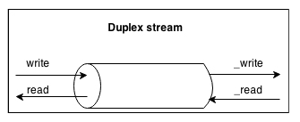
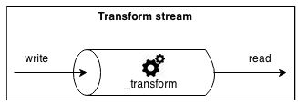

# 开始使用流
在前面一节，我们学到了流的作用非常大，除此之外，流从核心模块开始，遍布于整个Node.js。
比如，`fs`模块用 `createReadStream()` 来从文件读取，用`createWriteStream()`来写入文件，`http`请求和响应对象也是流，`zlib`使我们可以以流的方式来压缩、解压数据。

现在我们明白了为什么流如此重要，接下来从头开始，深入地探索流的内涵。
## 剖析流
在Node.js中，每种流都是下面四种抽象类型的一种实现，这四种类型都可以在`stream`核心模块中见到：

* `stream.Readable`
* `steam.Writable`
* `stream.Duplex`
* `stream.Transform`

每种流类型都是`EventEmitter`的一个实例。流可以产生许多种类型的事件，比如当`Readable`流读取完毕之后，会发出`end`事件，当出错时，会发出`error`事件。

> 需要注意的一点是，本章展示的例子中，会适当地进行错误处理。但是在实际生产中，在流上注册一个`error`监听事件。

流的弹性非常大的原因之一是它们不仅可以处理字节数据，而且可以更加实用地处理几乎任何JavaScript值；事实上，流可以支持两种类型的操作：

* **字节模式**：在这种模式下，数据会变成小块的流，比如缓存或者是字符串。
* **对象模式**： 在这种模式下，流数据是一列对象（这个对象可以是大部分的JavaScript值）。

这两种操作模式使我们可以不光在I/O中使用流，还可以把它作为以函数式风格构建处理单元的工具，本章后续部分会做出相应介绍。

> 在本章中，我们主要讨论为大家所熟知的版本2，它是在Node.js 0.10版引入的。如果想了解就版接口的细节，请参考Node.js的官方博客 http://blog.nodejs.org/2012/12/20/streams2 。
## 可读的流
可读流为数据的来源；在Node.js中，它基于`stream`模块中的`Readable`抽象类来实现。
### 从流读取
从`Readable`模式接收数据有两种方式：流式和非流式。
#### 非流式
从`Readable`流读取的默认模式是为表征新数据可读的事件`readable`绑定一个监听器。那么，在循环中，读取所有数据直到缓存清空。可以通过`read()`方法来实现，这个方法同步地从内部缓存读取数据并返回一个`Buffer` 或 `String`对象，表征一个数据块。`read()`函数的签名如下：

```
readable.read([size])
```
使用这种方法，数据可以简单地从流按需读取。

为展示其工作模式，我们创建一个新的模块叫做`readStein.js`，实现了一个从标准输入（一种`Readable`流），并把所有的内容都返回到标准输出：

```
process.stdin
  .on('readable', function() {
    var chunk;
    console.log('New data available');
    while((chunk = process.stdin.read()) !== null) {
      console.log(
        'Chunk read: (' + chunk.length + ') "' +
        chunk.toString() + '"'
      );
    }
  })
  .on('end', function() {
    process.stdout.write('End of stream');
  });
```
`read()`方法是一个同步操作，从`Readable`流拉取数据块。如果流以字节模式运行，返回的数据块默认是一个`Buffer`对象。

> 在一个以字节模式运行的`Readable`流中，可以通过调用流的`setEncoding(encoding)`改为读取字符串，并提供一个有效的编码格式（比如：`utf8`）。

数据只能在`readable`监听器中读取，当有新的数据可读时，监听器会被触发。如果在内部缓存中没有数据可读，`read()`方法将返回`null`；此时，只能等待另一个`readable`事件被触发，告诉我们可以再次读取；或者是在流的最后，等待触发`end`事件。当流以字节模式运行时，我们也可以通过给`read()`方法传递一个`size`参数来读取特定长度的数据。这在实现网络协议或者解析特定的数据格式时十分有用。

现在我们可以运行`readStdin`模块并进行实验。在控制台输入一些字符，按下回车键，观察返回到标准输出的结果。为了在结束流并且生成一个优雅的`end`事件，我们需要插入一个`EOF`（文件结束符）（Windows使用*Ctrl+Z*，Linux使用*Ctrl+D*）。

也可以尝试把我们的程序和其他进程连接起来；使用管道操作符(|)，它会把一个程序的标准输出传递给下一个。比如，可以运行如下命令：

```
cat <文件路径> | node readStdin
```
这个例子有力地说明了流模式是一个通用的接口，它使我们的程序可以和别的预言通信。
#### 流式
从流读取的另一个方法是给它附加一个`data`事件；这将会把流转换为`流`模式，数据不再由`read()`拉取，而是一有数据，就被推送到`data`监听器上。比如，使用流模式后，前面的`readStdin`应用将代码如下：

```
process.stdin
  .on('data', function(chunk) {
    console.log('New data available');
    console.log(
      'Chunk read: (' + chunk.length + ')" ' +
      chunk.toString() + '"'
    );
  })
  .on('end', function() {
    process.stdout.write('End of stream');
  });
```
流模式继承了旧版的`steam`接口（也被称为*Streams1*），对数据处理的灵活性比较差。*Streams2*接口引入之后，流模式不再是默认的工作模式；为了开启流模式，可以给`data`事件附加一个监听器或者是直接触发`resume()`方法。为了暂时阻止流触发`data`事件，我们可以使用`pause()`方法，它会使所有进入的数据都被缓存在内部缓存中。

> 调用 `pause()`不会导致流返回非流模式。

### 实现可读流
既然我们知道了如何从流读取，下一步就是学习如何实现一个新的`Readable`流。为了实现这个目标，有必要创建一个继承自`steam.Readable`原型的类。具体的类实现中，必须提供`_read()`方法，它的签名如下：

```
readable._read(size)
```
在`Readable`类内部会调用`_read()`方法，它会使用`push()`依次填充内部缓冲区：

```
readable.push(chunk)
```
> 请牢记，`read()`是一个被流消费者调用的方法，而`_read()`是一个被流的子类实现的方法，无需直接调用。下划线通常表示这个方法不是公开的，无需直接调用。

为展示如何实现新的`Readable`流，我们可以实现一个生成随机字符串的流。创建一个叫做`randomStream.js`的模块，它将包含字符串生成器的代码。文件最上面，引入依赖：

```
var stream = require('stream');
var util = require('util');
var chance = require('chance').Chance();
```
没什么特别的，除了加载了一个叫做`chance`（ https://npmjs.org/package/chance ）的模块，它是一个可以生成任意种类的随机值的库，范围涵盖数字、字符串再到整个句子。

下一步是创建一个新的类叫做`RandomStream`，它指定了`stream.Readable`作为其父类：

```
function RandomStream(options) {
  stream.Readable.call(this, options);
}
util.inherits(RandomStream, stream.Readable);
```
在前面的代码中，调用父类的构造器来实现它的初始状态，传递`options`参数作为输入条件。通过`options`传入的参数如下：

* `encoding`参数用于把`Buffers`转换为`Strings`，其默认值是`null`。
* 一个开启对象模式的标识（`objectMode`默认为`false`）。
* 存储在内部缓冲区中的数据量上限。超过这个限制之后，无法继续从源读取数据（`highWaterMark`默认值是16KB）。

现在，既然新的`RandomStream`构造器已经完成了，接下来可以实现`_read()`方法了：

```
RandomStream.prototype._read = function(size) {
  var chunk = chance.string();         //[1]
  console.log('Pushing chunk of size:' + chunk.length);
  this.push(chunk, 'utf8');           //[2]
  if(chance.bool({likelihood: 5})) {       //[3]
    this.push(null);
  }
}
module.exports = RandomStream;
```
以下为对上述方法的解释：

1. 该方法使用`chance`生成一个随机字符串。
2. 将字符串推送到内部读取缓冲区。需要注意，既然推送的是字符串，指定编码格式的`utf8`(如果数据块只是一个字节`Buffer`对象，这样做是没意义的)。
3. 以5%的可能性随机地终止流，通过推送`null`到内部缓冲区来表示`EOF`的情况，换句话说，即为流的终结。

你也会发现，给到`_read()`的`size`参数被忽略了，因为这只是一个推荐的参数。我们可以简单地推送所有的数据，但如果要在同一次触发时推送多次，我们需要检查`push()`是否返回了`false`，这意味着内部缓冲区达到了上限`highWaterMark`，必须要停止向它增加更多的数据。

上面都是关于`RandomStream`的讨论；现在还没准备好调用它。现在创建一个新的模块`generateRandom.js`，在这里实例化一个新的`RandomStream`对象，并从中拉取数据：

```
var RandomStream = require('./randomStream');
var randomStream = new RandomStream();
randomStream.on('readable', function() {
  var chunk;
  while((chunk = randomStream.read()) !== null) {
    console.log("Chunk received: " + chunk.toString());
  }
});
```
现在可以尝试一下心得自定义流了。简单地执行`generateRandom`模块，看屏幕上输出的一组随机字符串。
## 可写流
可写流指的是数据的目的地；在Node.js中，它使用`stream`模块中 `Writable`抽象类。
### 写入流
把数据推送到一个可写流非常直接；只需使用`write()`方法，其签名如下：

```
writable.write(chunk, [encoding], [callback])
```
`encoding`参数是可选的，如果`thunk`是`String`类型时可以指定，默认值是`utf8`，如果`thunk`是buffer类型，会被忽略；当数据块被写入了底层的数据源，`callback`会被触发，同时它也是可选的。

为了表征不会再有数据写入到流，我们需要使用`end()`方法：

```
writable.end([chunk], [encoding], [callback]);
```
可以通过`end()`方法来提供最后一块数据；这样一来，`callback`函数等同于给`finish`事件注册的监听器，它会在所有的数据都写入到底层数据源之后才被触发。

现在，我将创建一个小型的产生随机字符串的HTTP服务器来展示其工作模式：

```
var chance = require('chance').Chance();
require('http').createServer(function (req, res) {
  res.writeHead(200, {'Content-Type': 'text/plain'});   //[1]
  while(chance.bool({likelihood: 95})) {       //[2]
    res.write(chance.string() + '\n');         //[3]
  }
  res.end('\nThe end...\n');           //[4]
  res.on('finish', function() {            //[5]
    console.log('All data was sent');
  });
}).listen(8080, function () {
  console.log('Listening');
});
```
我们创建的HTTP服务器会写入到`res`对象，它同时是`http.ServerResponse`和`Writable`流的实例。下面解释了其工作机制：

1. 首先，我们写HTTP响应的头。注意，`writeHead()`不是`Writable`接口的一部分；事实上，它是`http.ServerResponse`类暴露的附属方法。
2. 启动一个循环，它有5%的可能性终止（其逻辑实现为`chance.bool()`有95%的可能性返回`true`）。
3. 在循环中，将一个随机的字符串写入流。
4. 在循环的最后，调用流的 `end()`方法，表明不会再有别的数据写入。与此同时，我们提供了结束前的最后一个字符串。
5. 最终，为`finish`事件注册一个监听器，当所有的数据都被写入到网络接口中后会被触发。

可以调用这个小模块，`entropyServer.js`并执行它。为了测试服务器，我们可以在浏览器中打开`http://localhost:8080`，或使用`curl`执行如下命令：

```
curl localhost:8080
```
现在，服务器会开始给客户端发送随机的字符串（请记住，有些浏览器可能会缓存数据，流的行为可能不太明显）。

> 有趣的是，`http.ServerResponse`实际上是旧的`Stream`（ https://nodejs.org/docs/v0.8.0/api/stream.html ）类的实例。这一点需要特别说明，尽管这并不会影响我们的例子，因为可写流方面的接口和行为与新的`stream.Writable`类类似。
### 限压
和真实管道系统中的流体一样，Node.js流也会遇到瓶颈，即数据写入的速度大于消费速度。解决这个问题的机制是包括缓存进入的数据；然而，如果流没给写入者任何反馈，将会导致越来越多的数据积累在内部缓冲区中，导致内存溢出。

为防止这种情况的发生，当缓存超过了`highWaterMark` 的限制，`writable.write()`将会返回`false`。可写流有一个`highWaterMark`属性，它表示内部缓冲区的大小。当超过这个数值后，`write()`方法开始返回`false`，指示应用此时应该停止写入。当缓存被清空后，会触发`drain`事件，告知限制可以安全地开始写入了。这个机制叫做**限压**。

> 本节描述的机制可以相应地应用于`Readable`流。事实上，限压也存在于`Readable`流中，它在`_read()`中的`push()`函数返回`false`时被触发。然而，这个问题是针对流的实现者的，我们不太经常处理这种问题。

我们可以快速地演示如何将`Writable`流的限压考虑在内，修改之前实现的`entropyServer`模块代码如下：

```
var chance = require('chance').Chance();

require('http').createServer(function (req, res) {
  res.writeHead(200, {'Content-Type': 'text/plain'});
  
  function generateMore() {             //[1]
    while(chance.bool({likelihood: 95})) {       
      var shouldContinue = res.write(
        chance.string({length: (16 * 1024) – 1}) //[2]
      );
      if(!shouldContinue) {             //[3]
        console.log('Backpressure');
        return res.once('drain', generateMore);
      }
    }
    res.end('\nThe end...\n', function() {
      console.log('All data was sent');
    });
  }
  generateMore();
}).listen(8080, function () {
  console.log('Listening');
});
```
前面代码中最重要的步骤总结如下：

1. 我们把主要逻辑包含进了`generateMore()`函数。
2. 为了增加触发限压的几率，我们把数据块大小增加到了16KB-1Byte，这个数值非常接近默认的`highWaterMark`限制。
3. 写入一块代码后，我们检查`res.write()`的返回值；如果接收到`false`，意味着内部缓冲区已经满了，我们需要停止发送更多的数据。这种情况下，我们从函数中退出，在`drain`事件发生时，注册新一轮的写入。

如果现在试着运行服务，然后通过`curl`请求，将很有可能发生限压的情况，因为就服务器以极高的频率产生数据，超过了网络接口的处理能力。

### 实现可写流
我们可以通过继承`stream.Writable`并实现`_write()`来实现一个新的`Writable`流。让我们立即着手实现，同时讨论起细节。

我们将构建一个`Writable`流，接收如下格式的对象：

```
{
  path: <文件路径>,
  content: <字符串或者缓存>
}
```
对于每一个这种对象，我们的流需要创建路径为`path`的文件并保存`content`到文件中。我们可以立即发现流的输入是对象；这意味着我们的流必须以对象模式工作。

将这个要创建的模块命名为`toFileStream.js`，同时，作为第一步，首先加载所有需要用到的依赖：

```
var stream = require('stream');
var fs = require('fs');
var util = require('util');
var path = require('path');
var mkdirp = require('mkdirp');
```
接下来，我们为新的流创建构造函数，它继承与`stream.Writable`的原型：

```
function ToFileStream() {
  stream.Writable.call(this, {objectMode: true});
};
util.inherits(ToFileStream, stream.Writable);
```
接下来，我们必须触发父类的构造函数来初始化其内部状态；同时提供一个`options`对象来指明流以对象模式运行（`objectMode: true`）。`stream.Writable`接收的其它选线如下：

* `highWaterMark`（默认是16KB）：控制压力上限。
* `decodeStrings`（默认为`true`）: 它开启在把数据传递给`_write()`方法之前，自动解码字符串为字节流。在对象模式中，这个选项会被忽略。

最后，我们需要实现`_write()`方法：

```
ToFileStream.prototype._write = function(chunk, encoding, callback) {
  var self = this;
  mkdirp(path.dirname(chunk.path), function(err) {
    if(err) {
      return callback(err);
    }
    fs.writeFile(chunk.path, chunk.content, callback);
  });
}
module.exports = ToFileStream;
```
现在正好可以分析`_write()`方法的签名。如你所见，这个方法接收一个数据块，一个`encoding`（这个参数值在字节模式才有意义，同时流的`decodeStrings`选项被设置为`false`）。同样的，该方法接收一个`callback`函数，在操作完成时会被触发；没必要传递操作的结果，如果有需要的话，我们可以把错误传递进去，这将导致流产生`error`事件。

现在，尝试使用我们刚构建的流，创建一个新的模块，叫做`writeToFile.js`，对流执行一些写操作：

```
var ToFileStream = require('./toFileStream');
var tfs = new ToFileStream();
tfs.write({path: "file1.txt", content: "Hello"});
tfs.write({path: "file2.txt", content: "Node.js"});
tfs.write({path: "file3.txt", content: "Streams"});
tfs.end(function() {
  console.log("All files created");
});
```
这样，我们创建并使用了第一个定制的`Writable`流。运行这个新的模块并检查其输出。
## 双向流
`Duplex`流是指同时具备`Readable`和`Writable`流特性的一种流。它对于实现一个实体，它既是数据源也是数据的目的地，比如网络接口 时非常有用。`Duplex`同时继承了`stream.Readable`和`stream.Writable`，所以它对于我们来说没什么新东西。这意味着我们可以`read()`或者`write()`数据，或者同时监听`readable`和`drain`事件。

为创建一个自定义的`Duplex`流，我们需要同时实现`_read()`和`_write()`；传递给`Duplex`的配置对象将会在内部同时指向`Readable`和`Writable`构造函数。这些选项和我们在前面章节讨论过的一样，补充一个新的选项叫做`allowHalfOpen`（默认为`true`），如果将这个选项设置为`false`，将会导致一旦有一部分关闭，另外一部分也会随之关闭。

> 为了使`Duplex`流一边以对象模式工作，另一边以字节模式工作，我们需要在构造函数内部手动地设置如下属性：`this._writableState.objectMode`、`this._readableState.objectMode`。

## 流的转换
`Transform`流是一种特殊类型的`Duplex`流，他们是为处理数据转换特殊设计的。

在一个简单的`Duplex`流中，在数据读取和数据写入之间没有直接联系（至少流的实现对于这种关系是未知的）。想象一下TCP接口的应用场景，只是在远程的节点间发送和接收数据；接口本身不负责输入和输出之间的关系。下图描述了`Duplex`的数据流：



在另一种情况下，`Transform`流对从`Writable`一方获取到的每一块数据应用一些转换，并使转换后的数据在`Readable`一方可以读取到。下图展示了在`Transform`流中数据是怎样流动的：



从外表看来，`Transform`的接口和`Duplex`流的接口类似。然而，在实现`Duplex`接口的时候，需要提供`_read()`、`_write()`方法，然而要实现一个新的`Transform`流，我们必须填充另外两个方法：`_transform()`和`_flush()`。

下面举例说明怎样创建一个新的  `Transform`。
### 实现流的转换
让我们来实现一个`Transform`流，它的作用是替换所有给定的字符串。为了实现这个，功能，我们需要创建一个新的模块，叫做`replaceStream.js`。和往常一样，我们从它的依赖、创建构造函数、拓展父流类的原型开始。

```
var stream = require('stream');
var util = require('util');

function ReplaceStream(searchString, replaceString) {
  stream.Transform.call(this, {decodeStrings: false});
  this.searchString = searchString;
  this.replaceString = replaceString;
  this.tailPiece = '';
}
util.inherits(ReplaceStream, stream.Transform);
```
我们假设这个流只处理文字，所以初始化父构造函数的同时，设置`decodeStrings`选项为`false`；这使我们可以在`_transform()`方法中接收字符串而不是缓存。

现在，实现`_transform()`函数本身：

```
ReplaceStream.prototype._transform = function(chunk, encoding,
    callback) {
  var pieces = (this.tailPiece + chunk)         //[1]
    .split(this.searchString);
  var lastPiece = pieces[pieces.length - 1];
  var tailPieceLen = this.searchString.length - 1;
 
  this.tailPiece = lastPiece.slice(-tailPieceLen);     //[2]
  pieces[pieces.length - 1] = lastPiece.slice(0, -tailPieceLen);
  
  this.push(pieces.join(this.replaceString));       //[3]
  callback();
}
```
`_transform()`方法和`Writable`流中的`_write()`方法有一样的签名，但是他不是把数据写入底层数据源，而是用`this.push()`把数据推送到内部缓冲区，和`Readable`流中的`_read()`方法做的是一样的工作。这样就讲清了`Transform`流的两端是怎样工作的。

`ReplaceStream`的`_transform()`方法实现了核心算法。在缓存中搜索并替换某个字符串是一项简单的工作；然而，当数据是流式的，可能的匹配项可能被分布到不同的数据块时，就大不相同了。上述代码中的各个步骤解释如下：

1. 使用`searchString`函数作为分割器。
2. 然后，取出数组的最后一个元素，然后抽离最后`searchString.length-1`个字符。其结果被保存到`tailPiece`变量中，这个变量会附加到另一块数据之前。
3. 最后，被`split()`分割的各个部分用`replaceString`连接起来，并推送到内部缓冲区中。

当流结束的时候，我们还有`tailPiece`变量没被推送到内部缓冲区。`_flush()`就是用来处理这种情况的；它会在流结束前被触发，这是最后一次结束流或者推送剩余数据的机会。接下来实现这一部分逻辑：

```
ReplaceStream.prototype._flush = function(callback) {
  this.push(this.tailPiece);
  callback();
}
module.exports = ReplaceStream;
```
`_flush()`方法只接收一个`callback`最为参数，我们需要确保当所有操作都完成时这个`callback`被触发，这样才能终止流。加上这个方法，我们就完成了`ReplaceStream`的实现。

现在，可以尝试使用一下心的流了。可以创建一个心的模块叫做`replaceStreamTest.js`，写入一些数据然后读取结果：

```
var ReplaceStream = require('./replaceStream');

var rs = new ReplaceStream('World', 'Node.js');
rs.on('data', function(chunk) {
  console.log(chunk);
});

rs.write('Hello W');
rs.write('orld!');
rs.end();
```
为了凸显流的实力，我们把搜索项（这里是`World`）分到不同的块中；然后使用流模式来从同一个流读取，打印每个被转换后的数据块。运行上面的程序得到的输出如下：

```
Hel
lo Node.js
!
```

> 还有第五种类型的流值得一提：`stream.PassThrough`。不像前面提到的其他流类型，`PassThrough`不是抽象的并且可以直接实例化，而无需实现任何方法。事实上，这是一个无需进行的任何转换操作的`Transform`流。
## 使用管道连接流
Unix管道的概念是被Douglas Mcllroy 发明的；这使得一个程序的输出被连接到下一个程序的输入。看下面的命令：

```
echo Hello World! | sed s/World/Node.js/g
```
在前面的命令中，`echo`会打印出`Hello World!`到标准输出，它会被转到`sed`的标准输入（多亏了管道`|`操作符）；然后`sed`会把`World`替换为`Node.js`，然后把结果打印为标准输出（标准输出在这里为控制台）。

类似地，Node.js的流可以使用`Readable`流的`pipe()`方法连接起来，接口如下：

```
readable.pipe(writable, [options])
```
直觉上讲，`pipe()`方法接收从`readable`流返回的数据，然后把它压入到提供的`writable`流。同时，当`writable`流释放`end`事件后，`writable`流自动终止（除非将选项中的`end`指定为`false`）。`pipe()`方法返回`writable`流，作为一个参数传入，使我们可以创建链式的触发，前提是这个流也是`Readable`的（比如`Duplex`或`Transform`流）。

引两种流到一起将会产生一种吸力，使数据自动流入`writable`流，所以无需调用`read()`或者`write()`方法；但最为重要的是，无需再控制超压，因为已经有机制处理这个问题。

快速地举一个例子（有很多例子可以举），我们可以创建一个新的模块 `replace.js`，它会接受一个字符串流作为标准输入，应用替换转换，然后把数据推送到标准输出：

```
var ReplaceStream = require('./replaceStream');
process.stdin
  .pipe(new ReplaceStream(process.argv[2], process.argv[3]))
  .pipe(process.stdout);
```
前面的程序把来自标准输入的数据传入`ReplaceStream`，然后向后传递到标准输出。现在，试着使用这个小应用，我们可以使用Unix管道把数据导入到其标准输入，如下面的例子所示：

```
echo Hello World! | node replace World Node.js
```
这将会产生如下输出：

```
Hello Node.js
```
这个简单的例子展示了流（尤其是文字流）是通用的接口，管道是组合并连接这些神奇接口的方式。

> `error`方法并不会自动地在管线上传递。以下面这段代码为例：
```
stream1
  .pipe(stream2)
  .on('error', function() {});
```
> 在前面的管线中，只会捕捉到来自`stream2`的错误，即放置事件监听器的那一个。这意味着，如果想捕捉来自于`stream1`的任何错误，我们需要在它之上直接添加监听器。后面章节我们将会看到一种可以缓解这种不便的模式（将流组合起来）。同样，我们应该知道，如果目标流发生了错误，它会从源流断开管道，将会导致管线阻断。

## 有用的包
接下来介绍几个用于处理流的`npm`包。
### 可读流
我们已经提过Node.js的0.8和0.10版本的流接口上的变化。0.8以前的旧版本叫做**Streams1**，然而Node.js 0.10支持的新版本的接口叫做**Streams2**。核心团队做了很多工作保持向后兼容性，所以基于Streams接口构建的应用在0.10版本也依旧可用；然而相反的情况下就不好说了，所以在Node.js 0.8版本上使用Streams2是不可行的。同样的，将要发布的0.12可能会展示一个新版本的流接口，**Streams3**，可能还有其他版本，使接口趋于稳定。

> 流接口在0.10版本在官方文档中依旧被标记为不稳定。

幸运的是，有一种方法可以屏蔽这些变化；叫做`readable-stream`( https://www.npmjs.com/package/readable-stream )，一个`npm`包，它包含了Node.js核心代码中对于Streams2和Streams3的实现。尤其是，使用1.0版本的可读流的时候，我们可以使用Streams2的接口，即便是运行在0.8版本上。如果我们选择1.1版本（也可能是Node.js 0.12版包含的1.2版本），我们可以使用Streams3版本，而无需考虑使用的Node.js平台。

`readable-stream`是对核心`stream`模块的替换（基于其版本），所以要使用它只需引入`readable-stream`而不是`stream`：

```
var stream = require('readable-stream');
var Readable = stream.Readable;
var Writable = stream.Writable;
var Duplex = stream.Duplex;
var Transform = stream.Transform;
```
保护我们的应用和库免受不稳定的流接口变化的影响，可以极大地减少平台不兼容带来的缺陷。

> 对于`readable-stream`的详细使用可以参考Rod Vagg写的这篇文章： [文章已经找不到了]。
### through 和 from
我们至今为止创建自定义流的方式并没有真正地遵循Node方式；事实上，继承基本流类型违反了最小界面原则并且需要一些重复代码。这并不意味着流设计的不好；事实上，我们应该明白，既然它们是Node.js核心代码的一部分，它们必须保证有足够大的弹性，使用户端可以出于更多目的而进行拓展。

然而，大部分情况下，我们不需要原型继承给予的所有能力和拓展性，我们通常想要的只是一个快速并且简名的方式来定义新的流。Node.js社区也为他提供了解决方案。一个完美的例子是`through2`( https://www.npmjs.com/package/through2 ) ，这是一个简化`Transform`流创建的库。使用`through2`,我们可以通过触发一个简单的函数来创建一个新的`Transform`流：

```
var transform = through2([options], [_transform], [_flush])
```
类似地，可以使用诸如以下代码基于`from2`( https://www.npmjs.com/package/from2 )创建一个`Readable`流：

```
var readable = from2([options], _read)
```
使用这个库的优势在于可以很早就清楚地展示其用途。

> `through`和`from`是构建在Streams1上的原始包。