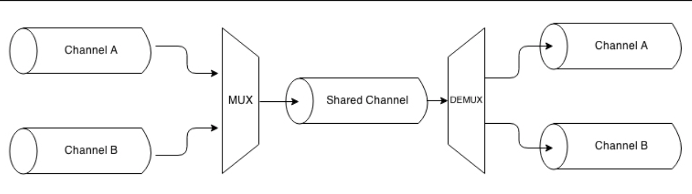
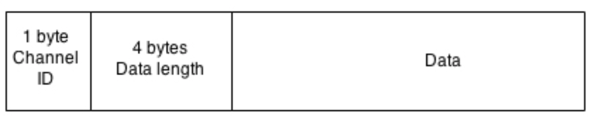

# 管道模式
和现实中的管流一样，Node.js流可以从基于不同模式的流合并而来；我们可以把两个不同的流合并成一个，把一个流分到两个或两个以上的管道，或者基于某个条件将流转发。在本章中，我们将要探索可以用于Node.js流的重要的*管流*技术。

## 组合流
在这一章，我们讲了很多关于流提供的简洁的基础框架，使我们可以模块化并且可以重用代码，但是还有一块没搞清楚的是：如果我们想模块化并重用整个管线呢？如果我们想把多个流合并成看起来像是一个呢？下图展示了这个功能：


从上图可以看出，我们可以发现一些实现这个功能的线索：

* 当写入一个合并的流，我们实际上是写入管线的第一个流。
* 当从合并的流读取时，我们实际上是从管线的最后一个流读取。

一个合并的流实际上是一个`Duplex`流，它把第一个流关联到自己的`Writable`一端，把最后一个流关联到其`Readable`一端。

> 想要由两个不同的流创建一个`Duplex`流，即一个`Writable`和一个`Readable`，我们可以使用`npm`模块，如`duplexer2`( https://www.npmjs.com/package/duplexer2 )

但这还不够；事实上，合并流的另外一个重要的特性是它必须捕获管线中任意一段发出的所有的错误。如我们前面提到过的，任何`error`事件都不会自动传递到管线的下一段；因此，如果我们想（应该）进行恰如其分的错误管理的话，我们需要显式地给每一段流添加一个错误监听器。然而，如果合并的流是一个黑盒，这意味着我们对管线中间的流没有访问权限；因此，对合并流来说，一个重要的功能是作为从管线中任意流中发出的所有错误的聚合器。
总结一下，一个合并流有两个主要的优势：

* 我们可以把它重新发布为一个黑盒，隐藏内部的管线。
* 我们有了一个简化的错误管理，因此无需给管线中的每一段流都附加一个错误监听器，只需给合并流附加一个即可。

合并流是一个非常通用并且常见的实践，在没有什么特殊需求的前提下，只是想重用某个已有的解决方案，如`multipipe` （ https://www.npmjs.com/package/multipipe ）或者是`conbine-stream`（ https://www.npmjs.com/package/combine-stream ），先简单地举两个例子。

### 实现一个组合流
举一个简单的例子，考虑如下两个转换流：

* 一个压缩并加密数据
* 一个解压并解密数据

使用诸如`multipipe`的库，我们可以容易地通过合并一些从核心模块已经有的流构建这种简单的流（文件`combineStreams.js`）：

```
var zlib = require('zlib');
var crypto = require('crypto');
var combine = require('multipipe');
var fs = require('fs');

module.exports.compressAndEncrypt = function (password) {
  return combine(
    zlib.createGzip(),
    crypto.createCipher('aes192', password)
  );
}

module.exports.decryptAndDecompress = function (password) {
  return combine(
    crypto.createDecipher('aes192', password),
    zlib.createGunzip()
  );
}

```
现在我们可以使用这些合并流了，把他们当成是一个黑盒，比如，创建一个小应用，归档一个文件，压缩并将其加密。创建一个叫做`archive.js`的模块：

```
var fs = require('fs');
var compressAndEncryptStream =
    require('./combinedStreams').compressAndEncrypt;

fs.createReadStream(process.argv[3])
  .pipe(compressAndEncryptStream(process.argv[2]))
  .pipe(fs.createWriteStream(process.argv[3] + ".gz.enc"));

```
我们可以进一步提升前面的代码，基于我们刚创建的管线来创建一个一个新的合并管线，这次不是为了获得一个可重用的黑盒，而只是利用其聚合错误管理的优点。事实上，正如我们已经提到过多次的，下面的代码只会捕获最后一段流发出的错误：

```
fs.createReadStream(process.argv[3])
  .pipe(compressAndEncryptStream(process.argv[2]))
  .pipe(fs.createWriteStream(process.argv[3] + ".gz.enc"))
  .on('error', function(err) {
    //Only errors from the last stream
    console.log(err);
  }); 
```
然而，通过合并所有的流到一起，我们可以优雅地修复这个问题。我们接下来重写`archive.js`文件如下：

```
var combine = require('multipipe');
var fs = require('fs');
var compressAndEncryptStream =
    require('./combinedStreams').compressAndEncrypt;
    
combine(
  fs.createReadStream(process.argv[3]),
  compressAndEncryptStream(process.argv[2]),
  fs.createWriteStream(process.argv[3] + ".gz.aes")
).on('error', function(err) {
  //this error may come from any stream in the pipeline
  console.log(err);
}); 

```
如我们所见，我们可以直接给组合流附加一个错误监听器，它会接收到任何内部流发出的任何`error`事件。
现在，要运行`archive`模块，只需在命令行参数中指定一个密码和一个文件即可：

```
node archive mypassword /path/to/a/file.txt
```
通过这个例子，我们已经非常清楚地展示了组合流的重要性；从一个方面来讲，它使我们可以创建一个可重用的流部件并且从另一个方面来讲，它简化了管线的错误管理。

## 分流
我们可以通过把一个`Readable`导入到多个`Writable`流的方式来运行一个流分支。当我们想把相同的数据发送到不同的目的地时非常有用，比如，两个不同的网络接口或者两个不同的文件。当我们想对同一份数据进行不同的转换或者想基于某些标准来分割数据。下图给出了这种模式的图像表示：


将流分支在Node.js中是一个简单的情况；让我们举个例子来说明这一点。

### 实现一个多校验和的生成器
创建一个小工具，可以同时输出给定文件的`sha1`和`md5`哈希值。我们把这个模块称为`generateHashes.js`，让我们从实例化检验和流开始：

```
var fs = require('fs');
var crypto = require('crypto');

var sha1Stream = crypto.createHash('sha1');
sha1Stream.setEncoding('base64');

var md5Stream = crypto.createHash('md5');
md5Stream.setEncoding('base64');
```
到此为止，没什么特别的；模块的下一部分，我们从一个文件创建一个`Readable`流，为了获得两个另外的文件，把它分成两个的流。两个文件分别包含`sha1`哈希和`md5`校验和。

```
var inputFile = process.argv[2];
var inputStream = fs.createReadStream(inputFile);

inputStream
  .pipe(sha1Stream)
  .pipe(fs.createWriteStream(inputFile + '.sha1'));
  
inputStream
  .pipe(md5Stream)
  .pipe(fs.createWriteStream(inputFile + '.md5'));
```
是不是非常简单？`inputStream`变量在一侧被导入到`sha1Stream`，在另外一侧被导入`md5Stream`。需要注意某些点，虽然这些点发生在幕后：

* 当`inputStream`终止时，`md5Stream`和`sha1Stream`都会自动终止。除非是当触发`pipe()`的时候指定选项`{end:false}`。
* 两股流会接收同样的数据块，所以在运行对数据有副作用的操作时我们必须非常小心，因为这种操作会影响分支的每一股流。
* 自带背压控制；`inputStream`的流量将会和最慢的一支保持一致。
## 合并流
合并流是分流的相反操作，是指把一组`Readable`流导入一个的`Writable`流，如下图所示：


把多个流合并进一个通常是一种简单的操作；然而，我们需要关注`end`事件的处理，因为管线使用自动结束的选项将会导致一旦一个源结束，目标流就会结束。这经常会导致错误发生，因为另一个活跃的源会继续写入到一个已经结束的流中。解决这个问题的方案是当导入多个来源到一个目标时，使用`{end:false}`选项，然后当所有的来源都结束写入之后再触发目标流的`end()`方法。
### 实现一个作用于多文件夹的tarball(打包工具)
为了举出一个简单的例子，我们实现一个小程序，基于两个不同文件夹的内容创建一个tarball。为了完成这个目标，我们引入两个新的`npm`包：

* *tar*（ https://www.npmjs.com/package/tar ）：用来创建tarball的流库。
* *fstream*（ https://www.npmjs.com/package/fstream ）：一个从文件系统中的文件来创建对象流的库。

我们的新模块叫做`mergeTar.js`；它的代码从一些初始化工作开始：

```
var tar = require('tar');
var fstream = require('fstream');
var path = require('path');

var destination = path.resolve(process.argv[2]);
var sourceA = path.resolve(process.argv[3]);
var sourceB = path.resolve(process.argv[4]);
```
在前面的代码中，我么加载了所有的依赖包并且初始化了代表目标文件名字的变量，还有两个源文件夹（`SourceA`和`SourceB`）。
接下来，我们创建压缩流并将其导入到目标位置：

```
var pack = tar.pack();
pack.pipe(fstream.Writer(destination));
```
现在，我们来初始化源流：

```
var endCount = 0;
function onEnd() {
  if(++endCount === 2) {
    pack.end();
  }
}

var sourceStreamA =
  fstream.Reader({type: "Directory", path: sourceA})
  .on('end', onEnd);
  
var sourceStreamB =
  fstream.Reader({type: "Directory", path: sourceB})
  .on('end', onEnd);
```
在前面的代码中，创建了从两个源文件夹读取数据的流（`sourceStreamA`和`sourceStreamB`）；然后，给每个源流附加一个`end`监听器。当两个文件夹都读取完毕之后，将会结束`pack`流。
最后，执行真正的合并：

```
sourceStreamA.pipe(pack, {end: false});
sourceStreamB.pipe(pack, {end: false});
```
我们把两个源都导入到了`pack`流中，并且通过在两次`pipe()`调用中，提供选项`{end: false}`把目标流的自动结束给禁用掉了。
通过这种方法，我们完成了简单的`tar`功能。我们可以通过如下方法进行尝试：

```
node mergeTar dest.tar /path/to/sourceA /path/to/sourceB 
```
在本节的最后，有必要提一下，在`npm`中，我们可以找到一些模块，可以直接拿来简化流的合并：

* `merge-stream`（ https://www.npmjs.com/package/merge-stream ）
* `multistream-merge`（ https://www.npmjs.com/package/multistream-merge ）

针对流合并模式再多说一点，导入到目标流的数据是随机混合的；这个特性对于某些类型的对象流（如最后一个例子所示）是可行的，但如果用这种方式来处理字节流的话，可能会带来意想不到的结果。
然而，这种模式有一个变体，是我们可以按顺序合并流；它一个接着一个地消费源流，当前一个结束后，下一个才会发出数据（就好像是把所有来源的输出连接到一起）。通常来说，在`npm`上，我们也可以找到处理这一类问题的包，其中之一便是`multistream`（ https://www.npmjs.com/package/multistream ）。
## 多路合并及多路分解
合并流模式有一个特殊的变体，即我们不想只是把多个流合并到一起，而是使用一个共享频道来出传输一组流的数据。这是一个完全不同的操作，因为即便在共享频道中，源流还是保持着逻辑上的独立，这样一来我们就可以实现：一旦数据到达共享频道的另外一头，还可以把流分开。下图清晰地阐释了这种情况：



把多个流合并到一起的操作（也叫做**频道**），使多个数据传输可以在同一个流上实现的技术叫做**多路合并**。相反的操作，即把从共享频道接收到的源流重新构造的技术叫做**多路分解**。执行这些操作的设备分别叫做**多路合并器**和**多路分解器**。在计算机科学和电信学科，这是研究很多的一个领域，这是任何种类的通讯媒介的基础，比如电话、无线电、电视以及因特网本身。这是一个很大的话题，不在本书的讨论范围内。
这这一节我们将展示如何使用Node.js共享流来传递多个逻辑上独立的流，然后在共享流的末端，再把他们分开。

### 创建远程日志收集器
我们接下来基于一个例子进行讨论。我们将建立一个小程序，它会启动一个子进程，并将其标准输出和标准错误都转发到一个远程服务器上，它会按次序将两个流依次保存到两个单独的文件中。因此，在这种情况下，共享媒介是TCP连接，将被多路合并的是子进程的`stdout`和`stderr`。我们将会使用一种叫做**包开关**，一些网路协议，诸如IP、TCP、UDP都采用了这种技术，即将数据放入包中，使我们可以指定多种元数据，用于多路分解，路由，控制流程，检查数据失败，等等。我们为这个例子实现的协议非常简单，我们只是把数据包装进拥有如下结构的包中：


如上图所示，该包裹包含了真正的数据，还有一个头（频道编号+数据长度），这样才能区分来自每个流的数据，使多路分解器可以将包裹发送到正确的频道中。

#### 客户端-多路传输
我们从客户端开始构建应用程序。包含诸多功能，我们将这个模块称之为`client.js`；这个模块负责启动一个子进程并合并其中的流。
因此，让我们从定义模块开始。首先，我们需要一些依赖：

```
var child_process = require('child_process');
var net = require('net');
var path = require('path');
```
然后，我们实现一个功能来执行合并一系列来源的功能：

```
function multiplexChannels(sources, destination) {
  var totalChannels = sources.length;
  for(var i = 0; i < sources.length; i++) {
    sources[i]
      .on('readable', function(i) {    //[1]
        var chunk;
        while((chunk = this.read()) !== null) {
          var outBuff = new Buffer(1 + 4 + chunk.length);  //[2]
          outBuff.writeUInt8(i, 0);       
          outBuff.writeUInt32BE(chunk.length, 1);
          chunk.copy(outBuff, 5);
          console.log('Sending packet to channel: ' + i);
          destination.write(outBuff);  //[3]
        }
      }.bind(sources[i], i))
      .on('end', function() {        //[4]
        if(--totalChannels === 0) {
          destination.end();
        }
      });
  }
}

```
`multiplexChannels()`函数接收将要被合并的流、目标频道作为输入，然后执行如下步骤：

1. 对于每个源流，为其注册一个`readable`事件监听器，使用无流程模式从流读取数据。
2. 当读取到一个数据块，我们把它包进一个邮包，依次包含：1字节（`UInt8`）代表频道编号，4字节（`UInt32BE`）代表包大小，然后是真实数据。
3. 当邮包构造结束，我们将其写入目标流。
4. 最后，我们注册一个`end`事件，当所有的源流都结束时结束目标流。

> 我们的协议可以将8个不同的源流合并，因为只有1位来标识频道。

现在，我们客户端的最后一部分变得非常简单：

```
var socket = net.connect(3000, function() {        //[1]
  var child = child_process.fork(     //[2]
    process.argv[2],
    process.argv.slice(3) ,
    {silent: true}
  );
  multiplexChannels([child.stdout, child.stderr], socket);  //[3]
});
```
在前面一个代码块中，我们做了如下操作：

1. 创建一个新的TCP客户端，连接到地址`localhost:3000`。
2. 通过第一个命令行参数作为路径，剩下的作为参数，启动子进程。指定`{slient:true}`作为选项，因此子进程不会继承父类的`stderr`和`stdout`。
3. 最后，将子进程的`stderr`和`stdout`使用`multiplexChannels()`合并入`socket`。

#### 服务器端-合并多路传输
现在，我们可以着手创建爱应用程序的服务器端了（`server.js`），在这里，我们将把来自远程连接的流解耦，并把他们导入到不同的文件中。让我们从创建一个叫做`demultiplexChannel()`的函数开始：

```
function demultiplexChannel(source, destinations) {
  var currentChannel = null;
  var currentLength = null;
  
  source
    .on('readable', function() {           //[1]
      var chunk;
      if(currentChannel === null) {          //[2]
        chunk = this.read(1);
        currentChannel = chunk && chunk.readUInt8(0);
      }
      
      if(currentLength === null) {          //[3]
        chunk = this.read(4);
        currentLength = chunk && chunk.readUInt32BE(0);
        if(currentLength === null) {
          return;
        }
      }
      
      chunk = this.read(currentLength);        //[4]
      if(chunk === null) {
        return;
      }
      console.log('Received packet from: ' + currentChannel);
      destinations[currentChannel].write(chunk);   //[5]
      currentChannel = null;
      currentLength = null;
    })
    
    .on('end', function() {            //[6]
      destinations.forEach(function(destination) {
        destination.end();
      });
      console.log('Source channel closed');
    });
}
```
前面这段代码可能看起来复杂，其实并不复杂；多亏了Node.js `Readable`流的拉取特性，我们可以很容易地实现我们的小协议，实现步骤如下：

1. 使用非阻塞模式从流读取。
2. 首先，如果我们还没读取到频道编号，我们会试着从流读取一字节，然后把它转换为数字。
3. 下一步是读取数据的长度。我们需要4字节来存储，所以可能会读取不到数据，所以调用`this.read()`时可能会返回空。对于这种情况，我们会打断字符处理，在下一次事件处理时重试。
4. 当我们最终知道了数据长度，我们知道应该知道从内存缓冲区拉取多少数据，所以我们试着将其全部读取。
5. 当我们读取到了所有的数据，可以将其写入到目标频道中，确保重置了`currentChannel`和`currentLength`变量（将用于解析下一个包裹）。
6. 最后，确保当源频道结束时，结束掉了所有的目标频道。

既然我们可以分解源流，我们添加必不可少的功能：

```
net.createServer(function(socket) {
  var stdoutStream = fs.createWriteStream('stdout.log');
  var stderrStream = fs.createWriteStream('stderr.log');
  
  demultiplexChannel(socket, [stdoutStream, stderrStream]);
}).listen(3000, function() {
  console.log('Server started');
});
```
在上面的代码中，我们首先在端口3000启动了一个TCP服务器，然后对于每个接收到的链接，将会创建两个`Writable`流，指向两个不同的文件，一个是标准输出，另外一个是标准错误，这便是我们的目标信道。最后，我们使用`demultiplexChannel()`把`socket`流分解为`stdoutStream`和`stderrStream`。
#### 运行这个多路分解/多路合并应用
接下来，我们将尝试一下这个多路分解/多路合并应用，首先，我们创建一个小的Node.js程序，产生一些示例输出；这个模块名叫做`generateData.js`：

```
console.log("out1");
console.log("out2");
console.error("err1");
console.log("out3");
console.error("err2");
```
好了，现在我们准备好了试用我们的远程日志应用。首先，启动服务器：

```
node server
```
然后是客户端，提供我们想启动为子进程的文件：

```
node client generateData.js
```
客户端几乎是一瞬间就执行完了，但是在处理过程的最后，`generateData`的标准输出和标准错误都经由一个TCP链接传输到服务器了，在这里，被分离开，放入了不同的文件中。

> 请注意，我们使用的是`child_process.fork()`（ https://nodejs.org/api/child_process.html#child_process_child_process_fork_modulepath_args_options ），我们的客户端只可以加载其他Node.js模块。
### 多路合并及多路分解对象流


