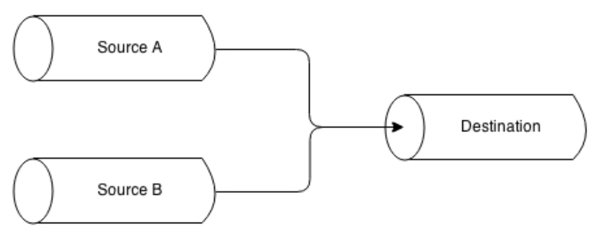

# 管道模式
和现实中的管流一样，Node.js流可以从基于不同模式的流合并而来；我们可以把两个不同的流合并成一个，把一个流分到两个或两个以上的管道，或者基于某个条件将流转发。在本章中，我们将要探索可以用于Node.js流的重要的*管流*技术。

## 组合流
在这一章，我们讲了很多关于流提供的简洁的基础框架，使我们可以模块化并且可以重用代码，但是还有一块没搞清楚的是：如果我们想模块化并重用整个管线呢？如果我们想把多个流合并成看起来像是一个呢？下图展示了这个功能：


从上图可以看出，我们可以发现一些实现这个功能的线索：

* 当写入一个合并的流，我们实际上是写入管线的第一个流。
* 当从合并的流读取时，我们实际上是从管线的最后一个流读取。

一个合并的流实际上是一个`Duplex`流，它把第一个流关联到自己的`Writable`一端，把最后一个流关联到其`Readable`一端。

> 想要由两个不同的流创建一个`Duplex`流，即一个`Writable`和一个`Readable`，我们可以使用`npm`模块，如`duplexer2`( https://www.npmjs.com/package/duplexer2 )

但这还不够；事实上，合并流的另外一个重要的特性是它必须捕获管线中任意一段发出的所有的错误。如我们前面提到过的，任何`error`事件都不会自动传递到管线的下一段；因此，如果我们想（应该）进行恰如其分的错误管理的话，我们需要显式地给每一段流添加一个错误监听器。然而，如果合并的流是一个黑盒，这意味着我们对管线中间的流没有访问权限；因此，对合并流来说，一个重要的功能是作为从管线中任意流中发出的所有错误的聚合器。
总结一下，一个合并流有两个主要的优势：

* 我们可以把它重新发布为一个黑盒，隐藏内部的管线。
* 我们有了一个简化的错误管理，因此无需给管线中的每一段流都附加一个错误监听器，只需给合并流附加一个即可。

合并流是一个非常通用并且常见的实践，在没有什么特殊需求的前提下，只是想重用某个已有的解决方案，如`multipipe` （ https://www.npmjs.com/package/multipipe ）或者是`conbine-stream`（ https://www.npmjs.com/package/combine-stream ），先简单地举两个例子。

### 实现一个组合流
举一个简单的例子，考虑如下两个转换流：

* 一个压缩并加密数据
* 一个解压并解密数据

使用诸如`multipipe`的库，我们可以容易地通过合并一些从核心模块已经有的流构建这种简单的流（文件`combineStreams.js`）：

```
var zlib = require('zlib');
var crypto = require('crypto');
var combine = require('multipipe');
var fs = require('fs');

module.exports.compressAndEncrypt = function (password) {
  return combine(
    zlib.createGzip(),
    crypto.createCipher('aes192', password)
  );
}

module.exports.decryptAndDecompress = function (password) {
  return combine(
    crypto.createDecipher('aes192', password),
    zlib.createGunzip()
  );
}

```
现在我们可以使用这些合并流了，把他们当成是一个黑盒，比如，创建一个小应用，归档一个文件，压缩并将其加密。创建一个叫做`archive.js`的模块：

```
var fs = require('fs');
var compressAndEncryptStream =
    require('./combinedStreams').compressAndEncrypt;

fs.createReadStream(process.argv[3])
  .pipe(compressAndEncryptStream(process.argv[2]))
  .pipe(fs.createWriteStream(process.argv[3] + ".gz.enc"));

```
我们可以进一步提升前面的代码，基于我们刚创建的管线来创建一个一个新的合并管线，这次不是为了获得一个可重用的黑盒，而只是利用其聚合错误管理的优点。事实上，正如我们已经提到过多次的，下面的代码只会捕获最后一段流发出的错误：

```
fs.createReadStream(process.argv[3])
  .pipe(compressAndEncryptStream(process.argv[2]))
  .pipe(fs.createWriteStream(process.argv[3] + ".gz.enc"))
  .on('error', function(err) {
    //Only errors from the last stream
    console.log(err);
  }); 
```
然而，通过合并所有的流到一起，我们可以优雅地修复这个问题。我们接下来重写`archive.js`文件如下：

```
var combine = require('multipipe');
var fs = require('fs');
var compressAndEncryptStream =
    require('./combinedStreams').compressAndEncrypt;
    
combine(
  fs.createReadStream(process.argv[3]),
  compressAndEncryptStream(process.argv[2]),
  fs.createWriteStream(process.argv[3] + ".gz.aes")
).on('error', function(err) {
  //this error may come from any stream in the pipeline
  console.log(err);
}); 

```
如我们所见，我们可以直接给组合流附加一个错误监听器，它会接收到任何内部流发出的任何`error`事件。
现在，要运行`archive`模块，只需在命令行参数中指定一个密码和一个文件即可：

```
node archive mypassword /path/to/a/file.txt
```
通过这个例子，我们已经非常清楚地展示了组合流的重要性；从一个方面来讲，它使我们可以创建一个可重用的流部件并且从另一个方面来讲，它简化了管线的错误管理。

## 分流
我们可以通过把一个`Readable`导入到多个`Writable`流的方式来运行一个流分支。当我们想把相同的数据发送到不同的目的地时非常有用，比如，两个不同的网络接口或者两个不同的文件。当我们想对同一份数据进行不同的转换或者想基于某些标准来分割数据。下图给出了这种模式的图像表示：


将流分支在Node.js中是一个简单的情况；让我们举个例子来说明这一点。

### 实现一个多校验和的生成器
创建一个小工具，可以同时输出给定文件的`sha1`和`md5`哈希值。我们把这个模块称为`generateHashes.js`，让我们从实例化检验和流开始：

```
var fs = require('fs');
var crypto = require('crypto');

var sha1Stream = crypto.createHash('sha1');
sha1Stream.setEncoding('base64');

var md5Stream = crypto.createHash('md5');
md5Stream.setEncoding('base64');
```
到此为止，没什么特别的；模块的下一部分，我们从一个文件创建一个`Readable`流，为了获得两个另外的文件，把它分成两个的流。两个文件分别包含`sha1`哈希和`md5`校验和。

```
var inputFile = process.argv[2];
var inputStream = fs.createReadStream(inputFile);

inputStream
  .pipe(sha1Stream)
  .pipe(fs.createWriteStream(inputFile + '.sha1'));
  
inputStream
  .pipe(md5Stream)
  .pipe(fs.createWriteStream(inputFile + '.md5'));
```
是不是非常简单？`inputStream`变量在一侧被导入到`sha1Stream`，在另外一侧被导入`md5Stream`。需要注意某些点，虽然这些点发生在幕后：

* 当`inputStream`终止时，`md5Stream`和`sha1Stream`都会自动终止。除非是当触发`pipe()`的时候指定选项`{end:false}`。
* 两股流会接收同样的数据块，所以在运行对数据有副作用的操作时我们必须非常小心，因为这种操作会影响分支的每一股流。
* 自带背压控制；`inputStream`的流量将会和最慢的一支保持一致。
## 合并流
合并流是分流的相反操作，是指把一组`Readable`流导入一个的`Writable`流，如下图所示：



把多个流合并进一个通常是一种简单的操作；然而，我们需要关注`end`事件的处理，因为管线使用自动结束的选项将会导致一旦一个源结束，目标流就会结束。这经常会导致错误发生，因为另一个活跃的源会继续写入到一个已经结束的流中。解决这个问题的方案是当导入多个来源到一个目标时，使用`{end:false}`选项，然后当所有的来源都结束写入之后再触发目标流的`end()`方法。
### 实现一个作用于多文件夹的tarball(打包工具)

## 多路传输及其合并

### 创建远程日志

#### 客户端-多路传输

#### 服务器端-合并多路传输

#### 运行这个多路/合并多路应用
### 多路和合并多路对象流


