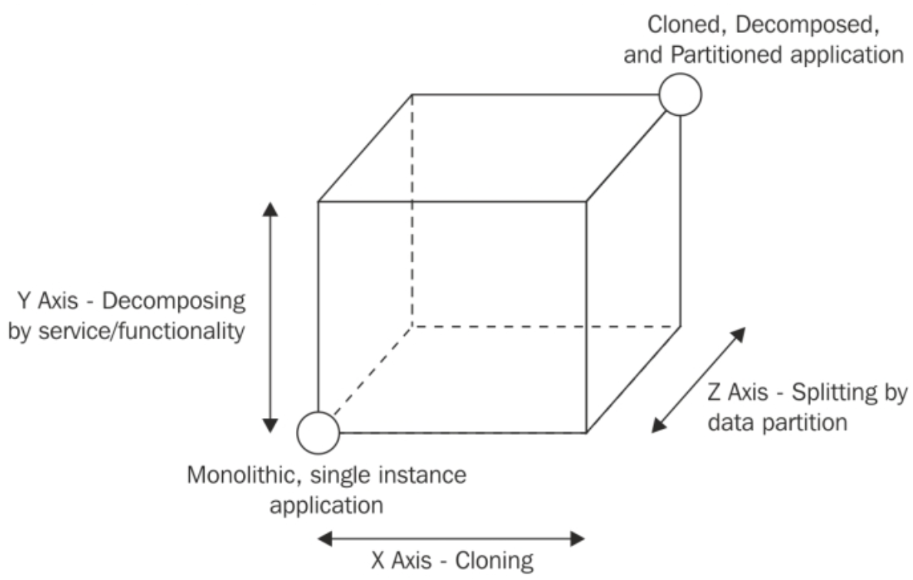

# 应用程序拓展介绍
在了解偏实用的模式和例子之前，需要说一下拓展应用的原因以及怎么实现。
## 拓展Node.js应用
我们已经知道，典型的Node.js应用的大部分任务都运行在单线程的上下文中。在第一章，*Node.js设计基础*中，我们了解到了这非但不是一个限制，而是一个优势。多亏了非阻塞I/O的设计，使得应用程序可以优化并发请求时资源的使用。一个单线程被非阻塞I/O充分地利用，每秒可以完美地负担中等数量的请求，约为每秒几百（主要取决于应用程序）。假设我们使用较好的硬件，单线程可用到的资源是有限的，不管服务器性能有多好。因此，如果我们想把Node.js用于高负载的应用，唯一的方法是把它拓展到多个线程、多个机器中。
然而，负载并不是拓展Node.js应用的唯一原因；事实上，用同样的技术，我们的应用可以获得其它期望的特性，如**可用性**、**容错率**。可拓展性也是关于尺寸和复杂度的概念；实际上，构建可以适应增长的架构也是软件设计需要考虑的另一个重要的点。JavaScript是一个必须小心使用的工具，类型检查的缺失和许多坑会成为应用增长的阻碍，但有了规则和准确的设计，我们可以把这些变成优势。使用JavaScript，我们经常不得不保持应用简洁，把它分成许多可管理的小块，使其更容易拓展和分发。
## 可拓展性的三个维度
谈到可拓展性，第一个基本的原则是理解**负载分发**，一种把应用程序的负载分发到不同的进程和机器上。有许多方式可以达到这个目标，Martin L. Abbott 和 Michael T. Fisher的《可拓展的艺术》提出了一个天才的模型来表示它们，叫做**拓展立方体**。模型按照下面三个维度来描述可拓展性：

* **X轴**：复制。
* **Y轴**：按服务和功能分解。
* **Z轴**：数据分片。

这三个维度可以用一个立方体表示，如下图所示：

立方体的左下角代表应用程序的所有功能和服务都在一个代码库里（**单块**应用），在单个实例上运行。这是处理小的工作负载或在开发早期常见的情况。
单块应用最简便的演进方式是沿着X轴发展，这种方式简单、大部分情况下成本比较低（指的是开发成本），而且效率非常高。这背后的原则是非常简单的，将同一个应用复制N次，每个实例处理N分之一的负载。
沿着Y轴拓展是指基于功能点、服务、用例来分解应用程序。这种情况下，*分解*意味着创建不同的、独立应用，每个部分都有自己的代码库，有时候拥有自己的数据库，甚至有独立的UI。比如，一个常见的情况是把管理端应用和公开的应用分开。另一个例子是把负责用户验证的服务，建立一个单独的验证服务器。分解应用程序的标准是根据其功能，极大地依赖业务需求，用例，数据，和许多其它因素，本章后面的部分将会讲到。有趣的是，这个拓展维度是附加影响最大的，不止是应用的架构，还有从开发的角度如何管理。我们可以看到，**微服务**是这样一个术语，经常和设计精良的Y轴拓展联系起来。
最后一个拓展维度是沿Z轴，是指应用被分解成每个部分只负责所有数据的一个部分。这是一项主要用于数据库的技术，叫做*横向隔离*或*分片*。用这种方式，同一个应用有多个实例，每个部分运行在一部分数据上，基于不同的标准确定范围。比如，我们可以把用户基于他们的国家（列表隔离），或者基于他们姓的首字母（范围隔离）或使用一个哈希函数来确定每个用户属于哪个部分（哈希隔离）。每个部分可以分配给一个特定的实例。使用数据隔离之后，需要每个操作前置一个**搜寻**的步骤来确定那个实例来负责给定的数据。如我们所说，数据分离主要应用于数据库层面，因为其主要目的是克服关于大的单个数据集（受磁盘空间、内存、网络容量的限制）的问题。只在复杂、分布式架构或者特定的用例时，在应用层面实施横向隔离才值得考虑。如在构建用于定制的数据持久化、数据库不支持分片、应用大到了google的级别。考虑到其复杂性，只有在X、Y轴拓展被充分利用之后，才考虑Z轴拓展。
在下一节，我们将关注两个最常见并且有效的技术来拓展应用，即复制和按功能/服务分解。

