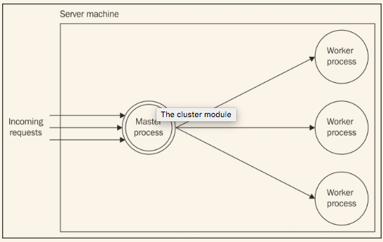

# 复制与负载均衡
当分配给一台机器的资源无法再升级或者升级带来的成本上升高于简单地开启另一台服务器时，传统的多线程服务器就需要拓展了。通过使用多线程，传统的服务器能够充分利用服务器的所有处理能力，使用所有的处理器和系统。然而，一个单独的Node.js线程无法实现这个功能，因为它是单线程的并且有一个1GB的限制（在64位的机器上，可以增加到1.7GB )。这意味着Node.js应用相对于传统服务器需要更经常地拓展，即便是在单机情况下，也需要能够充分利用所有的资源。

> 在Node.js中，**竖向拓展**（为单台机器增加更多的资源）和**横向拓展**（为基础设施增加更多的机器）基本是等同的概念；都是引入相同的技术来充分利用所有的处理能力。

不要傻傻地认为这是一个劣势。相反，几近于强制的拓展在某些方面是对程序有利的，尤其是在可用性和容错方面。事实上，通过复制的方式来拓展Node.js应用是相对来说比较简单的，并且即便是没必要使用更多资源的时候，只是为了拥有冗余和容错能力。
这也迫使开发者从应用早期就考虑拓展性，确保应用不依赖任何不能跨进程、机器的资源。事实上，预先考虑的可拓展性是指每个实例都不存储不能共享的通用信息，通常是指硬件，诸如内存和磁盘。比如，在web服务器上，把会话存储在磁盘上不利于拓展；相反，使用一个共享的数据库能够确保每个实例都能访问相同的绘画信息，不管它部署在哪。
现在来介绍最基础的拓展Node.js的机制：*cluster*模块。

## 集群模块
在Node.js中，在单台机器上的不同实例间分配负载的最简单模式是使用*cluster*模块，它是核心库的一部分。*cluster*模块简化了建立同一应用的一个新实例的工作，在它们中间自动地分配链接，如下图所示：

**主进程**负责管理一系列的进程（**workers**），每个都代表你想拓展的实例。每个进入的链接然后被分配到被复制的worker,在他们中分配他们。

### 关于集群模块的行为备注
在Node.js的0.8和0.10中，*cluster*模块使所有的worker都共享相同的服务器链接，把在多个worker间**负载均衡**的工作留给操作系统。然而，这种方式有个问题；事实上，操作系统在worker之间分配负载的算法不是用来做网络请求的负载均衡的，而是安排线程的执行。这样一来，实例之间的分配就不均衡了；经常是一部分worker接收了大部分的负载。这种行为对于操作系统调度器是有意义的，因为它专注于把不同进程间的上下文切换减到最低。这是*cluster*模块在Node.js低于0.10版时无法发挥最大可能性的原因。
然而，从0.11.2开始情况变化了，简明的**单循环**负载均衡算法被加入到主线程中，确保了请求均衡地分配到所有的worker上。新的负载均衡算法在除了Windows之外的所有平台默认开启，可以通过全局设置*cluster.schedulingPolicy*变量来修改，使用常量*cluster.SCHED_RR*（单循环算法）或*cluster.SCHED_NONE*（操作系统处理）。

>单循环算法基于轮转平等地分发负载。第一个请求指向第一个服务，第二个指向列表的下一个，以此类推。当到达列表末尾时，循环又重新开始。这是最简单最常用的负载均衡算法之一；然而，这不是唯一的。更高级的算法允许置顶优先级，选择负载最小或者响应最快的服务。

> 你可以在下面的两个issue中找到*cluster*模块演进的细节：
> 
> * https://github.com/joyent/node/issues/3241
> * https://github.com/joyent/node/issues/3241

### 构建一个简单的HTTP服务器

### 使用集群模块拓展

### 集群模式的弹性和可用性

### 零停机时间重启

## 处理状态沟通

### 多实例共享状态

### 棘手的负载均衡

## 通过反向代理拓展

### 使用Nginx实现负载均衡

## 使用服务注册

### 使用http-proxy和seaport实现动态负载均衡

## 点到点的负载均衡

### 实现一个可以平衡多台服务器请求的HTTP客户端

