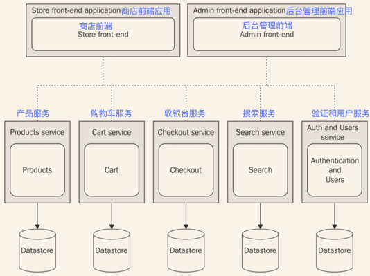
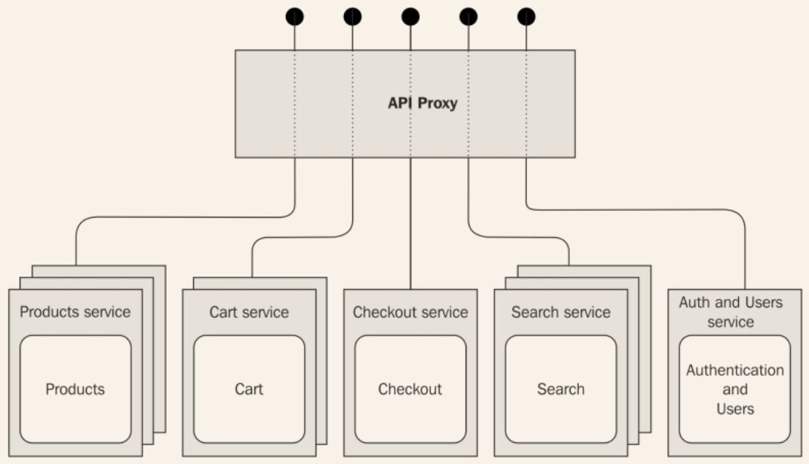
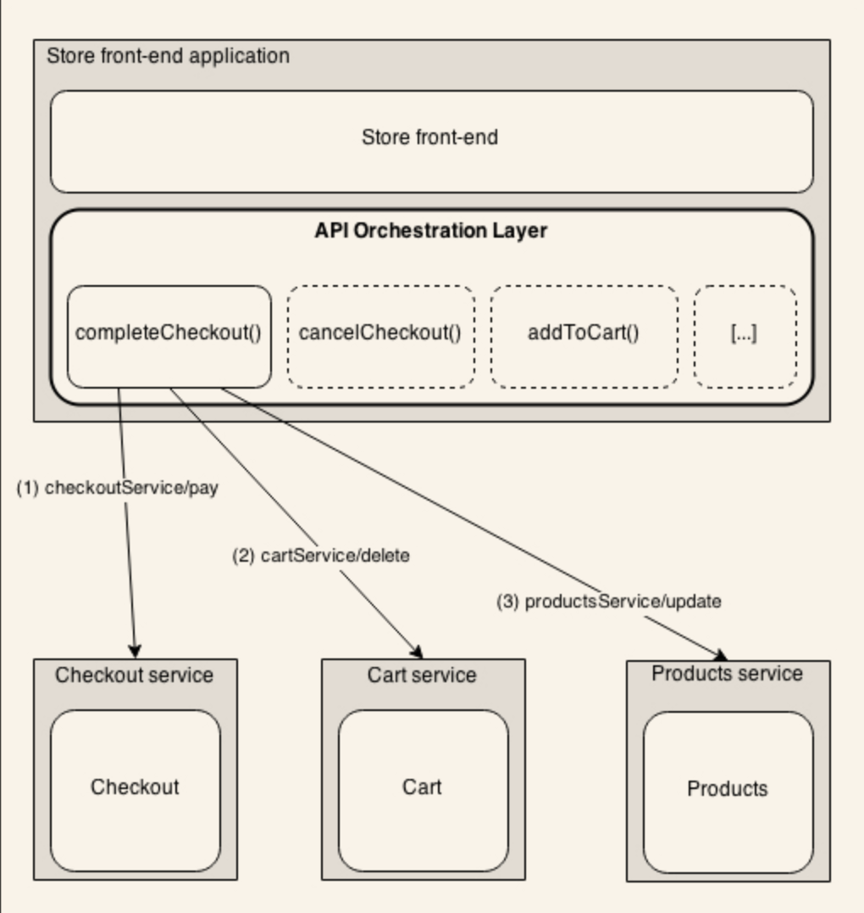
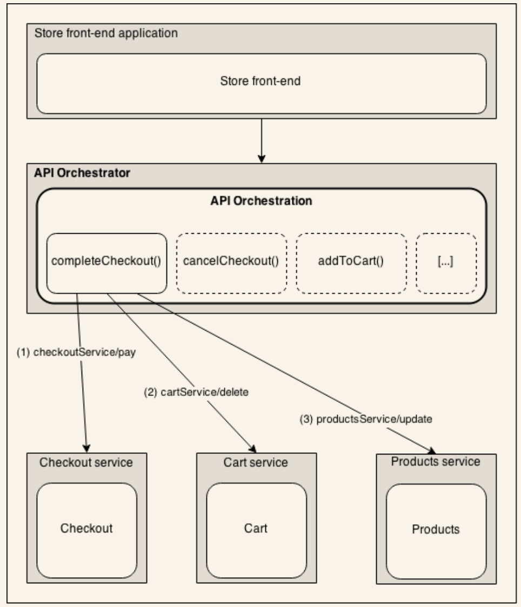
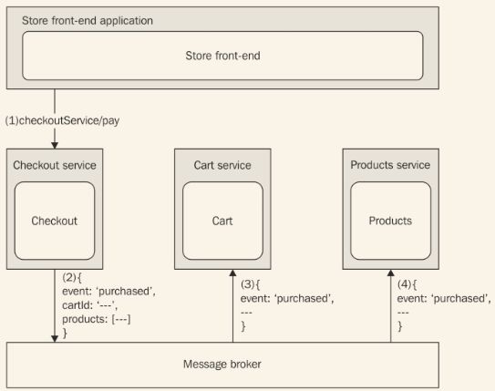

# 分解复杂应用
到目前为止，我们主要分析了拓展立方体的X轴。我们已经学到了分发应用程序负载最简单、最快速的方式，同时提升了其可用性。在接下来的章节，将关注拓展立方体的Y轴，通过按照功能和服务**分解**应用来拓展。我们将会学到，这种技术不光可以拓展应用程序的容量，并且最重要的是（降低）其复杂性。
## 单块架构
术语**单块**可能会让我们认为这是一个没有分模块的系统，应用程序所有的服务都集成到一起，几乎到了无法区分的地步。然而，大部分情况下不是这样的。通常，单块系统拥有高度模块化的架构，并且内部模块间解耦做的非常好。
Liunx操作系统内核就是一个典型的案例，它是*单块内核*（和它的生态系统和Unix哲学正好相反）大类的一部分。Linux拥有成千上万的服务和模块，即便在系统运行过程中也可以动态地加载和卸载。然而，他们都以*内核模式*运行，这意味着他们中的任何一个失败的话，可能导致整个系统无法工作（你是否见过*内核恐慌*？）。这种方式和微内核架构正好相反，微内核模式是指只有操作系统的核心服务以内核模式运行，剩下的以用户模式运行，通常每个都有自己的进程。这种方式的主要好处是任一个服务出现问题都只会在隔离的环境中引起故障，而不是影响整个系统的稳定。

> 关于内核设计的Torvalds-Tanenbaum争论可能是计算机科学历史上最著名的*火焰争论*了，只要争论点是使用单块还是微内核设计。你可以在 https://groups.google.com/forum/#!msg/comp.os.minix/wlhw16QWltI/P8isWhZ8PJ8J 看到这个讨论的web版本（最先出现在Usenet）。

非常值得关注的是，在这30多年以来，这个原则依旧被应用在不同的环境中。现代单块应用可以比作单内核；如果他们的某个部件坏掉了，整个系统都会受到影响，用Node.js中的术语可以理解为所有的服务都是同一个代码库的一部分，运行在单个进程中（在没复制的情况下）。
下图是单块架构的一个例子：

前图展示了典型的电子商务应用程序的架构。架构是模块化的；有两个不同的前端，一个是主库存，另一个是管理端界面。在内部，我们有一个清晰的功能分离，每个负责一个特定部分的业务逻辑：**产品**、**购物车**、**收银台**、**搜索**、**验证**、**用户**。然而，前面的架构是单块的，每个模块都是同一个代码库的一部分，作为同一个应用程序的一部分。当一个部分失败时，比如，一个未知错误，可能导致整个在线商店系统崩溃。
这种类型的架构的另一个问题是模块间的内部交互；实际情况是他们在同一个应用程序中运行，使其非常容易在模块间构建交互和耦合。例如，考虑一个产品被购买的用例；**收银台**模块需要更新**产品**对象的可访问性，如果这两个模块在同一个应用程序中，开发者非常容易获得**产品**的引用，直接更新它的可访问性。在一个单块系统中维持低耦合是非常难的，一部分原因是因为他们之间的边界不清楚或者没做合适的规范。
高度耦合通常是应用程序增长的的主要障碍之一，因为其复杂性，阻碍了它的可拓展性。事实上，错综复杂的依赖图意味着系统的每个部分都是一个牵制；需要维护产品的整个生命周期，每一个变化都需要仔细评估，因为每一部分都像积木塔的一个木块，移动或者移除一个都会导致整个塔崩塌。通常导致为了解决不断增加的复杂性而开会、制定开发步骤。
## 微服务架构
现在我们来揭示写一个大型应用最重要的模式：*防止写大型应用*。这看起来是一句废话，但是这毫无疑问是拓展软件系统的复杂度和容量的有效策略。所以什么是写大型应用程序的备选项？答案是拓展立方体的Y轴，按照服务和功能分离。思路是把应用程序分解为必要的部分，创建分离的、独立的应用。这基本上是和单块架构相反。这和Unix哲学一致，也和我们在本书开头讨论的Node.js原则一致，特别是*使每一个程序做好一件事情*。
**微服务架构**可能是这种模式可借鉴的模式，一组自我满足的服务代替了一个大型的单块系统。*微*是指服务必须足够小，但都在合理的范围内。不要误认为创建一个拥有100个不同的应用程序的架构但只提供一个web服务是一个好的选择。事实上，并没有严格的规定来说明一个服务应该多大或者多小，并不是只有尺寸影响了微服务架构的设计；而是多种因素的组合，主要是**松耦合**、**高内聚**和**集成复杂度**。
### 一个微服务架构的案例
我们现在来看之前的那个单块电子商务应用在使用了微服务架构之后是怎样的：

从上图可以看出，电子商务应用程序的每个部件都是独立存在、自我维护的实体，运行在自己的上下文中，拥有自己的数据库。在生产中，他们都是各自独立的应用程序，暴露出一些咧的相关服务。
服务的**数据所有权**是微服务架构的一个重要的特性。这是数据库也需要分割，维护适当级别的隔离和独立性的原因。如果只使用一个独立的共享数据库，不同服务共同协作就容易的多；然而，这也会给服务带来耦合（基于数据），使拥有多个应用的优势受到损害。
连接所有节点的虚线告诉我们，为了整个系统的功能完整心，他们之间需要通信、交换信息。因为服务不共享同一个数据库，需要更多的通信来维持系统的数据一致性。比如**收银**应用需要知道关于**产品**的一些信息，如发货的价格和限制，与此同时，它需要更新存储在**产品**服务中的数据，如，收银结束后产品的可访问性控制。上图中，我们试着保持节点间通信的抽象。毫无疑问，最流行的策略是使用web服务，但我们后面会看到，这不是唯一的选择。

> 模式（微服务架构）：把一个复杂的应用通过创建一些小的、自包含的服务来分解掉。

### 微服务架构的优缺点
这一节，我们将强调实现微服务架构的优缺点。我们将会看到，这种方式将会给我们的应用开发的方式带来根本性的变化，变革我们看待可拓展性和复杂度的方式，另一方面，它也引入了不小的挑战。

> Martin Fowler 写了一篇伟大的关于微服务的文章，你可以在 http://martinfowler.com/articles/microservices.html 看到。

#### 每个服务都是可拓展的
使每个服务运行在自己的应用程序上下文中的主要的技术优势是崩溃、bug、破坏性的修改都不会传递到整个系统。目标是构建真正独立的服务，它们更小、更容易修改、甚至是**重新构建**。举个例子，如果我们电子商务应用的**收银**服务突然因为一个严重的bug崩溃了,系统剩下的部分将会像往常一样继续工作。某些功能会被影响到，比如，购买产品，但是剩余的系统都会继续工作。
并且，假设我们突然发现用来实现一个部件的数据库或者编程语言并不是一个很好的设计决定。在单块应用中，在不影响整个系统的情况下，几乎什么也做不了；相反，在微服务架构的中，我们可以更容易地重新实现整个服务，使用不同的数据库或平台，系统的其它部分甚至都觉察不到。

#### 跨平台和语言的重用
把一个大型的单块系统分解成需要小的服务，我们可以创造可以更容易重用的独立工具。**ElasticSearch**是一个可重用的搜索服务的好例子，我们在第五章*关联模块*中构建的验证服务器也是一个可以很容易地在很多应用中重用的服务的例子，除了构建它的编程语言之外。
主要优势在于，和单块应用比起来，信息隐藏级别更高了。这可能是因为交互通常是通过远程的接口发生的，比如web服务或消息，这使其更容易隐藏服务的实现和部署细节。比如，如果进需要触发一个web服务，我们无法知道背后的基础设施是怎样拓展的，使用的编程语言，使用的什么数据库等等。
#### 拓展应用的方法
回到拓展立方体，非常清楚，微服务是等价于沿着Y轴拓展应用，所以已经有了在多台机器之间分配负载的机制。同时，我们也不该忘记我们可以组合微服务，利用立方体的其它两个维度来进一步拓展应用。比如，每个服务可以被复制，以处理更多请求，并且，有趣的方面是他们都可以被独立地拓展，可以更好地进行资源管理。

#### 微服务的挑战
到现在为止，看起来微服务可以解决我们所有的问题；然而，事实远非如此。实际上，维护更多的节点在集成、部署、代码共享方面带来了更高的复杂性；它修复了传统架构的一些弊病，但也带来了许多新问题。怎样使应用交互？怎样部署、拓展、监控如此大量的应用？幸运的的，云服务和现代的DEVOPS方法论可以为这些问题提供答案，同时，Node.js可以帮大忙。它的模块系统使共享代码更方便。Node.js本来的设计就是分布式系统（就是我们使用微服务架构实现的这种）中的一个节点。

> 尽管微服务可以使用任何框架（甚至是只用核心Node.js模块）构建，但也有一些解决方案专门为此而生，他们中最有名的是**[Seneca](https://npmjs.org/package/seneca)**。管理微服务部署的一个很有用的工具是*[nscale](https://github.com/nearform/nscale)*

## 微服务架构的集成模式
微服务最难克服的挑战是把所有的节点连接起来使他们协作。比如，我们的电子商务应用的**购物车**服务如果没有了可添加的**产品**将没有任何意义，**收银**服务如果没有购物车了之后也就没有用了。就像我们已经提到的，还有其它因素使多个服务间的交互变得非常必要。比如，**搜索**服务需要知道那个**产品**可以访问，还要确保保持信息实时更新。同样地，对于**收银**服务，当购买完成后，需要更新产品可访问性的信息。
当设计集成策略时，考虑服务间引入的耦合也是非常重要的。我们不该忘记，设计一个分布式架构需要和设计一个模块一样的实践和原则，因此，也需要考虑诸如可重用性和可拓展性等服务特性。
### API代理
我们要展示的第一个模式是使用**API代理**，一个在客户端和一系列远程API之间代理通信的服务器。在微服务架构中，主要的意图是为多个API提供一个单一的访问点，但也提供负载均衡，缓存，验证，流量限制，所有对于实现稳固API有用的特性。
这个模式对于我们已经不新了；当使用*http-proxy*和*seaport*构建自定义的负载均衡器时，我们已经看到过它的实际使用了。比如，我们的负载均衡器只暴露了两个服务，然后，多亏了服务注册器，它可以把一个服务的URL地址对应到一个服务器列表上。API代理以同样的方式工作；它实际上是一个反向代理，同时也是一个负载均衡器，通过特定的配置来处理API请求。下图展示了怎样把这个解决方案应用到我们的电子商务应用上：

从前面的图中，可以清楚地看到API代理是怎样隐藏底层基础设施的复杂性的。这在微服务架构中真的很好用，节点的数量可能很大，尤其是每个服务在多个机器间拓展。通过**API代理**实现的集成因此只是结构化的；没有语义上的机制。简单地提供复杂微服务架构的**单视图**。这和我们将要学的下一个模式相反，它的集成是语义化的。

### API编排
我们接下来将要描述的可能是最自然最简明的集成和组合一系列服务的方法，叫做**API编排**。Daniel Jacobson,Netflix API的副总工程师，在它的一篇博客里（http://thenextweb.com/dd/2013/12/17/future-api-design-orchestration-layer/），对API编排的定义如下：

*API编排层（OL）是一个抽象层。它选取通用的建模数据元素和/或特性，用特定的方式为目标开发者或应用而准备。*
通用的建模数据和/或特性和微服务架构中的一个服务的描述很像。想法是创建一个抽象层来连接这些散碎的服务来为应用实现特定的新服务。
使用电子商务应用来举个例子。如下图：

前图展示了**商店前端应用**是怎样使用编排层通过构造和编排已有服务来构建更复杂的特性的。
描述的场景以一个假定的*completeCheckout()*服务为例，它会在结束结算时客户点击了**付款**按钮后触发。图片展示了*completeCheckout()*是怎样由三个不同的步骤组合成一个操作的：

1. 首先，通过触发*checkoutService/pay*来完成事务。
2. 然后，当付款被成功处理后，我们需要告诉购物车服务，我们买的所有东西可以从购物车移走了。通过触发*cartService/delete*来实现。
3. 同时，当付款结束，我们需要更新我们刚买的产品的可访问性。通过*productsService/update*来完成。

如我们所见，我们从三个不同的服务中取出三个操作，然后可以构建一个新的API，协调服务来保证整个系统嗯一致性状态。
通过**API编排层**完成的另一个常见操作是数据聚合，换句话说，是把来自不同服务的数据组合到一个单独的响应中。假设如果我们想列出购物车包含的所有产品。这种情况下，编排层将需要从**购物车**服务获取嗲产品的ID列表然后从**产品**服务获取关于产品的完整信息。组合和协调服务的方式非常多，但是需要记住的重要模式是编排层的角色，它在一些服务和特定的应用之间扮演一个抽象层。
编排层是进一步功能分割的重要候选。把它实现为一个专门的、独立的服务是非常常见的，这种情况下，可以把它叫做**API编排器**。这个实践和微服务哲学是一致的。
下图展示了我们的架构的进一步提升：

创建一个独立的编排器，如上图所示，有助于把客户端应用（在我们的例子中是商店前端）和微服务的复杂性解耦。这使我们想到了API代理；然而，这有根本的不同；一个编排器组成了一个语义化的多服务集成，不只是一个原生的代理，它通常和底层服务暴露不同的API。

### 和消息代理集成

编排器模式给了我们一种集成多个服务的简明方式。它有利也有弊。使用这种模式易于设计、易于调试、易于拓展，但不幸的是，需要对底层架构和每个服务的工作机制了如指掌。如果我们讨论的是对象而不是架构节点，那么编排器就是一个反模式的**上帝对象**，定义了一个知道并做了太多事情的对象，这会导致高度耦合，低内聚，但重要的是高度的复杂性。
我们将要展示的模式试图在多个服务之间分配在整个系统中同步信息的职责。然而，我们最不想做的事情是在服务间创建直接关联，将会导致高度耦合和由于节点间交互数增加导致的远期系统增长的复杂度。目标是使每个服务维护自己的隔离；它们甚至可以在没有其它服务或和的新的服务和节点组合使用的情况下工作。
解决方案是使用**消息代理**，一个能把消息发送者从接收者中解耦出来的系统，可以实现一个中心化的**publish/subscribe**模式，在实践中是分布式系统的观察者模式（在本书的后续章节会讨论更多这方面的内容）。下图展示了这种模式应用到电子商务应用的一个案例：

如上图，**结算**服务的客户端，即前端应用，不需要和其它服务集成。它需要做的就是触发*checkoutService/pay*来完成结算，从顾客那里把钱拿走；所有的集成工作发生在背后：

1. **商店前端**触发**结算**服务中的*checkoutService/pay*。
2. 当操作完成时，**结算**服务创建一个事件，把操作的细节附加上去。具体的细节是：*cartId*和刚购买的产品列表。事件被发布到消息代理。此时，**结算**服务不知道谁会收到这个消息。
3. **购物车**服务订阅了消息代理，所以它会接收到刚被**结算**服务发布的*purchased*事件。基于这个新消息，它更新了自己的数据库，调整包含在消息中的产品的可见性。

整个处理过程不需要外部实体（诸如编排器）的明显介入。负责发布消息和保持信息同步的服务本身。没有*上帝服务*需要知道怎样移动系统的每一个齿轮，每个服务都负责自己的集成自己的部分。
消息代理是解耦服务和减少沟通复杂性的一个基础元素。也可能提供其它有趣的特性，诸如消息队列的持久化和保证消息顺序。在下一章我们将讨论更多这方面的话题。

