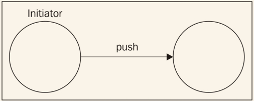
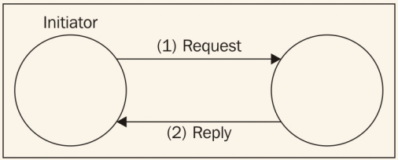
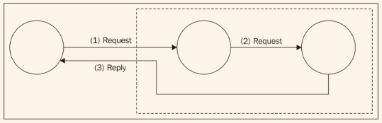
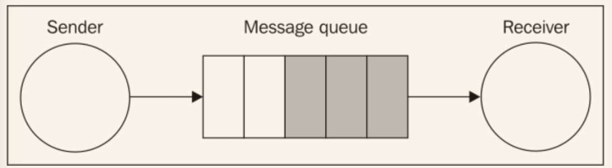
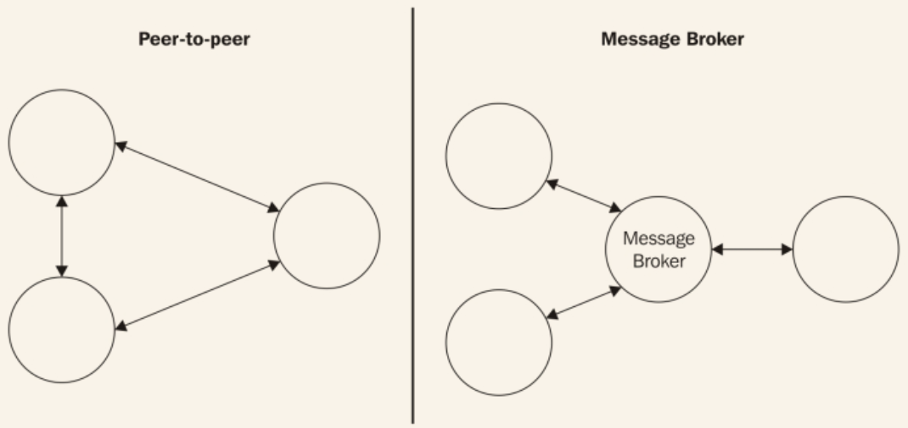

# 消息系统基础
当我们说到消息和消息系统，有四个基本点需要考虑，它们是：

* 通信的方向，可以是只有单向或者请求/回复交换
* 消息的意图，也决定了它的内容
* 消息的时间，可以发送后立即接收或过一会（异步）
* 消息的传输，可以直接也可以通过消息代理

这一节将会概述这些话题，作为后续讨论的基础。

## 单向和请求/回复模式
消息系统最基础的方面是通信的方向，同时也决定了代码的编写方法。
最简单的通信模式是但消息被推送后，从源到目标是**单向**的，这种情形是明显的，不需要太多解释。

典型的单向通信的例子是邮件，或使用Websocket给链接的浏览器发送消息的web服务器，或者一个把任务分配给工作进程的系统。
**请求/回复**模式比只有单向的模式更流行，典型的例子是触发web服务。下图展示了一个简单的总所周知的场景：

请求/回复模式看起来像是一个很容易实现的模式；然而，当通信是异步的或者引入了多个节点之后，他会变得更加复杂一些。看下图中的例子：

根据前图所示的架构，我们可以看到请求/回复模式的复杂性。如果考虑到任意两个节点间的通信方向，可以确定它们是单向的。然而，从一个全局角度看，初始化器发送一个请求，依次接收到一个相关的响应，即使来自不同的节点。在这种情况下，**请求/回复**模式和单纯的单向模式不同的是请求和回复之间的关系，这个保存在初始化器中。请求通常在和请求相同的上下文中被处理。

## 消息类型
**消息**实际是一种连接软件组件的方法，有几种不同的原因使用它：我们想获取另一个系统或组件持有的信息，远程地执行操作，通知其它同级组件某件事情刚发生了。由于通信原因不同，消息的内容也不同。一般说来，我们可以识别出3种不同类型的消息，基于他们的目的：

* **命令消息**
* **事件消息**
* **文档消息**

命令消息我们已经很熟悉了；它其实是一个序列化的命令对象，我们在*第四章 设计模式*中描述过。这种类型的消息的目的是触发接收者上的动作或任务的执行。为了达到这个目的，消息必须包含运行一个任务必要的信息，一般是操作的名称、执行时需要提供的参数列表。命令消息可以用来实现**远程过程调用（RPC）**系统、分布式计算或更简单地用来请求数据。RESTful HTTP调用是命令消息的简单的例子；每个HTTP动词都有一个特定的含义，和某个特定的操作关联：GET用来获取资源；POST，用来创建新的；PUT用来更新；DELETE用来销毁。
一个事件消息用来通知另一个组件某些事情发生了。它通常包含事件的类型，有时还有一些细节，比如上下文、主题和相关参与者。在web开发中，我们在浏览器中使用事件消息，当使用长连接或者WebSocket接收服务器发出的通知，从而知道刚发生了什么，比如数据的变化或者是更常见的系统状态的变化。在分布式应用中使用事件是一种重要的集成机制，它使我们保持系统中所有的节点保持一致。
文档消息主要用来在组件和机器间传递数据。文档和命令消息的主要区别在于，它不会包含任何信息来告诉接收者怎么处理数据。换句话说，和事件消息的主要区别是缺少一个相关的事件。通常，命令消息的回复是文档消息，因为他们通常只包含请求的数据或操作的结果。

## 异步消息和队列
作为一个Node.js开发者，我们应该已经知道执行异步操作的优势。对于消息和通信来说，也是一样的。
把同步通信比作打电话：两端必须同时连接到同一个频道，他们必须实时交换信息。通常，我们想打给别人，我们要么需要另一个电话或者关闭当前的通讯以便启动一个新的。
异步通信和短信类似，在发送时它不需要接收者连接到网络，我们会即时收到响应或者在一个未知的时间段之后，或者根本接收不到响应。我们可以一个接一个地发送多条短信给多个接收者，但以任何顺序接收他们的响应。简而言之，我们使用更少的资源，拥有了更好的并发机制。
异步通信的另一个重要的优势在于，消息可以存储，然后立刻或者稍后传输出去。这在接收者太过繁忙来不及处理新消息或者为了保证传输可靠性的时候非常有效。在消息系统中，使用**消息队列**可以实现这个功能，这是一个协调发送者和接收者之间通信的组件，在消息传输到目标前存储所有的消息，如下图所示：

如果出于某种原因接收者崩溃、断网、速度减慢，消息会在队列中积聚，一旦接收者在线或者满负荷工作，消息就会被分发出去。队列可以存在于发送者中，或者和发送者、接收者分离，或者运行在一个专门的外部系统中，扮演沟通过程中的**中间件**角色。
## 点到点或基于代理的消息
消息可以直接以点到点的模式发送给接收者，或者通过一个中心化的协调系统，叫做**消息代理**。代理的主要角色是把接收者从发送者中解耦出来。下图展示了两种方式在架构上的不同：

在点到点架构中，每个节点直接负责把消息发送到接收者。这种架构需要节点知道接收者的地址和端口，它们需要满足其协议和消息格式。代理相应地免去了这些复杂性：每个节点可以完全独立，可以和未知数量的节点通信，且无需直接了解它们的细节。代理可以作为一个连接不同通讯协议之间的桥梁，比如，流行的**RabbitMQ**代理（http://www.rabbitmq.com）支持**高级消息队列协议（AMQP）**、**消息队列远程传输（MQTT）**、**简单/流式 基于文本的消息协议（STOMP）**，使支持不同消息协议的应用交流。

> MQTT(http://mqtt.org)是一个轻量级的消息协议，特地为机器到机器间的通讯（物联网）设计。AMQP(http://www.amqp.org)是一个更复杂的协议，是一个作为专利版消息中间件的开源替代品而设计的。STOMP（http://stomp.github.io）是一个轻量级的基于文本的协议，类似于HTTP设计。所有的三个协议都是应用层的协议，基于TCP/IP。

除了解耦和交互，代理可以提供更多高级的特性，诸如持久化的队列、路由、消息转换、监控，更不用说代理支持的大量的消息模式了。当然了，没什么可以阻止我们通过点到点的架构实现所有这些特性，但不幸的是需要付出更多的努力。然而，也有一些原因不使用代理：

* 移除单一节点造成的失败
* 代理需要拓展，在点到点架构中，我们只需要拓展单个节点
* 在没有中间环节的情况下交换消息可以大大减少传输的延迟

如果想要实现一个点到点的消息系统，我们可以有更多的弹性和能力，因为我们不会受到特定技术、协议、架构的限制。流行的øMQ（http://zeromq.org）是一个构建消息系统的低级别库，是一个可以很好地展示*通过构建自定义的点对点或者混合架构*可以获得弹性。

