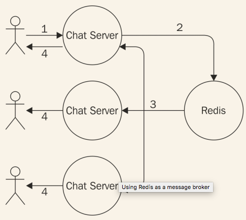
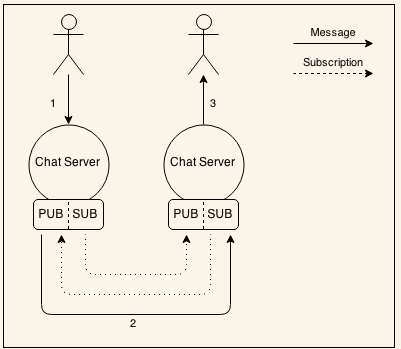
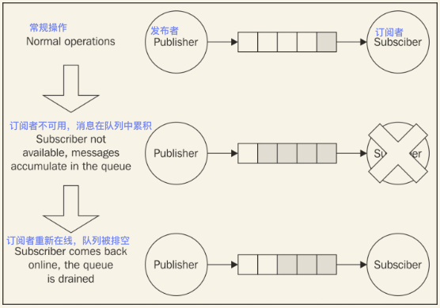
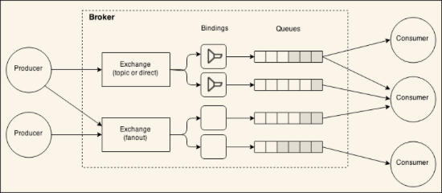
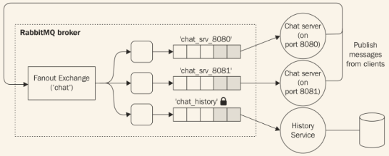

# 发布订阅模式
发布/订阅（通常缩写为Pub/Sub）可能是最知名的单向消息模式了。我们应该对它很熟悉了，它就是一个分布式的**观察者模式**。在观察者模式的案例中，有一组**订阅者**注册到了他们希望接收的特定类型的消息。从另一方面来将，**发布者**创建了消息，可以在相关的订阅者之间分发。下图展示了两种主要的pub/sub模式，第一个是点到点的，第二个使用了代理来协调通信：


pub/sub的特殊性在于，发布者预先不知道谁将接收消息。就像前面说到的一样，订阅者需要注册到自己希望接收的消息类型上，使发布者可以和未知数量的接收者一起工作。换句话说，pub/sub模式的两端是松耦合的，这个特性使其非常适合集成正在扩张的系统中的不同节点。
消息代理的出现进一步提升了节点间的解耦程度，因为订阅者只和代理交互，不知道哪个节点是消息的发送者。我们后面可以看到，消息代理也可以提供消息队列系统，在节点间存在连接问题时也能保证可靠传输。
现在，我们举个例子来描述这个模式：
## 构建一个简单的实时聊天应用
为了展示一个用pub/sub模式来集成分布式架构的例子，我们会构建一个基础的实时聊天应用，使用纯WebSockets。然后，我们试着通过运行多个实例来拓展它，并使用一个消息系统来使他们通信。
### 实现服务器端
现在我们立即开始吧。首先构建聊天应用；我们将依靠*ws*包（ https://npmjs.org/package/ws ）来实现,它是一个专门为Node.js实现的WebSocket。我们都知道，使用Node.js实现一个试试应用非常简单，我们的代码会印证这个说法。然后创建聊天应用的服务器端；其内容（在*app.js*文件中）如下：

```
var WebSocketServer = require('ws').Server;

//static file server
var server = require('http').createServer(   //[1]
  require('ecstatic')({root: __dirname + '/www'})
);

var wss = new WebSocketServer({server: server});     //[2]
wss.on('connection', function(ws) {
  console.log('Client connected');
  ws.on('message', function(msg) {         //[3]
    console.log('Message: ' + msg);
    broadcast(msg);
  });
});

function broadcast(msg) {           //[4]
  wss.clients.forEach(function(client) {
    client.send(msg);
  });
}

server.listen(process.argv[2] || 8080);
```
这样就行了！这是实现我们的聊天服务器需要做的所有工作。它是这样工作的：

1. 我们先创建一个http服务器，附加一个中间件叫做*ecstatic*( https://npmjs.org/package/ecstatic )来提供静态文件。应用程序给客户端提供资源（JavaScript和CSS）就需要这个。
2. 我们创建了一个WebSocket服务器的新实例然后附加到一个已有的HTTP服务器上。然后通过附加一个对*connection*事件监听器来监听进入的WebSocket连接。
3. 每次一个新的客户端连接到服务器，我们开始监听进入的消息。当消息到达后，把它光波导所有连接的客户端。
4. *broadcast()*函数简单地遍历所有相连的客户端,然后分别触发其*send()*函数。

这就是Node.js的魔法！当然了，我们实现的服务器非常小、非常基础，但我们将会看到，它可以工作。
### 实现客户端
接下来，该实现聊天功能的客户端了；这也非常小巧，只是最少量的HTML，包含一些基本的JavaScript代码。我们来创建这个叫做*www/index.html*的文件表示的页面：

```
<html>
  <head>
    <script>
      var ws = new WebSocket('ws://' + window.document.location.host);
      ws.onmessage = function(message) {
        var msgDiv = document.createElement('div');
        msgDiv.innerHTML = message.data;
        document.getElementById('messages').appendChild(msgDiv);
      };
      
      function sendMessage() {
        var message = document.getElementById('msgBox').value;
        ws.send(message);
      }
    </script>
  </head>
  <body>
    Messages:
    <div id='messages'></div>
    <input type='text' placeholder='Send a message' id='msgBox'>
    <input type='button' onclick='sendMessage()' value='Send'>
  </body>
</html> 
```
我们创建的HTML页面都不需要任何的注释；只是一段简单的web开发代码。使用原生的WebSocket对象来初始化到Node.js服务器的连接，然后开始监听从服务器来的消息，当消息到达时，把他们展示在一个新建的*div*标签中。为了发送消息，使用一个简单的文本框和按钮。

> 当结束或者重启一个聊天服务器，WebSocket连接结束并且不会重新连接（应该使用*Socket.io*这种高级库）。这意味着服务器重启后需要刷新浏览器来重建连接（或者重新实现一个重连机制，这里不会详述）。

### 运行和拓展聊天应用
我们可以立刻试着运行我们的应用，使用如下命令启动服务器：

```
node app 8080
```
> 你需要有一个版本比较新的支持WebSocket的浏览器才能运行这个Demo，下面是兼容的浏览器： http://caniuse.com/#feat=websockets

在浏览器打开*http://localhost:8080*,将看到如下图所示的界面：


我们现在想要展示的是，当我们试着通过启动多个实例来拓展应用。让我们试着这样做，在另一个端口上启动另一个服务器：

```
node app 8081
```
我们希望结果是两个客户端连接到两个不同的服务器，可以交换聊天信息。但遗憾的是，我们现在的代码无法实现这个功能，可以通过打开*http://localhost:8081* 试试。
我们在一个实例上发送一个聊天消息，只能在本地广播，在连接到特定服务器的客户端之间分发消息。两个服务器之间不能交流。我们需要集成他们。

> 在实际应用中，我们使用负载均衡器来在实例间分发流量，但在这个demo中不用。这就使我们可以特意访问每个服务器来看实例间是怎样交互的。

## 使用Redis作为消息代理
我们以Redis( http://redis.io )为开端，分析最重要的pub/sub实现，Redis是一个快速、弹性的键值存储，也被很多人定义为数据结构服务器。Redis更像是一个数据库而非消息代理，然而，在它的诸多特性中间，有一组命令专门用来实现一个中心化的发布/订阅模式。当然了，和专门的高级消息中间件比起来，这个实现非常简单、基础，但这也是它流行的原因。通常，Redis已经存在于基础设施中了，比如作为一个缓存服务器或者存储会话信息；它的速度和可拓展性使其非常适合于在分布式系统中共享数据。所以，一旦在项目中需要使用发布/订阅代理，最简单迅速的选择是重用Redis本身，避免安装、维护一个专门的消息代理。让我们写一个例子来展示其简单、强大。

> 这个例子需要有一个已经安装好并能正常运行的Redis,在它的默认端口上监听。在 http://redis.io/topics/quickstart 可以看到更多细节。

我们的计划是用Redis作为一个消息代理来集成聊天服务器。每个实例把从客户端接收到的消息发布到代理上，与此同时，订阅从其它服务器实例上发来的任何消息。这样一来，我们架构中的每一个服务器都既是订阅者也是发布者。下图展示了我们想要获得的架构：



通过看上图，我们可以总结出一条消息经过的历程：

1. 消息被输入到网页的文本框，然后被发送到连接的聊天服务器实例。
2. 消息然后被发布到代理。
3. 代理把消息分发给所有的订阅者，在我们的架构中，都是聊天服务器的实例。
4. 在每个实例中，消息被分发到所有连接的客户端。

> Redis允许发布和订阅一个**频道**，用一个字符串来标识，比如*chat.nodejs*。也可以使用通配符来定义订阅关系，可能匹配多个频道，比如*chat.**。

让我们来看它是怎样工作的。修改服务器端代码，增加发布/订阅逻辑：

```
var WebSocketServer = require('ws').Server;
**var redis = require("redis");**           //[1]
**var redisSub = redis.createClient();**
**var redisPub = redis.createClient();**

//static file server
var server = require('http').createServer(
  require('ecstatic')({root: __dirname + '/www'})
);

var wss = new WebSocketServer({server: server});
wss.on('connection', function(ws) {
  console.log('Client connected');
  ws.on('message', function(msg) {
    console.log('Message: ' + msg);
    **redisPub.publish('chat_messages', msg);**   //[2]
  });
});

**redisSub.subscribe('chat_messages');**     //[3]
**redisSub.on('message', function(channel, msg)** {
  wss.clients.forEach(function(client) {
    client.send(msg);
  });
});

server.listen(process.argv[2] || 8080); 
```
我们对前面代码的修改已经高亮显示了；这是它的工作模式：

1. 把我们的应用连接到Redis服务器上，使用*redis*包（ https://npmjs.org/package/redis ），它是一个完整的客户端，支持所有可用的Redis命令。然后，我们建立两个不同的链接，一个用于订阅到频道，另一个用来发布消息。这在Redis中是非常必要的，因为一旦连接被置于订阅者模式，只有订阅相关的命令可用。这样我们就需要另外一个连接来发布消息。
2. 当从一个连接的客户端收到一条消息，我们把消息发送到*chat_messages*频道。我们不直接把消息广播到客户端是因为服务器订阅到了相同的频道（等会会看到），所以它会通过Redis返回给我们。对于这个例子来说，这是简单有效的机制。
3. 刚才说到，我们的服务同时订阅到了*chat_message*频道，所以我们注册一个监听器来接收发送到这个频道的所有消息（消息可能是从当前服务器发出的，也可能是从别的服务器发出）。当接收到消息后，简单地把消息广播到所有连接到这台WebSocket服务器的客户端。

这些小修改足以集成所有我们打算启动的聊天服务器。为了证明它，我们可以试着启动应用的多个实例：

```
node app 8080
node app 8081
node app 8082
```
然后每个浏览器标签打开一个地址，验证我们发到一个服务器上的消息成功地被其它连接到别的服务器上的客户端接收到。恭喜，我们刚刚使用发布/订阅模式集成了一个实时的分布式应用。

## 用øMQ实现点到点的发布订阅
代理的存在可以在很大程度上简化消息系统的架构；然而，有时候这并不是一个可行的解决方案，比如，当延迟非常关键，当拓展复杂的分布式系统，或不允许存在存在单点失败时。
### øMQ介绍
如果我们的项目到了评估可用的点到点消息交换的备选方案时，最好的值得考虑的解决方案是**øMQ**（ http://zeromq.org ，也被称作zmq,ZeroMQ或0MQ ）；在本书的前面章节已经提到过这个库了。øMQ是一个提供了构建多种消息模式的基础工具。它是一个底层的，非常快速，使用极少的API但提供了消息系统的所有基本构建块，比如原子消息、负载均衡、队列以及更多。它支持多种类型的传输，诸如进程内频道（ inproc:// ）,进程间通信（ ipc:// ）,使用PGM协议的多发布（ pgm:// 或 epgm:// ），当然了，也支持经典的TCP（tcp://）。
在øMQ的特性中，我们可以发现用来实现发布/订阅模式的工具，正是我们的例子所需的。所以，我们现在将要做的是，把代理（Redis）从我们的聊天应用架构中移除，让多个节点借助øMQ的发布/订阅接口以点到点的模式通信。

> øMQ接口可以看做是网络接口的封装，为了方便实现最常见的消息模式，提供了进一步的抽象。比如，我们找到对应的接口来实现发布/订阅，请求/回复，或者单向通信。

### 为聊天服务器设计一个点到点的架构
当我们从架构中移除代理后，聊天应用的每个实例都需要直接连接到其它可用的实例，用于接收到他们发布的消息。在øMQ中，我们有两种为这个目的专门设计的接口：*PUB*和*SUB*。典型的模式是把*PUB*接口绑定到其它*SUB*接口订阅监听的端口上。
订阅可以有一个过滤器来确定哪种消息会被传出到*SUB*接口。过滤器是一个简单的字节流（也可以是一个字符串），将会和消息（也是一个字节流）的开头一致。当消息通过*PUB*发布，它会被广播到所有连接的*SUB*接口，但这发生在订阅过滤生效之后。只有当使用了连接协议（如TCP）后，过滤器才可以应用到发布者一侧。
下图展示了应用到分布式聊天服务器的模式（为了简便起见，只有两个实例）：



上图展示了当存在两个聊天服务器的实例时，信息是如何流动的，但同样的概念可以被应用于N个实例。这个架构告诉我们每个节点都需要知道系统中其它节点的情况，能够建立起所有必要的连接。这幅图同时告诉我们当信息反向流动时，订阅是怎样从*SUB*接口到*PUB*接口的。

> 为了运行本节的例子，需要在系统上安装øMQ字节文件。你可以在 http://zeromq.org/intro:get-the-software 上找到更多信息。注：这个例子是基于øMQ4.0版本测试的。

### 使用ZMQ的PUB/SUB连接


```
[...]
var args = require('minimist')(process.argv.slice(2));   //[1]
var zmq = require('zmq');

var pubSocket = zmq.socket('pub');         //[2]
pubSocket.bind('tcp://127.0.0.1:' + args['pub']);

var subSocket = zmq.socket('sub');         //[3]
var subPorts = [].concat(args['sub']);
subPorts.forEach(function(p) {
  console.log('Subscribing to ' + p);
  subSocket.connect('tcp://127.0.0.1:' + p);
});
subSocket.subscribe('chat');

[...]
  ws.on('message', function(msg) {         //[4]
    console.log('Message: ' + msg);
    broadcast(msg);
    pubSocket.send('chat ' + msg);
  });
[...]

subSocket.on('message', function(msg) {       //[5]
  console.log('From other server: ' + msg);
  broadcast(msg.toString().split(' ')[1]);
});

[...]
server.listen(args['http'] || 8080); 
```

通过上面的代码可以看出，我们的应用逻辑变得稍微复杂了一点，但还是可以直接看出我们正在实现一个分布式的点到点发布/订阅模式。让我们一起看所有的部分是怎样组合起来的：

1. 我们引用了一个*zmq*包（ https://npmjs.org/package/zmq ），它是Node.js和øMQ原生库的关联。我们也引入了*minimist*（ https://npmjs.org/package/minimist ），这是一个命令行参数解析器；使用它，可以很容易地命名的参数。
2. 立刻创建我们的*PUB*接口，把它绑定到通过*--port*命令行参数提供的端口上。
3. 我们创建*SUB*接口，把它连接到其它实例的*PUB*接口。目标*PUB*接口的端口号是通过*--sub*参数（可能多于一个）提供的。然后创建准确的订阅，通过提供*chat*作为过滤器，这意味着我们将只会收到以*chat*开头的消息。
4. 当一个新的消息通过WebSocket接收后，把它广播到所有连接到这台服务器的客户端，但同时通过*PUB*接口把它发布出去。我们使用*chat*和一个空格作为前缀，所以所有的消息都会使用*chat*作为过滤器发布到所有的订阅。
5. 我们开始监听到达*SUB*接口的消息，做一些简单的消息解析，移除前面的*chat*前缀，然后把它广播到所有的和在台服务器连接的客户端。

现在，我们构建了一个简单的分布式系统，使用点到点的发布/订阅模式把他们集成起来。
让它们开始工作，启动三个应用实例，确保他们连接到了正确的*PUB*和*SUB*接口：

```
node app --http 8080 --pub 5000 --sub 5001 --sub 5002
node app --http 8081 --pub 5001 --sub 5000 --sub 5002
node app --http 8082 --pub 5002 --sub 5000 --sub 5001
```

第一个命令要启动一个包含一个监听8080端口的HTTP服务器的实例，在端口*5000*上绑定一个*PUB*接口，在*5001*和*5002*上连接到*SUB*接口，这两个端口正是另外两个实例的*PUB*绑定的端口。另外两个命令执行类似的工作。
首先可以看到，øMQ在*PUB*对应端口不可用时不会报错。比如，在执行第一条命令时，没有实例监听端口*5001*和*5002*，但øMQ不会报任何错误。这是因为øMQ有一个重连机制，在合适的时间间隔内，会自动尝试重新建立到这些端口的连接。这个特性在某个节点宕机或者重启时也会变得非常有用。同样的*容错机制*也被应用到了*PUB*接口：如果没有订阅者，会简单地丢弃所有的消息，但它会继续运行。
此时，我们可以尝试使用浏览器导航到我们启动的任何的服务器实例，验证消息是否正确地广播到了所有的聊天服务器。

> 在前面的例子中，我们假设了一种*静态*架构，即预先知道实例的数量和他们的地址。我们可以引入一个服务注册器，就像在前面章节描述的那样，动态地连接我们的实例。同样需要指出，øMQ可以使用和刚描述的相同的指令来实现一个消息代理。

## 持久的订阅者
消息系统的一个重要的抽象是**消息队列（MQ）**。使用消息队列，消息的发送者和接收者在建立通讯时不用处于激活并连接的状态，因为队列系统负责存储消息，知道目标可以接收他们。这个行为和**建立并忘记**正好相反，在那种模式下，订阅者只有在连接到消息系统同时才能接收消息。
一个接收者能够可靠地接收所有的消息，即便是发送时还没有监听，这种接收者叫做**持久的接收者**。

> MQTT协议为在发送者和接收者之间交换的消息确定了一个**服务质量**级别。这个级别对于描述任何其它消息系统（不只是MQTT）是非常有用的。详细如下：
> * **QoS0，最多一次**：被称为设置并忘记，消息不会被持久化，不确认传输结果。这意味着当崩溃或断开和接收者的连接时，消息可能会丢失。
> * **QoS1，最少一次**：消息保证至少收到一次，但是可能会重复发送，比如接收者在通知发送者之前崩溃。这表明消息需要持久化，在将来需要再发送一遍。
> * **QoS2，确定的一次**：这是最可靠的QoS，保证了消息只接收一次，并且只有一次。需要付出的成本是速度更慢，需要更多的数据来告知消息传输的结果。
> 在MQTT的说明（http://public.dhe.ibm.com/software/dw/webservices/ws-mqtt/mqtt-v3r1.html#qos-flows ）可以了解更多。

如前所述，为了实现持久化的订阅者，在订阅者掉线时，系统需要使用一个消息队列来积累消息。队列可以存储在内存或者持久化地存储于磁盘上，即便是代理重启或者崩溃了，也可以支持消息恢复。下图形象地展示了保存在消息队列中的持久化订阅者：



持久的订阅者可能是队列使消息系统具备的最重要的模式了，但这不是队列能够带来的唯一好处，我们后面的章节将会看到。

> Redis的发布/订阅命令实现的是创建并忘记机制（QoS0）。然而，Redis也可以用其它命令的组合来实现一个持久的订阅者（不直接依赖于它的发布/订阅实现）。你可以在下面两篇文章中找到这项技术的描述：
> 1. https://davidmarquis.wordpress.com/2013/01/03/reliable-delivery-message-queues-with-redis/ 
> 2. http://www.ericjperry.com/redis-message-queue/ 
> øMQ定义了一些支持持久化订阅器的模式，但大部分要自己实现其机制。

### AMQP简介
消息队列通常用在不允许消息丢失的情形，包括事务严格的应用场景，比如银行和金融系统。这通常意味着典型的企业级消息队列是软件非常复杂的一部分，使用『防弹』协议和持久化存储来保证出现故障时，消息的传输依旧正常。基于这个原因，企业级消息中间件的市场份额多年以来一直都被Oracle和IBM等大公司控制，他们每家都实现了自己专有的协议，给消费者带来极大的局限。幸运的是，多亏了开放协议的增长，诸如AMQP、STOMP和MQTT，最近几年消息系统正在回到主流。现在对AMQP进行一个概览，来理解消息队列系统的运作机制；这是理解怎样使用基于这个协议的典型API的基础。
**AMQP**(高级消息队列协议)是一个开放标准协议，被很多消息队列系统支持。除了定义了常见的通信协议，它也提供了一个模型，用于描述路由、过滤、队列、可靠性、安全性。在AMQP中，有三个必要的组件：

* **队列**（Queue）：这个数据结构负责存储被客户端消费的消息。来自队列的消息被推送（或拉取）到一个或多个消费者（通常是我们的应用）。如果多个消费者附加到了同一个队列上，消息会通过在它们之间负载均衡。队列可以是下面的一种：
    * **持久性**：这意为着当代理重启后，队列会自动重建。持久化队列并不是说它的内容都被保存；事实上，只有被标记为持久的消息才会保存在磁盘上，在重启后恢复。
    * **排它性**：这意味着队列绑定到一个特定的订阅器连接上。当连接关闭，队列也被销毁。
    * **自动删除**：当最后一个订阅器失去连接后，队列会被自动删除。
* **交换器**（Exchange）：这是消息发布的点。一个交换器会把消息路由到一个或更多队列是基于实现它的算法：
    * **直接交换**：通过完全匹配键来路由消息（比如*chat.msg*）。
    * **话题交换**：它使用一个和路由键匹配的通配符模式来分发消息（比如，*chat.#*匹配所有以*chat*开头的路由）。
    * **扇出交换**：它把消息广播到所有连接的队列中，不管提供了什么路由键。
* **绑定**（Binding）： 这是交换器和队列之间的连接。也定义了用来过滤来自交换器的消息的路由键和模式。

这些组件被**代理**管理，代理暴露了创建并操作他们的API。当连接到代理后，客户端创建一个**频道**，即为连接的抽象，负责维持和代理通信的状态。

> 在AMQP中，持久订阅器模式可以通过创建任意类型的非排他、非自动删除的队列来实现。

下图展示了把这些组件放在一起的样子：



AMQP模型比我们现在为止接触过的消息系统都复杂（Redis和øMQ）；然而，它提供了一系列的特性，以及只通过原始的发布/订阅机制很难实现的功能。

> 你可以在RabbitMQ的网站上找到AMQP模型的详细介绍：https://www.rabbitmq.com/tutorials/amqp-concepts.html 。


### 使用AMQP和RabbitMQ实现持久订阅
现在开始实践我们刚学到的关于持久化订阅器和AMQP知识，在一个小例子上应用。典型的场景是当我们希望保证微服务架构中的不同服务保持一致，不允许消息丢失；前面章节我们已经描述了这个集成模式。如果我们想要使用代理来保证所有的服务处于同一状态，不遗漏任何消息是非常重要的，否则的话，最后可能会处于一个不一致的状态。
#### 为聊天应用设计一个历史服务
让我们使用微服务的方法来拓展我们的小型聊天应用。现在增加一个历史服务，在数据库里保存聊天消息，所以当一个客户端连接上来，我们可以查询服务获取所有的消息历史。我们将会使用RabbitMQ代理（ https://www.rabbitmq.com ）和AMQP来集成历史消息服务和聊天服务器。
下图展示了计划的架构：



就像前面的架构描述的一样，我们将使用一个单独的*扇出*交换器；无需任何特定的路由，所以我们的场景无需使用比这更复杂的交换器。接下来，我们为每个聊天服务器实例创建一个队列；这些队列是排它性的，当聊天服务器离线时，我们并不打算接收遗漏的消息，因为这是历史消息服务要做的事情，最终可以基于存储的消息实现更复杂的请求。在实践中，这意味着我们的聊天服务器不是持久的订阅器，连接一旦断开，消息队列也会被销毁。
对应地，历史服务不能够丢失任何消息；否则的话，就不能完成设计意图。我们将要为其创建的队列必须是持久的，所以任何发布的消息都会在历史服务掉线时存储到队列中，当重新在线时，再进行传输。
我们将会使用熟悉的LevelUP作为历史消息的存储引擎，同时也会使用*amqplib*包（ https://www.npmjs.com/package/amqplib ）使用AMQP协议连接到RabbitMQ。

>下面的例子需要一个启动的RabbitMQ服务器，监听其默认端口。想要获取更多信息，请参阅官方文档：http://www.rabbitmq.com/download.html

#### 使用AMQP实现一个可靠的历史服务
现在我们来实现我们的历史服务。我们将创建一个独立的应用（典型的微服务），实现在模块*historySvc.js*中。这个模块由两部分构成：一个返回聊天历史给客户端的HTTP服务器和一个AMQP消费者，负责捕获聊天信息并把他们存储在本地数据库中。
看下面的代码来看功能是怎么实现的：

```
var level = require('level');
var timestamp = require('monotonic-timestamp');
var JSONStream = require('JSONStream');
var db = level('./msgHistory');
var amqp = require('amqplib');

//用来查询聊天历史的HTTP服务器
require('http').createServer(function (req, res) {
    res.writeHead(200);
    db.createValueStream()
        .pipe(JSONStream.stringify())
        .pipe(res);
}).listen(8090);

var channel, queue;
amqp
    .connect('amqp://localhost')  //[1]
    .then(function (conn) {
        return conn.createChannel();
    })
    .then(function (ch) {
        channel = ch;
        return channel.assertExchange('chat', 'fanout'); //[2]
    })
    .then(function () {
        return channel.assertQueue('chat_history'); //[3]
    })
    .then(function (q) {
        queue = q.queue;
        return channel.bindQueue(queue, 'chat');  //[4]
    })
    .then(function () {
        return channel.consume(queue, function (msg) {  //[5]
            var content = msg.content.toString();
            console.log('Saving message: ' + content);
            db.put(timestamp(), content, function (err) {
                if (!err) channel.ack(msg);
            });
        });
    })
    .catch(function (err) {
        console.log(err);
    });
```
我们可以立刻看到，AMQP需要很少的步骤就创建起来了，在这个模块中，我们需要创建并连接到模型所有的组件。很容易观察到，*amqplib*默认支持Promise，所以把异步的步骤变成了顺序的。让我们看看它是怎样工作的：

1. 首先，用AMQP代理建立连接，这里我们用RabbitMQ作为AMQP代理。然后，创建了一个频道，和会话类似，将保持通讯的状态。
2. 下一步，建立起我们的交换器，叫做*chat*。就和我们前面提到过的一样，这是一个*扇出*交换器。*assertExchange()*命令会确保交换器在代理上存在，否则将会创建一个。
3. 也创建了一个队列，叫做*chat_history*。队列默认是持久的，不是**排它**的，也不是**自动删除**的，所以为了支持持久化订阅器，无需传入任何多余的选项。
4. 下一步，把队列和前面创建的交换器绑定。这里，无需任何其它选项，比如路由键或模式，因为交换器是扇出类型的，所以无需任何过滤。
5. 最后，开始监听从刚刚创建的队列来的消息。我们把接收到的每一条消息都保存在LevelDB数据库,使用单调递增时间戳作为键（ https://www.npmjs.com/package/monotonic-timestamp ），使消息按照日期排序。我们可以看到一个有趣的现象，当消息成功地保存到数据库之后，我们使用*channel.ack(msg)*来通知每条消息。如果代理没收到ACK（通知），消息会保存在队列中，等待再次处理。这是另一个AMQP带给我们的好处，把服务的可靠性带到了一个新高度。如果不想直接发送通知，可以在*channel.consume()*接口中传入一个*{noAck:true}*选项。

#### 使用AMQP集成聊天应用
为了使用AMQP集成聊天服务器，我们需要一个类似于在历史服务中实现的构建，所以就不完整地重复一遍了。然而，还是要看一下队列是怎样创建的，新的消息是怎样发布到交换器的。新的*app.js*文件的相关部分如下：

```
[...]
  .then(function() {
    return channel.assertQueue('chat_srv_'+httpPort, {exclusive: true});
  })
[...]
  ws.on('message', function(msg) {
    console.log('Message: ' + msg);
    channel.publish('chat', '', new Buffer(msg));
  });
[...]
```
正如我们提到过的，我们的聊天服务器无需持久订阅，创建并忘记模式足够了。所以当创建我们的队列时，传入一个*{exclusive:true}*来表明队列被限定到当前连接，且当聊天服务器关闭后，队列也会被立刻销毁。
发布一个新消息也非常简单，只需指定目标交换器（*chat*）和一个路由键，这里把它设置为空字符串因为我们使用的是*扇出*交换器。
现在可以运行提升后的聊天架构，启动两个聊天服务器和历史服务器：

```
node app 8080
node app 8081
node historySvc
```
现在可以看到在我们的系统上，有趣的事情发生了，尤其是消息历史服务，在能够应对宕机的机制运行。如果停止历史服务，继续使用web界面发送消息，将会发现，当历史消息服务器重启了，他会立即收到所有丢失的消息。这是一个持久化的订阅器起作用的完美案例。

> 在没有其中一个部件（历史消息服务）的情况下，微服务方式也能够让我的系统*存活*。只会有一个暂时的功能缺失（没有聊天历史服务），但是用户依旧可以实时交换聊天消息。厉害！


