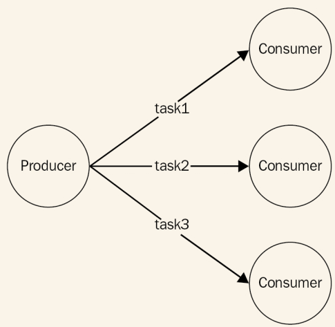
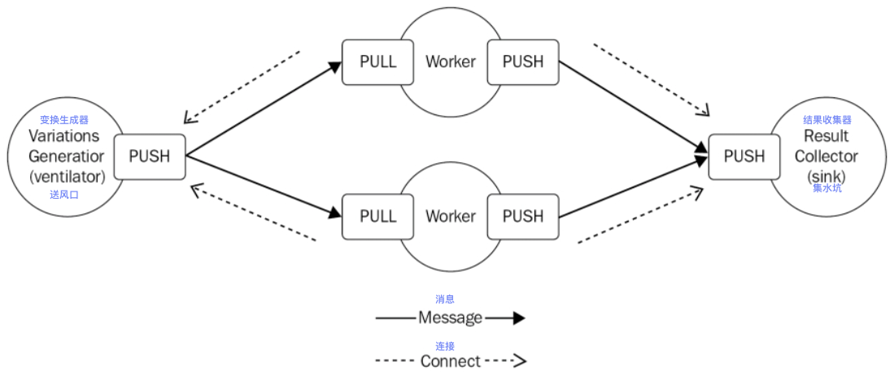

# 管道和任务分配模式
在第六章，*菜单*，我们学到了怎样把开销大的任务代理到多个本地进程，但即便这是一种有影响力的方法，他也不能突破单台机器的边界来拓展。在这一节，我们将看到怎样使用和分布式架构类似的模式，使用远程的工作进程，在网络中的任何机器上。
实现的想法是构建一个能让我们在多个机器上散布任务的消息模式。这些任务应该是单块的工作或者是大任务通过分制技术分成的一小块。
如果我们看下图展示的逻辑架构，可以发现一个熟悉的模式：

从前图可以看出，发布/订阅模式不适用于这种类型的应用，因为我们绝对不想任务被多个工作进程接收。我们需要的是，一个类似于负载均衡的消息分发模式，把每条消息分配到不同的消费者上（在这种情况下也叫做工作进程）。在消息系统的术语中，这种模式也被称为**竟态消费**、**扇出**分配或**集水坑**。
和上一章见到的HTTP负载均衡器的一个重要的不同点是，消费者处于更活跃的状态。事实上，我们后面会看到，大部分时间不是生产者连接到消费者，而是消费者自己为了收到新的任务而连接到任务创建者或者消息队列。这在可拓展的系统中是非常有利的，使我们可以无缝地增加工作进程的数量而无需修改创建者或者使用服务注册器。
同时，在一个通用的消息系统中，没必要在创建者和工作进程之间有一个请求/应答通信。相反，大部分情况下，更可取的办法是使用单向异步通信，能有更好的平行性和延展性。这这种架构中，消息可能一直以一个方向传输，创建一个**管线**，如下图所示：

管线让我们可以构建非常复杂的处理架构，没有同步请求/回复通信的压力，可以达到低延迟高吞吐量。在前面的图中，我们可以看到消息被分配到一组工作进程（扇出），前往其它的处理单元，然后聚合到一个但节点（扇入），通常称为**槽**。
在这一节，我们将关注于构建这种架构的代码块，通过分析两种最重要的变种：点到点和基于代理。

> 管线和任务分配模式的组合也叫做**平行管线**。

## ØMQ的扇出扇入模式
我们已经发现ØMQ在构建点到点的分布式架构方面的能力。在前一节，我们用*PUB*和*SUB*接口来把一条消息发送到多个消费者；现在，我们来看怎样使用另一组接口*PUSH*和*PULL*构建并行的管线。
### PUSH/PULL接口
从直观上来说，*PUSH*接口用于发送消息，*PULL*接口意为接收。尽管看起来这是一个简单的组合；然而，他们的一些特性使其完美地适用于构建单向通信系统：

* 都可以在连接或帮顶模式下工作。换句话说，可以构建一个*PUSH*接口，然后把它绑定到一个本地端口，监听从*PULL*接口来的连接，或者相反，一个*PULL*接口可能监听从*PUSH*来的连接。消息总是以相同的方向流动，从*PUSH*到*PULL*，只是连接的初始化器会有不同。绑定模式是最好的持久化节点解决方案，比如，任务创建器和槽。然而连接模式最适用于暂存节点，比如任务工作进程。能够允许暂存节点的数量随意变化，不会影响更多的持久节点。
* 如果多个*PULL*接口连接到了一个的*PUSH*接口，消息均等地分配到*PULL*接口，实际开发中，他们是负载均衡的（点到点的负载均衡）。在另一端，一个*PULL*接口接收来自多个*PUSH*接口的消息，将使用**平等队列**来处理消息，这意味着他们被均等地消费，在进入的消息上使用轮转。
* 使用*PUSH*接口发送的消息时，如果没有相连的*PULL*接口，消息不会丢失；相反，消息会存储在创建者的队列中，直到一个在线节点来拉取消息。

现在开始理解ØMQ和传统的Web服务间的区别，搞清楚为什么说它是一个构建任意一种消息系统的完美工具。
### 使用ØMQ构建分布式*散列和*解密器
现在来构建一个简单的应用来看我们刚描述的PUSH/PULL接口实际是怎样工作的。
将要做的是一个简单且迷人的散列和解密器，一个利用暴力破解技术来试图匹配一个给定的散列和（MD5、SHA1等等）到给定字母表的任何变换。这是一个完美并行负载（ https://en.wikipedia.org/wiki/Embarrassingly_parallel ），非常适合于构建一个例子来展示并行管线的能力。
对我们的应用来说，我们想实现一个典型的并行管线，使用一个节点来创建并在多个工作进程间分配任务，增加一个节点来收集所有的结果。我们刚描述的系统可以用ØMQ按照下图的架构来实现：

在我们的架构中，拥有一个送风口，生成所有可能的字符变换，基于给定的字母表，并把他们分配到一组工作进程中，工作进程按照次序计算每个变换的散列和，试着匹配给定的输入。如果找到一个匹配项，结果会被发送到结果收集节点（集水坑）。
我们架构中的固定节点是送风口和集水坑，工作进程是暂时性的节点。这意味着每个工作进程把自己的*PULL*接口连接到送风口上，把它的*PUSH*接口连接到集水坑上，这样就可以启动、停止任意多个工作进程，而无需修改送风口和集水坑的任何参数。

#### 实现送风口
#### 实现工作进程
#### 实现集水坑
#### 运行程序

## AMQP的管线和竟态消费者
### 点到点通信和竟态消费者
### 使用AMQP实现散列和解密器
#### 实现生产者
#### 实现工作进程
#### 实现结果收集
#### 运行程序

