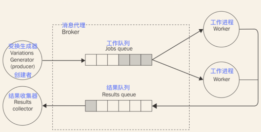

# 管道和任务分配模式
在第六章，*菜单*，我们学到了怎样把开销大的任务代理到多个本地进程，但即便这是一种有影响力的方法，他也不能突破单台机器的边界来拓展。在这一节，我们将看到怎样使用和分布式架构类似的模式，使用远程的工作进程，在网络中的任何机器上。
实现的想法是构建一个能让我们在多个机器上散布任务的消息模式。这些任务应该是单块的工作或者是大任务通过分制技术分成的一小块。
如果我们看下图展示的逻辑架构，可以发现一个熟悉的模式：


从前图可以看出，发布/订阅模式不适用于这种类型的应用，因为我们绝对不想任务被多个工作进程接收。我们需要的是，一个类似于负载均衡的消息分发模式，把每条消息分配到不同的消费者上（在这种情况下也叫做工作进程）。在消息系统的术语中，这种模式也被称为**竟态消费**、**扇出**分配或**集水坑**。
和上一章见到的HTTP负载均衡器的一个重要的不同点是，消费者处于更活跃的状态。事实上，我们后面会看到，大部分时间不是生产者连接到消费者，而是消费者自己为了收到新的任务而连接到任务创建者或者消息队列。这在可拓展的系统中是非常有利的，使我们可以无缝地增加工作进程的数量而无需修改创建者或者使用服务注册器。
同时，在一个通用的消息系统中，没必要在创建者和工作进程之间有一个请求/应答通信。相反，大部分情况下，更可取的办法是使用单向异步通信，能有更好的平行性和延展性。这这种架构中，消息可能一直以一个方向传输，创建一个**管线**，如下图所示：


管线让我们可以构建非常复杂的处理架构，没有同步请求/回复通信的压力，可以达到低延迟高吞吐量。在前面的图中，我们可以看到消息被分配到一组工作进程（扇出），前往其它的处理单元，然后聚合到一个但节点（扇入），通常称为**槽**。
在这一节，我们将关注于构建这种架构的代码块，通过分析两种最重要的变种：点到点和基于代理。

> 管线和任务分配模式的组合也叫做**平行管线**。

## ØMQ的扇出扇入模式
我们已经发现ØMQ在构建点到点的分布式架构方面的能力。在前一节，我们用*PUB*和*SUB*接口来把一条消息发送到多个消费者；现在，我们来看怎样使用另一组接口*PUSH*和*PULL*构建并行的管线。
### PUSH/PULL接口
从直观上来说，*PUSH*接口用于发送消息，*PULL*接口意为接收。尽管看起来这是一个简单的组合；然而，他们的一些特性使其完美地适用于构建单向通信系统：

* 都可以在连接或帮顶模式下工作。换句话说，可以构建一个*PUSH*接口，然后把它绑定到一个本地端口，监听从*PULL*接口来的连接，或者相反，一个*PULL*接口可能监听从*PUSH*来的连接。消息总是以相同的方向流动，从*PUSH*到*PULL*，只是连接的初始化器会有不同。绑定模式是最好的持久化节点解决方案，比如，任务创建器和槽。然而连接模式最适用于暂存节点，比如任务工作进程。能够允许暂存节点的数量随意变化，不会影响更多的持久节点。
* 如果多个*PULL*接口连接到了一个的*PUSH*接口，消息均等地分配到*PULL*接口，实际开发中，他们是负载均衡的（点到点的负载均衡）。在另一端，一个*PULL*接口接收来自多个*PUSH*接口的消息，将使用**平等队列**来处理消息，这意味着他们被均等地消费，在进入的消息上使用轮转。
* 使用*PUSH*接口发送的消息时，如果没有相连的*PULL*接口，消息不会丢失；相反，消息会存储在创建者的队列中，直到一个在线节点来拉取消息。

现在开始理解ØMQ和传统的Web服务间的区别，搞清楚为什么说它是一个构建任意一种消息系统的完美工具。
### 使用ØMQ构建分布式*散列和*解密器
现在来构建一个简单的应用来看我们刚描述的PUSH/PULL接口实际是怎样工作的。
将要做的是一个简单且迷人的散列和解密器，一个利用暴力破解技术来试图匹配一个给定的散列和（MD5、SHA1等等）到给定字母表的任何变换。这是一个完美并行负载（ https://en.wikipedia.org/wiki/Embarrassingly_parallel ），非常适合于构建一个例子来展示并行管线的能力。
对我们的应用来说，我们想实现一个典型的并行管线，使用一个节点来创建并在多个工作进程间分配任务，增加一个节点来收集所有的结果。我们刚描述的系统可以用ØMQ按照下图的架构来实现：


在我们的架构中，拥有一个送风口，生成所有可能的字符变换，基于给定的字母表，并把他们分配到一组工作进程中，工作进程按照次序计算每个变换的散列和，试着匹配给定的输入。如果找到一个匹配项，结果会被发送到结果收集节点（集水坑）。
我们架构中的固定节点是送风口和集水坑，工作进程是暂时性的节点。这意味着每个工作进程把自己的*PULL*接口连接到送风口上，把它的*PUSH*接口连接到集水坑上，这样就可以启动、停止任意多个工作进程，而无需修改送风口和集水坑的任何参数。

#### 实现送风口
现在以实现一个新的送风口模块作为开始，文件名为*ventilator.js*：

```
var zmq = require('zmq');
var variationsStream = require('variations-stream');
var alphabet = 'abcdefghijklmnopqrstuvwxyz';
var batchSize = 10000;
var maxLength = process.argv[2];
var searchHash = process.argv[3];

var ventilator = zmq.socket('push');   //[1]
ventilator.bindSync("tcp://*:5000");

var batch = [];
variationsStream(alphabet, maxLength)
    .on('data', function (combination) {
        batch.push(combination);
        if (batch.length === batchSize) {  //[2]
            var msg = {searchHash: searchHash, variations: batch};
            ventilator.send(JSON.stringify(msg));
            batch = [];
        }
    })
    .on('end', function () {
        //send remaining combinations
        var msg = {searchHash: searchHash, variations: batch};
        ventilator.send(JSON.stringify(msg));
    });
```
为防止创建太多的变换，生成器只基于英语字母表的小写字母，并设置了生成单词的数量。这个限制通过命令行的参数（*maxLength*）输入，还有要匹配的散列和（*searchHash*）。我们用了一个库叫做*variations-stream*（https://npmjs.org/package/variations-stream ），利用流接口来创建所有的变换。
我们最感兴趣的部分是怎样在工作进程间分配任务的：

1. 首先创建一个*PUSH*接口，并绑定到本地端口*5000*，这是工作进程的*PULL*接口连接过来接收任务的位置。
2. 我们把生成的变换每10000个编成一组，然后创建一个消息，包含这个要匹配的散列和这一批要检查的单词。这就是工作进程将要收到的任务对象。当我们在*ventilator*接口上触发*send()*，消息会传输到下一个可用的工作进程，依据轮转算法分配。


#### 实现工作进程
现在开始实现工作进程（*worker.js*）：

```
var zmq = require('zmq');
var crypto = require('crypto');
var fromVentilator = zmq.socket('pull');
var toSink = zmq.socket('push');

fromVentilator.connect('tcp://localhost:5000');
toSink.connect('tcp://localhost:5001');

fromVentilator.on('message', function(buffer) {
    var msg = JSON.parse(buffer);
    var variations = msg.variations;
    variations.forEach(function(word) {
        console.log('Processing: ' + word);
        var shasum = crypto.createHash('sha1');
        shasum.update(word);
        var digest = shasum.digest('hex');
        if(digest === msg.searchHash) {
            console.log('Found! => ' + word);
            toSink.send('Found! ' + digest + ' => ' + word);
        }
    });
});
```
前面说过，工作进程代表我们架构中一个暂时的节点，因此它的接口应连接到远程节点而不是监听进入的连接。实际在工作进程中，创建了两个接口：

* 一个连接到送风口的*PULL*接口，用于接收任务。
* 一个连接到集水坑的*PUSH*接口，用于传递结果。

除了这些，工作进程完成的工作非常简单：对于接收到的每条消息，我们遍历它包含的一批单词，然后对于每个单词计算它的SHA1散列和，然后试着匹配随消息传入的*searchHash*。当找到匹配后，结果被传入到集水坑中。
#### 实现集水坑
对于我们的案例，集水坑是一个非常基础的结果收集器，只是简单地打印接收到的来自工作进程的消息到控制台上。*sink.js*文件的内容如下：

```
var zmq  = require('zmq');
var sink = zmq.socket('pull');
sink.bindSync("tcp://*:5001");

sink.on('message', function(buffer) {
    console.log('Message from worker: ', buffer.toString());
});
```
可以看到有趣的结果，集水坑（和送风口一样）也是我们架构中的一个持久化节点，因此绑定到它的*PULL*接口，而不是把它连接到工作进程的的*PUSH*接口。

#### 运行程序
现在可以运行我们的应用了，现在启动两个工作进程，和一个集水坑：

```
node worker
node worker
node sink
```
然后启动送风口，指定要生成的单词的最大长度和要匹配的SHA1散列和。下面是一个参数的例子：

```
node ventilator 4 f8e966d1e207d02c44511a58dccff2f5429e9a3b
```
运行前面的命令，送风口会开始生成所有可能的单词，最大长度是4，把它们和要匹配的*散列和*分布到我们启动的一组工作进程上。计算的结果，如果有的话，会显示在集水坑的终端上。
## AMQP的管线和竟态消费者
在前面一节，我们看到了怎样在点到点的上下文中实现平行管线。我们将要探索这个模式应用到一个功能完整的消息代理（比如RabbitMQ）之后的样子。
### 点到点通信和竟态消费者
在点到点配置中，管线是非常容易在头脑中刻画的概念。有一个消息代理在中间，系统中多个节点之间的关系变得有点难理解了；代理本身扮演着一个沟通中介的角色，我们无法确定监听消息的另一端是哪一个。比如，当我们使用AMQP发送消息时，不是把它直接传输到目的地，而是给到交换器，然后是队列。最终，代理将决定把消息路由到哪里，基于在交换器中定义的规则，绑定关系，目标队列。
如果想使用AMQP这种系统实现管线和任务分配模式，我们需要确保每条消息都只被一个消费者接收到，但如果一个交换器可能被多个队列绑定的话，这个条件是没法保证的。解决方案是直接发送一个消息到目标队列，超越交换器，这种方法可以确保只有一个队列接收到消息。这种通信模式叫做**点到点**。
一旦可以直接发送一组消息到一个唯一的队列中，我们任务分配模式就实现了一半了。事实上，下一步就自然而然了：当多个消费者监听同一个队列，消息会均等地在他们之间分配，实现一个扇出分配。在消息代理中，这个机制叫做竟态消费者模式。
### 使用AMQP实现散列和解密器
我们刚看到，交换器是消息被散发到一组消费者的部件，而队列是负责消息负载均衡的。记住这个知识点，现在我们基于AMQP代理（比如RabbitMQ）来实现我们的暴力破解器。下图为系统概览：


正如我们讨论过的，把一组任务分配给多个工作进程，需要一个单独的队列。在上图中，我们叫它*工作队列*。在工作队列的另一端，我们有一组工作进程，即竟态消费者，换句话说，每个节点从队列中拉去不同的消息。结果是多个任务将会在不同的进程中平行执行。
被工作进程生成的任何结果都会被发送到另一个队列中，叫做结果队列，然后被结果收集器消费；结果收集器等同于集水坑或扇出分布。在整个架构中，我们不需要任何交换器，只需要把消息直接发送到其目标队列，实现点到点的通信。

#### 实现生产者
让我们看如何实现这样一个系统，从生产者（变换生成器）开始吧。代码和前面一节的类似，除了负责消息交换的部分。*producer.js*如下：

```
var amqp = require('amqplib');
//[...]

var connection, channel;
amqp
    .connect('amqp://localhost')
    .then(function (conn) {
        connection = conn;
        return conn.createChannel();
    })
    .then(function (ch) {
        channel = ch;
        produce();
    })
    .catch(function (err) {
        console.log(err);
    });

function produce() {
    //[...]
    variationsStream(alphabet, maxLength)
        .on('data', function (combination) {
            //[...]
            var msg = {searchHash: searchHash, variations: batch};
            channel.sendToQueue('jobs_queue',
                new Buffer(JSON.stringify(msg)));
            //[...]
        });
}

//[...]
```

如我们所见，少了交换器和绑定使AMQP通信的创建变得更简单了。在前面的代码中，我们甚至都不需要一个队列，因为我们只对发布消息感兴趣。
最重要的细节是*channel.sendToQueue()*API，我们从没见过。和其名字一样，这个API负责直接把消息发送到队列（例子中是*jobs_queue*）,直接越过任何交换器或路由。
#### 实现工作进程
在*jobs_queue*的另一端，工作进程监听进入的任务。其实现在*worker.js*文件中，如下：

```
var amqp = require('amqplib');
//[...]

var channel, queue;
amqp
    .connect('amqp://localhost')
    .then(function(conn) {
        return conn.createChannel();
    })
    .then(function(ch) {
        channel = ch;
        return channel.assertQueue('jobs_queue');
    })
    .then(function(q) {
        queue = q.queue;
        consume();
    });

    //[...]
function consume() {
    channel.consume(queue, function(msg) {
        //[...]
        variations.forEach(function(word) {
            //[...]
            if(digest === data.searchHash) {
                console.log('Found! => ' + word);
                channel.sendToQueue('results_queue',
                    new Buffer('Found! ' + digest + ' => ' + word));
            }
            //[...]
        });
        channel.ack(msg);
    });
}
```
我们的新工作进程和前面章节使用ØMQ实现的代码非常类似，除了和消息交换器相关的部分。在前面的代码中，我们可以看到如何确保*jobs_queue*存在，然后开始使用*channel.consume()*监听进入的任务。然后，每次找到匹配项，就通过*result_queue*传递结果到收集器，同样使用点到点通信。
如果启动了多个工作进程，他们会监听同一个队列，消息会在他们之间进行负载均衡。
#### 实现结果收集
#### 运行程序


