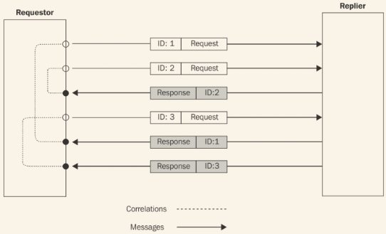
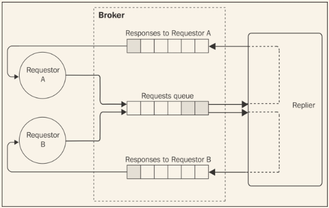

# 请求/应答模式
说到消息系统，通常意味着使用一个单向异步的通信；发布/订阅是一个典型案例。
单向通信可以在并行和效率方面带来极大的优势，但仅用它不能解决我们所有的集成和通信问题。有时，一个经典的请求/应答模式可能是解决问题的最好方式。因此，在这种情况下，我们只有异步单向通道，了解怎样抽象为以请求/应答风格交换信息还是很必要的。接下来我们就学习这方面的知识。
## 相关性识别器
我们要学的第一个请求/应答模式是**相关性识别器**，它是基于单向通道构建请求/应答抽象的基本的组成部分。
这种模式是每个请求都有一个识别器，然后会在响应时发送给接收者；用这种方式，请求的发送者可以把两条消息关联起来，把响应返回给正确的处理者。这种方式优雅地解决了单向异步通信存在的问题，消息可以在任何时间任何方向传输。让我们看一下下图中的例子：


前面的场景展示了如何使用一个相关ID，使我们能够把响应和请求对应起来，即便是他们的发送和接收的顺序不同。
### 使用相关性识别器来实现请求应答抽象
现在开始构建一个自理，选择最简单的单向频道，点到点（系统中的两个节点直接连接）和双向（消息可以在两个方向传输）。
在简单频道这一类别中，以Websocket为例：在服务器和浏览器间建立起一个点到点的连接，消息可以以任何方向传输。另一个例子，当使用*child_process.fork()*创建子进程是创建的信道，我们已经知道了，在第六章 菜谱 中已经了解过。这个通道也是异步的，仅能使用子进程连接到主进程，它允许信息以任意方式流通。这可能是这个类别中最基础的信道了，这就是我们在下一个例子中会使用它的原因。
下一个应用的计划是构建一个抽象层来封装父进程和子进程之间的信道。这个抽象层需要提供一个请求/应答的通信，可以使用想关心识别器来自动标识每个请求，然后以进入的应答的ID来匹配等待响应的请求处理器的列表。
在第六章 菜谱中，我们讲到过主进程可以用两个指令访问和子进程之间的信道：

* `child.send(message)`
* `child.on('message',callback)`

同样的，子进程可以使用以下指令来访问和主进程之间的信道：

* `process.send(message)`
* `process.on('message',callback)`

这意味着主进程中的频道的接口和子进程中是一样的；这样我们就可以构建一个通用的抽象，所有请求可以从信道的两端发出。

#### 抽象请求
以构建负责发送新请求的部分开始，创建一个新的文件，叫做*request.js*：
```
var uuid = require('node-uuid');

module.exports = function (channel) {
    var idToCallbackMap = {};        //[1]

    channel.on('message', function (message) {   //[2]
        var handler = idToCallbackMap[message.inReplyTo];
        if (handler) {
            handler(message.data);
        }
    });

    return function sendRequest(req, callback) {  //[3]
        var correlationId = uuid.v4();
        idToCallbackMap[correlationId] = callback;
        channel.send({
            type: 'request',
            data: req,
            id: correlationId
        });
    };
};
```
以下是请求抽象的工作原理：

1. 后续的部分是对请求功能的一个封装。这种模式的魔法在于*idToCallbackMap*变量，存储着外出请求和他们应答处理器的关系。
2. 当工厂被触发后，我们要做的第一件事是监听进入的消息。如果消息相关的ID（包含于*isReplyTo*属性）和*idToCallbackMap*中包含的ID匹配，我们就知道收到了一个应答，所以获取到了相关的响应处理器，然后使用消息中包含的数据触发它。
3. 最后，把用于发送新请求的函数返回。它负责使用*node-uuid*包（ https://npmjs.org/package/node-uuid ）来生成一个相关的ID，然后把请求数据包裹在一个**信封**中，使我们可以识别出相关的ID和消息的类型。

这是*request*模块的描述；让我们继续下一部分。

#### 抽象应答
现在离实现整个模式就差一步了，让我们看一下和*request.js*对应的部分。创建另一个叫做*reply.js*的文件，将包含对应答处理器的封装：

```
module.exports = function (channel) {
    return function registerHandler(handler) {
        channel.on('message', function (message) { //[1]
            if (message.type !== 'request') return;

            handler(message.data, function (reply) {
                channel.send({             //[2]
                    type: 'response',
                    data: reply,
                    inReplyTo: message.id
                });
            });
        });
    };
};
```
我们的*reply*模块也是一个工厂，返回注册新的请求处理器的函数：

1. 监听进入的请求，当接收到一个后，通过传入消息数据和一个从处理器收集应答的回调函数来立刻触发*handler*。
2. 一旦处理器完成其工作，将会触发我们提供的回调，将应答传进去。然后构建信封，把请求（*inReplyTo*属性）的关联ID附加上去，然后把所有的东西发还到频道。

有趣的是，这个模式在Node.js中非常容易实现，所有的东西都已经是异步的了，所以一个构建于单向信道之上的异步的请求/应答通信和其它异步操作没太大差异，尤其当我们构建一个抽象层来隐藏实现细节。
#### 尝试完整的请求应答循环
现在，我们可以用一下新的异步请求/应答抽象层了。现在在*replier.js*中创建一个简单的应答器：

```
var reply = require('./reply')(process);

reply(function (req, callback) {
    setTimeout(function () {
        callback({sum: req.a + req.b});
    }, req.delay);
});
```
我们的应答器简单计算了接收到的两个数的和，然后在一段时间（是在请求中指定的）后把结果返回。这使我们能够验证响应的顺序可以和发送请求的顺序不一致，来确认我们的模式能正常工作。
完成例子的最后一步是在*requestor.js*文件中创建一个请求器，负责使用*child_process.fork()*创建应答器：

```
var replier = require('child_process')
    .fork(__dirname + '/replier.js');
var request = require('./request')(replier);

request({a: 1, b: 2, delay: 500}, function (res) {
    console.log('1 + 2 = ', res.sum);
    replier.disconnect();
});

request({a: 6, b: 1, delay: 100}, function (res) {
    console.log('6 + 1 = ', res.sum);
});
```
请求器启动了应答器，然后把它的应用传递到了*request*抽象。然后运行两个请求的实例，验证接收到的请求是否正确。
试一下这个例子，简单地执行*request.js*模块，输入应该和下面一样：

```
6 + 1 = 7
1 + 2 = 3
```
这个结果确认了我们的模式工作的很好，应答正确地和请求关联起来了，不管他们是按照什么顺序发送和接收的。
## 返回地址
关联识别器是基于单向信道创建请求/应答模式的基础模式；然而，当我们的消息架构拥有多余一个信道或者队列，或者可能有多于一个的请求器。在这种情况下，除了一个关联ID，我们也需要知道其**返回地址**，一段能够让应答者发送响应到原始发送器的信息。
### 在AMQP中实现返回地址模式
在AMQP中，返回地址是指监听进入应答的队列。因为响应需要只被一个请求者接收，非常重要的是队列是私有的，且不会在多个不同的消费者间共享。基于这个特性，我们可以知道，我们需要一个临时性的队列，限定到请求者的连接，应答器必须使用返回队列建立一个点到点的通信，使其能够传输响应。
下图展示了这种场景的例子：



为基于AMQP创建一个请求/应答模式，我们需要做的只有在消息属性中指定响应队列的名字，这样应答者就知道把响应消息传输到哪了。这个理论看起来比较简单，那么就看怎样在实际应用中使用它吧。
#### 实现请求抽象
现在基于AMQP构建一个请求/应答抽象。我们将使用RabbitMQ作为代理，但其实任何兼容的AMQP代理都可以实现。从请求的抽象开始（是现在*amqpRequest.js*模块），这里只看相关的部分。
首先需要观察的东西是怎样创建保持响应的队列；这是负责相关内容的代码：

```
channel.assertQueue('', {exclusive: true});
```
当我们创建队列时，无需指定名字，这意味着会随机指定给我们一个；除了这个，队列是排它的，意味着它绑定到一个活动的AMQP连接，当连接关闭时会被销毁。无需把队列绑定到交换器，我们无需任何路由或分配到多个队列，这意味着消息需要直接传输到我们的响应队列。
接下来，让我们看如何生成一个新的请求：

```
AMQPRequest.prototype.request = function(queue, message, callback) {
    var id = uuid.v4();
    this.idToCallbackMap[id] = callback;
    this.channel.sendToQueue(queue,
        new Buffer(JSON.stringify(message)),
        {correlationId: id, replyTo: this.replyQueue}
    );
}
```
`request()`方法接收请求队列的名字（*queue*）和将要发送的消息（*message*）。就像我们在前一节学到的，需要创建一个相关ID，然后把它关联到*callback*函数。最终，发送一个消息，指定*correlationId*和*replyTo*属性作为元数据。
有趣的是，为了发送消息，我们将使用*channel.sentToQueue()*API而不是*channel.publish()*;这是因为我们不是为了使用交换器来实现发布/订阅，而是一个更基础的直接到目标队列的点到点传输。

> 在AMQP中，我们可以指定一组属性（或元数据），和主消息一起传输给消费者。

最后重要的*amqpRequest*原型的一块是监听进入的响应的部分：

```
AMQPRequest.prototype._listenForResponses = function() {
    var self = this;
    return this.channel.consume(this.replyQueue, function(msg) {
        var correlationId = msg.properties.correlationId;
        var handler = self.idToCallbackMap[correlationId];
        if(handler) {
            handler(JSON.parse(msg.content.toString()));
        }
    });
};
```
在前面的代码中，我们监听为了接收响应的队列，然后对于每个进入的消息，我们读取其关联ID，然后拿它和等待应答的处理者列表匹配。一旦有了处理者，我们只需要通过传入应答的消息来触发它。
#### 实现应答抽象
以上是关于*amqpRequest*模块的，现在该在一个新的模块*amqpReply.js*中实现响应抽象了。
我们已经创建了一个队列，将会接收进入的请求；我们可以使用简单的持久队列来实现。我们不会展示这部分功能的代码，因为又是AMQP调用。我们更感兴趣的是，怎样处理一个请求然后把它发回到正确的队列中：

```
AMQPReply.prototype.handleRequest = function (handler) {
    var self = this;
    return self.channel.consume(self.queue, function (msg) {
        var content = JSON.parse(msg.content.toString());
        handler(content, function (reply) {
            self.channel.sendToQueue(
                msg.properties.replyTo,
                new Buffer(JSON.stringify(reply)),
                {correlationId: msg.properties.correlationId}
            );
            self.channel.ack(msg);
        });
    });
};
```
当发回一个应答，我们使用*channel.sendToQueue()*来把消息直接发送到消息的*replyTo*属性指定的队列（即返回地址）。我们的*amqpReply*对象的另外一个作用是给应答设置一个*correlationId*,所以接收者可以在挂起的请求中匹配消息。
#### 实现请求者和应答者
到现在可以试一试了，首先，我们构建请求者和应答者的案例来看怎样使用我们的新抽象层。
从模块*replier.js*开始：

```
var Reply = require('./amqpReply');
var reply = Reply('requests_queue');

reply.initialize().then(function () {
    reply.handleRequest(function (req, callback) {
        console.log('Request received', req);
        callback({sum: req.a + req.b});
    });
});
```
很容易看出我们构建的抽象使我们隐藏了所有处理关联ID和返回地址的细节。我们需要做的只有初始化一个新的*reply*对象，指定接收请求的队列的名字。剩下的代码比较简单了；我们的应答者例子简单地计算了作为输入的两个数的和，然后使用提供的回调函数把结果发回去。
在另一端，有一个请求者的例子，实现在*requestor.js*文件中：

```
var req = require('./amqpRequest')();

req.initialize().then(function() {
    for(var i = 100; i > 0; i--) {
        sendRandomRequest();
    }
});

function sendRandomRequest() {
    var a = Math.round(Math.random() * 100);
    var b = Math.round(Math.random() * 100);
    req.request('requests_queue', {a: a, b: b},
        function(res) {
            console.log(a + ' + ' + b + ' = ' + res.sum);
        }
    );
}
```
我们的例子请求者发送了100个随机请求到*request_queue*队列。在这个情况下，也会看到我们的抽象完美地执行了其功能，把异步请求/应答模式的细节都隐藏起来了。
现在，试一下这个系统，简单地运行*replier*模块，然后是*requestor*模块：

```
node replier
node requestor
```
我们看到，一组操作被请求者发布然后被应答者接收，然后发回响应。
现在，我们可以进行其它实验。一旦请求者第一次开始后，它创建了一个持久化队列；这意味着，如果现在停止它，然后再次运行请求者，没有请求会被遗漏。所有的消息会存储在队列中，直至应答者重启。
另一个我们使用AMQP而免费获得的特性是应答者可以拓展到盒子外面。为了验证这个假设，我们可以试着启动两个或多个应答者，然后看请求在他们间负载均衡。这是因为，每次请求者启动后，它把自己作为监听者附加到了同一个持久化队列上，作为结果，代理会在队列所有的消费者之间进行负载均衡（竟态消费者模式）。赞！

> ØMQ有一组专门为请求/应答模式实现的接口（REQ/REP），但它们是同步的，只支持一次一个请求/应答。有专门的技术来实现复杂的请求/应答模式。需要了解更多信息，需要阅读位于 http://zguide.zeromq.org/page:all#advanced-request-reply 的官方指南。

